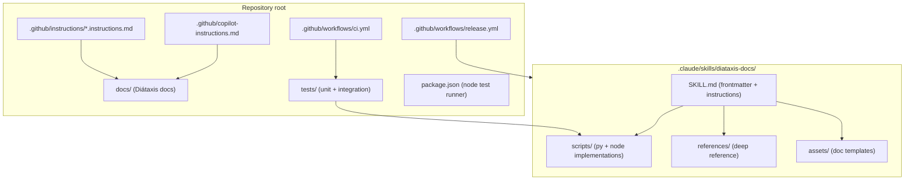
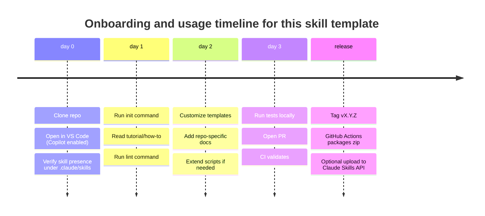

# Deep Research Report: Building a Claude Agent‑Skill Package with Code, Metadata, Tests, and Diátaxis Documentation

## Executive summary

Agent Skills are “filesystem-based” capability packages that an agent can discover and load on demand, typically as a directory with a required `SKILL.md` file plus optional scripts and resources. citeturn3view1turn3view2turn22view0turn28view1 Claude’s Agent Skills specifically leverage a sandboxed virtual-machine/container environment with filesystem access; the Skill’s YAML frontmatter is used for discovery, and the `SKILL.md` body is loaded only when the Skill is triggered (“progressive disclosure”), with further files read as needed. citeturn3view1turn3view2turn3view3turn22view0

To make a skill package “directly importable” into GitHub Copilot ecosystems, it’s now practical to align with the shared Agent Skills format: GitHub Copilot supports project skills in `.github/skills` or `.claude/skills`, and personal skills in user directories like `~/.copilot/skills` or `~/.claude/skills`. citeturn27view0turn28view1turn16view3 GitHub and VS Code documentation both describe skills as folders containing `SKILL.md` that Copilot can load when relevant—again following a tiered loading model (metadata → instructions → referenced resources). citeturn17view7turn28view3turn22view0

This report delivers a copy‑paste‑ready repository template that includes:
- A complete skill directory under `.claude/skills/<skill-name>/` (portable across Claude Code/Agent SDK and Copilot-aware tooling). citeturn3view9turn16view3turn27view0  
- Parallel minimal-but-working implementations in Python and Node.js (both included; Python is the safest default for Claude’s code execution container where Python is explicitly documented). citeturn11view2turn12view4  
- Unit + integration tests, with runnable test commands and CI validation via GitHub Actions.  
- Diátaxis-structured documentation set: tutorial (study), how‑to (work), reference (facts), troubleshooting (operational failures), aligned with Diátaxis distinctions. citeturn19view0turn20view3turn1view7  
- GitHub Copilot compatibility notes and repo-level instruction files (`.github/copilot-instructions.md` plus path-scoped `.instructions.md`). citeturn1view6turn14view5turn14view6  
- Licensing, security, and data retention considerations (notably: Claude Skills/code execution are not eligible for ZDR; code execution has no internet access). citeturn3view0turn9view2turn11view2  

## Standards and constraints that shape a “correct” skill package

Agent Skills converge on a shared core: a skill is a directory with a required `SKILL.md` containing YAML frontmatter (`name`, `description` required) followed by Markdown instructions, plus optional directories like `scripts/`, `references/`, and `assets/`. citeturn18view2turn22view0turn28view1 The open spec also defines optional frontmatter fields like `license`, `compatibility`, `metadata`, and an experimental `allowed-tools`. citeturn18view2turn21view4turn21view0

Claude-specific constraints:
- Skills load progressively: metadata always, `SKILL.md` body only when triggered, then additional files as referenced. citeturn3view2turn2view0turn3view3  
- In the Claude API, Skills run in a code execution container/tooling context; documentation explicitly calls out required beta headers and that Skills are used via the `container.skills` parameter alongside the code execution tool. citeturn3view3turn7view0turn9view3  
- The Skills guide includes hard limits: max 8 skills per request, max upload size 8 MB, frontmatter validation rules, and “no network” / “no runtime package installation” constraints for the skills execution environment. citeturn9view0turn2view7  
- Claude’s code execution sandbox documents: Python version 3.11.12, no internet access, and resource limits (memory/disk/CPU). citeturn11view2turn11view3  
- Data retention: Skills are explicitly not covered by Zero Data Retention arrangements. citeturn3view0turn9view2  

GitHub Copilot / VS Code constraints:
- Copilot supports agent skills in `.github/skills` or `.claude/skills`, and (depending on surface) personal skills under `~/.copilot/skills` or `~/.claude/skills`. citeturn27view0turn28view1turn16view3  
- GitHub docs note current surface availability: agent skills work with Copilot coding agent, Copilot CLI, and “agent mode” in VS Code Insiders, with stable VS Code support “coming soon.” citeturn27view0turn28view0  
- VS Code’s customization guidance describes monorepo “parent repository discovery” and explicitly includes “agent skills” among discovered customization types. citeturn14view0  

Diátaxis constraints (documentation architecture):
- Diátaxis separates documentation types by user need: tutorials serve study (learning-oriented), how-to guides serve work (task-oriented). citeturn19view0  
- Reference content supports “work” (accurate, factual lookup), while explanation supports “study” (building understanding). citeturn20view3turn1view8  
Your request replaces “explanation” with “troubleshooting”; this template treats troubleshooting as an operational, work-oriented companion that stays distinct from reference (facts) and how-to (procedures).

## Package architecture and required repository structure

### Required skill directory structure

A minimum portable skill is a directory with `SKILL.md`; optional supporting files should be referenced from it and kept shallow. citeturn18view2turn22view0turn3view2 The shared guidance across Claude and the open spec is to keep `SKILL.md` concise (commonly “under 500 lines”), and place detailed material in separate files for progressive disclosure. citeturn2view10turn22view0turn29view2

Because both Claude (Agent SDK / Claude Code) and Copilot recognize `.claude/skills/<skill-name>/SKILL.md` as a project-level location, this template places the skill there to maximize interoperability. citeturn3view9turn8view0turn27view0turn16view3

### File purpose table

| Path | Purpose | Loaded/used by |
|---|---|---|
| `.claude/skills/diataxis-docs/SKILL.md` | Skill entrypoint: metadata + instructions; triggers discovery | Claude Skills discovery / Copilot Skills discovery citeturn3view2turn28view3turn22view0 |
| `.claude/skills/diataxis-docs/scripts/*` | Deterministic helpers invoked via shell/code execution | Claude VM/container + tools; typically executed, not “memorized” citeturn3view2turn22view0turn29view2 |
| `.claude/skills/diataxis-docs/references/*` | Deep reference for the agent to read when needed | Progressive disclosure tier-3 citeturn3view2turn22view0turn29view2 |
| `.claude/skills/diataxis-docs/assets/*` | Templates/fixtures the agent copies/edits | Progressive disclosure tier-3 citeturn21view6turn22view0 |
| `docs/*` | Human docs (Diátaxis set) for the repo/template | Humans + Copilot context |
| `tests/*` | Unit + integration tests for both implementations | CI + local dev |
| `.github/workflows/*` | CI and release automation | GitHub Actions |
| `.github/copilot-instructions.md` | Repository-wide Copilot instructions | Copilot surfaces that support repo instructions citeturn1view6turn14view5 |
| `.github/instructions/*.instructions.md` | Path-scoped Copilot instruction overlays | Copilot surfaces supporting path scoping citeturn1view6turn14view5 |

### Mermaid diagram: file relationships



## Metadata and manifest design with cross-platform mapping

### Core SKILL.md frontmatter fields

At minimum, `name` and `description` are required by the open spec and by GitHub’s agent-skill guidance; `name` is constrained (lowercase, hyphenated, ≤64 chars), and `description` is constrained (≤1024 chars) and should describe both capabilities and when to use. citeturn18view2turn17view4turn28view1turn22view0

Claude API-specific validation also constrains `name` and `description` (and mentions reserved words and XML tag restrictions), and sets request limits like 8 skills per request and 8 MB max upload size. citeturn9view0turn2view7turn2view9

### Metadata comparison table (what each ecosystem expects)

| Metadata / field | Open Agent Skills spec | Claude API Skills | GitHub Copilot Skills | VS Code Skills UI |
|---|---|---|---|---|
| `name` | Required; strict constraints; must match directory name citeturn18view2turn22view0 | Required + validation rules citeturn9view0turn2view8 | Required; “typically matches directory name” citeturn28view1 | Required; must match parent dir citeturn17view4turn16view0 |
| `description` | Required; when-to-use + what-it-does citeturn18view2turn21view0 | Required + validation rules citeturn9view0turn2view8 | Required citeturn28view1 | Required citeturn17view4 |
| `license` | Optional citeturn18view2turn21view0 | Not required; safe to include | GitHub docs mention optional `license` citeturn28view1 | (Not required; can be included) |
| `compatibility` | Optional; describe environment requirements (≤500 chars) citeturn21view1turn21view0 | Not part of API schema but can exist in SKILL.md (treated as content) | Can exist; helps operators | Can exist; helps operators |
| `metadata` | Optional freeform key/value (strings) citeturn21view1turn21view4 | Not required | Not required | Not required |
| `allowed-tools` | Optional, experimental citeturn21view4turn22view0 | Tool permissions are set in API request; still usable as documentation | Tool permissions vary by environment | Tool permissions vary by environment |
| Additional frontmatter (client-specific) | Prefer `metadata` for portability | Claude Code supports many extra fields (e.g., `disable-model-invocation`) citeturn29view1turn29view2 | Not documented here | VS Code documents extra UX fields separately citeturn17view4 |

**Key interoperability decision for this template:** keep frontmatter within the open spec fields (`name`, `description`, `license`, `compatibility`, `metadata`, `allowed-tools`) to avoid breaking stricter validators. The platform-specific “extra fields” are documented in the repo reference docs but not used in the sample `SKILL.md`.

## Tests, CI/CD, licensing, and Copilot import considerations

### Testing strategy

This template’s scripts do two things:
- `init`: scaffold Diátaxis documentation files using templates
- `lint`: validate that Diátaxis docs exist and have expected top-level headings

This supports both “unit” behavior (function-level checks via subprocess) and “integration” behavior (in-place creation + validation of a project structure). It avoids network calls, aligning with Claude’s no-network sandbox constraint. citeturn9view0turn11view2

### CI/CD workflow strategy and constraints

Agent-skill packaging generally has two separate “publish” routes:
1. **Publish as a Git repo/release artifact** (portable; works for Copilot and Claude Code style discovery).
2. **Upload to Claude Skills API** (for Claude API usage), which requires the Skills endpoints and the “all files in one top-level directory with SKILL.md at root of that directory” rule at upload time. citeturn5view0turn6view0turn3view3  

This template implements (1) by default and includes an **optional** step for (2) as a commented job requiring secrets.

**Copilot coding agent note:** GitHub documents that workflows may not run by default for PRs created by Copilot coding agent until a human approves running workflows (“Approve and run workflows”). citeturn24view1turn24view4 This affects “agent-driven” PR validation: you should expect a human gate if you rely on CI runs in that scenario.

### Licensing, security, retention

- The Agent Skills spec supports a `license` field; GitHub’s “create skill” guidance also explicitly calls it optional to include in `SKILL.md`. citeturn18view2turn28view1  
- Claude Skills and code execution are not eligible for ZDR and are retained under standard retention policies; treat any sensitive artifacts accordingly. citeturn3view0turn10view0turn9view2  
- Claude code execution has no internet access and forbids outbound network requests; skills should not depend on fetching external resources at runtime. citeturn11view2turn9view0  

### CI steps comparison table

| Step | Purpose | Node path | Python path |
|---|---|---|---|
| Checkout | Pull code | `actions/checkout` | `actions/checkout` |
| Setup runtime | Ensure consistent interpreter | `actions/setup-node` | `actions/setup-python` |
| Run unit/integration tests | Validate scripts end-to-end | `npm run test:node` | `python -m unittest -v` |
| Validate SKILL metadata (lightweight) | Ensure naming/constraints and required files | Node test asserts | Python test asserts |
| Package | Create zip artifact | Same (bash zip) | Same (bash zip) |
| Publish (optional) | Create GitHub Release asset + optional Claude upload | `gh release create` + curl | `gh release create` + curl |

## Final repo deliverables ready to copy into a repository

### Required file tree

```text
.
├── .claude/
│   └── skills/
│       └── diataxis-docs/
│           ├── SKILL.md
│           ├── scripts/
│           │   ├── diataxis_docs.py
│           │   └── diataxis_docs.mjs
│           ├── references/
│           │   ├── REFERENCE.md
│           │   └── SKILL_SPEC_NOTES.md
│           └── assets/
│               ├── tutorial.template.md
│               ├── how-to.template.md
│               ├── reference.template.md
│               └── troubleshooting.template.md
├── docs/
│   ├── tutorial.md
│   ├── how-to.md
│   ├── reference.md
│   └── troubleshooting.md
├── tests/
│   ├── fixtures/
│   │   ├── good_project/
│   │   │   └── docs/
│   │   │       ├── tutorial.md
│   │   │       ├── how-to.md
│   │   │       ├── reference.md
│   │   │       └── troubleshooting.md
│   │   └── bad_project/
│   │       └── docs/
│   │           ├── tutorial.md
│   │           └── reference.md
│   ├── node/
│   │   └── diataxis_docs.test.mjs
│   └── python/
│       └── test_diataxis_docs.py
├── .github/
│   ├── workflows/
│   │   ├── ci.yml
│   │   └── release.yml
│   ├── copilot-instructions.md
│   └── instructions/
│       ├── docs.instructions.md
│       ├── node.instructions.md
│       └── python.instructions.md
├── package.json
├── README.md
├── LICENSE
├── SECURITY.md
└── .gitignore
```

### Skill package files

#### `.claude/skills/diataxis-docs/SKILL.md`

```md
---
name: diataxis-docs
description: Scaffold and validate a Diátaxis-style docs set (tutorial, how-to, reference, troubleshooting) for a repo. Use when you need to add or verify documentation structure quickly and consistently.
license: MIT
compatibility: Requires local filesystem write access. Works offline. Python 3.11+ recommended; Node.js 20+ optional.
metadata:
  template: "agent-skill-repo"
  version: "0.1.0"
  languages: "python,node"
allowed-tools: Bash(python *) Bash(node *) Read Write
---

# Diátaxis Docs Skill

## What this skill does
This skill helps you:
- **Initialize** a `docs/` folder with four files: `tutorial.md`, `how-to.md`, `reference.md`, `troubleshooting.md`
- **Validate** that those files exist and contain the expected top-level headings

## When to use
Use this skill when:
- A repo needs a structured documentation baseline
- Docs drift and you want a quick consistency check
- You are preparing a repo for agent-friendly onboarding (human + Copilot)

## Quick start

### Initialize docs (recommended: Python)
```bash
python .claude/skills/diataxis-docs/scripts/diataxis_docs.py init --repo-root . --docs-dir docs
```

### Validate docs (recommended: Python)
```bash
python .claude/skills/diataxis-docs/scripts/diataxis_docs.py lint --repo-root . --docs-dir docs
```

### Node.js alternative
```bash
node .claude/skills/diataxis-docs/scripts/diataxis_docs.mjs init --repo-root . --docs-dir docs
node .claude/skills/diataxis-docs/scripts/diataxis_docs.mjs lint --repo-root . --docs-dir docs
```

## Templates and references
- Templates live in `assets/`:
  - `assets/tutorial.template.md`
  - `assets/how-to.template.md`
  - `assets/reference.template.md`
  - `assets/troubleshooting.template.md`
- For detailed conventions and constraints, read:
  - `references/REFERENCE.md`
  - `references/SKILL_SPEC_NOTES.md`

## Output contract
- `init`:
  - Creates `docs/` if missing
  - Creates missing doc files from templates
  - Does **not** overwrite existing files unless `--force` is provided
- `lint`:
  - Returns exit code `0` if all checks pass
  - Returns exit code `2` if checks fail, with a human-readable report
```

#### `.claude/skills/diataxis-docs/scripts/diataxis_docs.py`

```python
#!/usr/bin/env python3
"""
diataxis_docs.py

A tiny, dependency-free CLI to:
- init: scaffold Diátaxis docs from templates
- lint: validate docs existence + top-level headings

Designed to run offline and in constrained environments.
"""

from __future__ import annotations

import argparse
import sys
from dataclasses import dataclass
from pathlib import Path
from typing import Dict, List, Tuple


EXPECTED_FILES = {
    "tutorial.md": "# Tutorial",
    "how-to.md": "# How-to",
    "reference.md": "# Reference",
    "troubleshooting.md": "# Troubleshooting",
}

TEMPLATE_DIRNAME = "assets"


@dataclass(frozen=True)
class LintResult:
    ok: bool
    errors: List[str]


def _skill_root() -> Path:
    # scripts/ is directly under the skill root
    return Path(__file__).resolve().parents[1]


def _load_template(template_name: str) -> str:
    template_path = _skill_root() / TEMPLATE_DIRNAME / template_name
    if not template_path.exists():
        raise FileNotFoundError(f"Missing template: {template_path}")
    return template_path.read_text(encoding="utf-8")


def init_docs(repo_root: Path, docs_dir: Path, force: bool) -> None:
    repo_root = repo_root.resolve()
    out_dir = (repo_root / docs_dir).resolve()

    out_dir.mkdir(parents=True, exist_ok=True)

    for filename in EXPECTED_FILES.keys():
        target = out_dir / filename
        if target.exists() and not force:
            continue

        template_name = filename.replace(".md", ".template.md")
        content = _load_template(template_name)
        target.write_text(content, encoding="utf-8")


def _first_nonempty_line(text: str) -> str:
    for line in text.splitlines():
        if line.strip():
            return line.strip()
    return ""


def lint_docs(repo_root: Path, docs_dir: Path) -> LintResult:
    repo_root = repo_root.resolve()
    out_dir = (repo_root / docs_dir).resolve()

    errors: List[str] = []

    if not out_dir.exists():
        errors.append(f"Missing docs directory: {out_dir}")
        return LintResult(ok=False, errors=errors)

    for filename, expected_h1 in EXPECTED_FILES.items():
        p = out_dir / filename
        if not p.exists():
            errors.append(f"Missing file: {p}")
            continue

        text = p.read_text(encoding="utf-8")
        first = _first_nonempty_line(text)

        if first != expected_h1:
            errors.append(
                f"{p}: expected first non-empty line '{expected_h1}', got '{first or '(empty)'}'"
            )

    return LintResult(ok=(len(errors) == 0), errors=errors)


def _print_lint(result: LintResult) -> None:
    if result.ok:
        print("OK: Diátaxis docs set is present and headings match.")
        return

    print("FAIL: Diátaxis docs validation failed.")
    for e in result.errors:
        print(f"- {e}")


def _build_parser() -> argparse.ArgumentParser:
    parser = argparse.ArgumentParser(prog="diataxis_docs.py")
    sub = parser.add_subparsers(dest="cmd", required=True)

    p_init = sub.add_parser("init", help="Create docs/ structure from templates")
    p_init.add_argument("--repo-root", default=".", help="Repository root (default: .)")
    p_init.add_argument("--docs-dir", default="docs", help="Docs directory (default: docs)")
    p_init.add_argument(
        "--force", action="store_true", help="Overwrite existing doc files"
    )

    p_lint = sub.add_parser("lint", help="Validate docs/ structure and headings")
    p_lint.add_argument("--repo-root", default=".", help="Repository root (default: .)")
    p_lint.add_argument("--docs-dir", default="docs", help="Docs directory (default: docs)")

    return parser


def main(argv: List[str]) -> int:
    parser = _build_parser()
    args = parser.parse_args(argv)

    repo_root = Path(args.repo_root)
    docs_dir = Path(args.docs_dir)

    if args.cmd == "init":
        try:
            init_docs(repo_root=repo_root, docs_dir=docs_dir, force=bool(args.force))
        except Exception as e:
            print(f"ERROR(init): {e}", file=sys.stderr)
            return 1
        print("Done: docs initialized.")
        return 0

    if args.cmd == "lint":
        try:
            result = lint_docs(repo_root=repo_root, docs_dir=docs_dir)
        except Exception as e:
            print(f"ERROR(lint): {e}", file=sys.stderr)
            return 1
        _print_lint(result)
        return 0 if result.ok else 2

    print("ERROR: unknown command", file=sys.stderr)
    return 1


if __name__ == "__main__":
    raise SystemExit(main(sys.argv[1:]))
```

#### `.claude/skills/diataxis-docs/scripts/diataxis_docs.mjs`

```js
#!/usr/bin/env node
/**
 * diataxis_docs.mjs
 *
 * Dependency-free Node.js equivalent of the Python CLI.
 * - init: scaffold docs from templates
 * - lint: validate file presence + top-level headings
 */

import { readFileSync, writeFileSync, mkdirSync, existsSync } from "node:fs";
import { resolve, dirname, join } from "node:path";
import { fileURLToPath } from "node:url";

const EXPECTED_FILES = new Map([
  ["tutorial.md", "# Tutorial"],
  ["how-to.md", "# How-to"],
  ["reference.md", "# Reference"],
  ["troubleshooting.md", "# Troubleshooting"],
]);

function skillRoot() {
  const __filename = fileURLToPath(import.meta.url);
  const __dirname = dirname(__filename);
  // scripts/ is directly under the skill root
  return resolve(__dirname, "..");
}

function loadTemplate(templateName) {
  const p = join(skillRoot(), "assets", templateName);
  if (!existsSync(p)) throw new Error(`Missing template: ${p}`);
  return readFileSync(p, "utf-8");
}

function firstNonEmptyLine(text) {
  for (const line of text.split(/\r?\n/)) {
    if (line.trim()) return line.trim();
  }
  return "";
}

function parseArgs(argv) {
  // minimal parsing: --k v and flags
  const out = { _: [] };
  for (let i = 0; i < argv.length; i++) {
    const a = argv[i];
    if (a.startsWith("--")) {
      const key = a.slice(2);
      const next = argv[i + 1];
      if (!next || next.startsWith("--")) {
        out[key] = true;
      } else {
        out[key] = next;
        i++;
      }
    } else {
      out._.push(a);
    }
  }
  return out;
}

function initDocs({ repoRoot, docsDir, force }) {
  const root = resolve(repoRoot);
  const outDir = resolve(join(root, docsDir));
  mkdirSync(outDir, { recursive: true });

  for (const filename of EXPECTED_FILES.keys()) {
    const target = join(outDir, filename);
    if (existsSync(target) && !force) continue;

    const templateName = filename.replace(".md", ".template.md");
    const content = loadTemplate(templateName);
    writeFileSync(target, content, "utf-8");
  }
}

function lintDocs({ repoRoot, docsDir }) {
  const root = resolve(repoRoot);
  const outDir = resolve(join(root, docsDir));

  const errors = [];
  if (!existsSync(outDir)) {
    errors.push(`Missing docs directory: ${outDir}`);
    return { ok: false, errors };
  }

  for (const [filename, expectedH1] of EXPECTED_FILES.entries()) {
    const p = join(outDir, filename);
    if (!existsSync(p)) {
      errors.push(`Missing file: ${p}`);
      continue;
    }
    const text = readFileSync(p, "utf-8");
    const first = firstNonEmptyLine(text);
    if (first !== expectedH1) {
      errors.push(
        `${p}: expected first non-empty line '${expectedH1}', got '${first || "(empty)"}'`
      );
    }
  }

  return { ok: errors.length === 0, errors };
}

function main(argv) {
  const [cmd, ...rest] = argv;
  if (!cmd || (cmd !== "init" && cmd !== "lint")) {
    console.error("Usage: node diataxis_docs.mjs <init|lint> [--repo-root .] [--docs-dir docs] [--force]");
    return 1;
  }

  const args = parseArgs(rest);
  const repoRoot = args["repo-root"] ?? ".";
  const docsDir = args["docs-dir"] ?? "docs";
  const force = Boolean(args["force"]);

  try {
    if (cmd === "init") {
      initDocs({ repoRoot, docsDir, force });
      console.log("Done: docs initialized.");
      return 0;
    }

    const res = lintDocs({ repoRoot, docsDir });
    if (res.ok) {
      console.log("OK: Diátaxis docs set is present and headings match.");
      return 0;
    }

    console.log("FAIL: Diátaxis docs validation failed.");
    for (const e of res.errors) console.log(`- ${e}`);
    return 2;
  } catch (e) {
    console.error(`ERROR(${cmd}): ${e?.message ?? e}`);
    return 1;
  }
}

process.exit(main(process.argv.slice(2)));
```

#### `.claude/skills/diataxis-docs/references/REFERENCE.md`

```md
# Reference: Diátaxis docs in this template

This repo uses four documentation kinds:
- Tutorial: a learning path (study-oriented). Focus on doing, not exhaustive facts.
- How-to: task-oriented, assumes competence; includes branching and real-world conditions.
- Reference: facts and constraints; no “story”, no long prose.
- Troubleshooting: symptom → cause → fix, plus diagnostic commands.

Primary sources:
- Diátaxis: https://diataxis.fr/
- Claude Agent Skills overview: https://platform.claude.com/docs/en/agents-and-tools/agent-skills/overview
- Agent Skills spec: https://agentskills.io/specification
- GitHub Copilot agent skills: https://docs.github.com/en/copilot/concepts/agents/about-agent-skills
```

#### `.claude/skills/diataxis-docs/references/SKILL_SPEC_NOTES.md`

```md
# Reference: Agent Skill packaging notes

Core requirements (portable):
- A skill is a directory containing SKILL.md at its root.
- SKILL.md must include YAML frontmatter + Markdown body.
- Frontmatter must include:
  - name (lowercase, hyphenated, <= 64 chars; match directory name)
  - description (<= 1024 chars; includes what + when)

Optional frontmatter:
- license
- compatibility
- metadata
- allowed-tools (experimental)

Good practice:
- Keep SKILL.md concise. Put deep content into references/ and assets/.
- Reference other files using relative paths from the skill root.
```

#### `.claude/skills/diataxis-docs/assets/tutorial.template.md`

```md
# Tutorial

## Goal
Learn how to create a Diátaxis documentation set for a repository.

## Prerequisites
- You can edit files in the repository
- You can run one of:
  - Python 3.11+
  - Node.js 20+

## Steps
1. Initialize documentation files.
2. Read each doc to understand the distinct purpose.
3. Run the linter to validate structure.

## Next
Continue with the How-to guide for common tasks.
```

#### `.claude/skills/diataxis-docs/assets/how-to.template.md`

```md
# How-to

## Add Diátaxis docs to an existing repo
1. Run init to create missing files.
2. Fill each doc with content matching its purpose.
3. Run lint until clean.

## Update docs without overwriting
- Run init without --force to preserve existing edits.

## Add new sections safely
- Keep the top-level purpose intact:
  - Tutorial = learning path
  - How-to = task recipe
  - Reference = facts
  - Troubleshooting = failures + fixes
```

#### `.claude/skills/diataxis-docs/assets/reference.template.md`

```md
# Reference

## Files
- docs/tutorial.md
- docs/how-to.md
- docs/reference.md
- docs/troubleshooting.md

## Commands
Python:
- init: python .claude/skills/diataxis-docs/scripts/diataxis_docs.py init --repo-root . --docs-dir docs
- lint: python .claude/skills/diataxis-docs/scripts/diataxis_docs.py lint --repo-root . --docs-dir docs

Node:
- init: node .claude/skills/diataxis-docs/scripts/diataxis_docs.mjs init --repo-root . --docs-dir docs
- lint: node .claude/skills/diataxis-docs/scripts/diataxis_docs.mjs lint --repo-root . --docs-dir docs

## Exit codes
- 0: success
- 1: runtime error
- 2: lint failure
```

#### `.claude/skills/diataxis-docs/assets/troubleshooting.template.md`

```md
# Troubleshooting

## Lint fails with “Missing docs directory”
Cause:
- docs/ folder does not exist

Fix:
- Run init:
  - Python: ... diataxis_docs.py init ...
  - Node: ... diataxis_docs.mjs init ...

## Lint fails with “expected first non-empty line”
Cause:
- The file’s first heading is wrong or the file is empty

Fix:
- Ensure the first non-empty line matches:
  - Tutorial: # Tutorial
  - How-to: # How-to
  - Reference: # Reference
  - Troubleshooting: # Troubleshooting
```

### Diátaxis documentation (human-facing)

#### `docs/tutorial.md`

```md
# Tutorial

## What you will build
You will add a complete Diátaxis-style documentation set to a repository:
- Tutorial
- How-to
- Reference
- Troubleshooting

## What you need
- A clone of this repository
- Python 3.11+ recommended (Node optional)

## Create the docs
From the repository root:

```bash
python .claude/skills/diataxis-docs/scripts/diataxis_docs.py init --repo-root . --docs-dir docs
```

## Validate the docs
```bash
python .claude/skills/diataxis-docs/scripts/diataxis_docs.py lint --repo-root . --docs-dir docs
```

If it prints OK, you have a valid baseline.

## Learn the distinctions
- Tutorial: follow the learning path
- How-to: jump straight to tasks
- Reference: look up facts fast
- Troubleshooting: fix failures

Next: open docs/how-to.md.
```

#### `docs/how-to.md`

```md
# How-to

## Initialize docs without overwriting
```bash
python .claude/skills/diataxis-docs/scripts/diataxis_docs.py init --repo-root . --docs-dir docs
```

## Force overwrite (regenerate templates)
```bash
python .claude/skills/diataxis-docs/scripts/diataxis_docs.py init --repo-root . --docs-dir docs --force
```

## Validate before merging
```bash
python .claude/skills/diataxis-docs/scripts/diataxis_docs.py lint --repo-root . --docs-dir docs
```

## Use Node.js instead
```bash
node .claude/skills/diataxis-docs/scripts/diataxis_docs.mjs lint --repo-root . --docs-dir docs
```

## Add content safely
- Put learning sequences in Tutorial
- Put step-by-step task recipes in How-to
- Put hard constraints and schemas in Reference
- Put symptoms, causes, and fixes in Troubleshooting
```

#### `docs/reference.md`

```md
# Reference

## Locations
- Skill: .claude/skills/diataxis-docs/
- Docs: docs/

## Commands

Python
- init: python .claude/skills/diataxis-docs/scripts/diataxis_docs.py init --repo-root . --docs-dir docs
- lint: python .claude/skills/diataxis-docs/scripts/diataxis_docs.py lint --repo-root . --docs-dir docs

Node
- init: node .claude/skills/diataxis-docs/scripts/diataxis_docs.mjs init --repo-root . --docs-dir docs
- lint: node .claude/skills/diataxis-docs/scripts/diataxis_docs.mjs lint --repo-root . --docs-dir docs

## Expected files and headings
- tutorial.md -> "# Tutorial"
- how-to.md -> "# How-to"
- reference.md -> "# Reference"
- troubleshooting.md -> "# Troubleshooting"

## Exit codes
- 0: OK
- 1: runtime error
- 2: validation failure
```

#### `docs/troubleshooting.md`

```md
# Troubleshooting

## Skill not discovered by Copilot or Claude
Check:
- The skill directory exists under:
  - .claude/skills/diataxis-docs/
- The entrypoint filename is exactly SKILL.md

Fix:
- Rename to SKILL.md and ensure it is in the skill directory root.

## Linter fails after you edited docs
Symptom:
- expected first non-empty line mismatch

Fix:
- Ensure the first non-empty line is the H1 heading shown in docs/reference.md.

## CI fails but local passes
Check:
- You are using Python 3.11+ and Node 20+ locally
Fix:
- Match CI versions shown in .github/workflows/ci.yml
```

### Tests and fixtures

#### `tests/fixtures/good_project/docs/tutorial.md`

```md
# Tutorial

A minimal valid tutorial.
```

#### `tests/fixtures/good_project/docs/how-to.md`

```md
# How-to

A minimal valid how-to.
```

#### `tests/fixtures/good_project/docs/reference.md`

```md
# Reference

A minimal valid reference.
```

#### `tests/fixtures/good_project/docs/troubleshooting.md`

```md
# Troubleshooting

A minimal valid troubleshooting doc.
```

#### `tests/fixtures/bad_project/docs/tutorial.md`

```md
# Tutorial

This is present.
```

#### `tests/fixtures/bad_project/docs/reference.md`

```md
# Reference

This is present, but other required docs are missing.
```

#### `tests/python/test_diataxis_docs.py`

```python
import shutil
import subprocess
import tempfile
import unittest
from pathlib import Path

SCRIPT = Path(".claude/skills/diataxis-docs/scripts/diataxis_docs.py").resolve()

def run_py(args, cwd):
    return subprocess.run(
        ["python", str(SCRIPT), *args],
        cwd=cwd,
        text=True,
        capture_output=True,
    )

class TestDiataxisDocsPython(unittest.TestCase):
    def test_init_creates_files(self):
        with tempfile.TemporaryDirectory() as td:
            repo = Path(td)
            r = run_py(["init", "--repo-root", ".", "--docs-dir", "docs"], cwd=repo)
            self.assertEqual(r.returncode, 0, (r.stdout, r.stderr))

            docs = repo / "docs"
            self.assertTrue((docs / "tutorial.md").exists())
            self.assertTrue((docs / "how-to.md").exists())
            self.assertTrue((docs / "reference.md").exists())
            self.assertTrue((docs / "troubleshooting.md").exists())

            # Lint should pass against newly created templates
            r2 = run_py(["lint", "--repo-root", ".", "--docs-dir", "docs"], cwd=repo)
            self.assertEqual(r2.returncode, 0, (r2.stdout, r2.stderr))

    def test_lint_good_fixture_passes(self):
        with tempfile.TemporaryDirectory() as td:
            repo = Path(td)
            fixture = Path("tests/fixtures/good_project").resolve()
            shutil.copytree(fixture, repo, dirs_exist_ok=True)

            r = run_py(["lint", "--repo-root", ".", "--docs-dir", "docs"], cwd=repo)
            self.assertEqual(r.returncode, 0, (r.stdout, r.stderr))

    def test_lint_bad_fixture_fails(self):
        with tempfile.TemporaryDirectory() as td:
            repo = Path(td)
            fixture = Path("tests/fixtures/bad_project").resolve()
            shutil.copytree(fixture, repo, dirs_exist_ok=True)

            r = run_py(["lint", "--repo-root", ".", "--docs-dir", "docs"], cwd=repo)
            self.assertEqual(r.returncode, 2, (r.stdout, r.stderr))
            self.assertIn("Missing file", r.stdout)

if __name__ == "__main__":
    unittest.main(verbosity=2)
```

#### `tests/node/diataxis_docs.test.mjs`

```js
import test from "node:test";
import assert from "node:assert/strict";
import { mkdtempSync } from "node:fs";
import { tmpdir } from "node:os";
import { join, resolve } from "node:path";
import { execFileSync } from "node:child_process";
import { copyFileSync, mkdirSync, existsSync } from "node:fs";

const SCRIPT = resolve(".claude/skills/diataxis-docs/scripts/diataxis_docs.mjs");

function runNode(args, cwd) {
  try {
    const out = execFileSync("node", [SCRIPT, ...args], { cwd, encoding: "utf-8" });
    return { code: 0, out };
  } catch (e) {
    return { code: e.status ?? 1, out: (e.stdout ?? "") + (e.stderr ?? "") };
  }
}

function seedFixtureGood(repoRoot) {
  const docs = join(repoRoot, "docs");
  mkdirSync(docs, { recursive: true });
  copyFileSync("tests/fixtures/good_project/docs/tutorial.md", join(docs, "tutorial.md"));
  copyFileSync("tests/fixtures/good_project/docs/how-to.md", join(docs, "how-to.md"));
  copyFileSync("tests/fixtures/good_project/docs/reference.md", join(docs, "reference.md"));
  copyFileSync("tests/fixtures/good_project/docs/troubleshooting.md", join(docs, "troubleshooting.md"));
}

test("init creates docs and lint passes", () => {
  const repo = mkdtempSync(join(tmpdir(), "diataxis-node-"));
  const r1 = runNode(["init", "--repo-root", ".", "--docs-dir", "docs"], repo);
  assert.equal(r1.code, 0, r1.out);

  assert.ok(existsSync(join(repo, "docs", "tutorial.md")));
  const r2 = runNode(["lint", "--repo-root", ".", "--docs-dir", "docs"], repo);
  assert.equal(r2.code, 0, r2.out);
});

test("lint passes on good fixture", () => {
  const repo = mkdtempSync(join(tmpdir(), "diataxis-node-good-"));
  seedFixtureGood(repo);

  const r = runNode(["lint", "--repo-root", ".", "--docs-dir", "docs"], repo);
  assert.equal(r.code, 0, r.out);
});
```

### GitHub Copilot instruction files

#### `.github/copilot-instructions.md`

```md
# Repository Copilot Instructions

This repository is an Agent Skill template. When making changes:

- Keep the skill under `.claude/skills/diataxis-docs/` valid and runnable.
- Do not add network-dependent logic to the skill scripts.
- Always update tests when changing behavior:
  - Python: `python -m unittest -v`
  - Node: `npm run test:node`
- Keep documentation Diátaxis-structured:
  - `docs/tutorial.md` (learning path)
  - `docs/how-to.md` (task recipes)
  - `docs/reference.md` (facts/commands)
  - `docs/troubleshooting.md` (symptoms + fixes)
- Prefer small, incremental PRs. Include a short rationale and how to test.
```

#### `.github/instructions/docs.instructions.md`

```md
---
applyTo: "docs/**/*.md"
---

# Documentation rules

- Keep each doc aligned to its role (Tutorial vs How-to vs Reference vs Troubleshooting).
- Avoid mixing reference facts into the tutorial.
- In troubleshooting, prefer: Symptom → Likely cause → Fix → How to confirm.
```

#### `.github/instructions/python.instructions.md`

```md
---
applyTo: "**/*.py"
excludeAgent: "code-review"
---

# Python rules

- Standard library only (no new deps).
- Prefer clear error messages and stable exit codes.
- Keep CLI behavior backward-compatible.
```

#### `.github/instructions/node.instructions.md`

```md
---
applyTo: "**/*.mjs"
excludeAgent: "code-review"
---

# Node.js rules

- No external packages.
- Use Node built-ins (node:test, child_process, fs, path).
- Keep output stable for tests.
```

### GitHub Actions workflows

#### `.github/workflows/ci.yml`

```yaml
name: ci

on:
  push:
  pull_request:

jobs:
  test-python:
    runs-on: ubuntu-latest
    steps:
      - uses: actions/checkout@v4
      - uses: actions/setup-python@v5
        with:
          python-version: "3.11"
      - name: Run Python tests
        run: python -m unittest -v

  test-node:
    runs-on: ubuntu-latest
    steps:
      - uses: actions/checkout@v4
      - uses: actions/setup-node@v4
        with:
          node-version: "20"
      - name: Run Node tests
        run: npm run test:node

  smoke-skill:
    runs-on: ubuntu-latest
    needs: [test-python, test-node]
    steps:
      - uses: actions/checkout@v4
      - uses: actions/setup-python@v5
        with:
          python-version: "3.11"
      - name: Smoke: init + lint
        run: |
          rm -rf docs
          python .claude/skills/diataxis-docs/scripts/diataxis_docs.py init --repo-root . --docs-dir docs
          python .claude/skills/diataxis-docs/scripts/diataxis_docs.py lint --repo-root . --docs-dir docs
```

#### `.github/workflows/release.yml`

```yaml
name: release

on:
  push:
    tags:
      - "v*"

permissions:
  contents: write

jobs:
  build-and-release:
    runs-on: ubuntu-latest
    steps:
      - uses: actions/checkout@v4

      - name: Package skill as zip
        run: |
          mkdir -p dist
          cd .claude/skills
          zip -r ../../dist/diataxis-docs.zip diataxis-docs

      - name: Create GitHub release (uses gh)
        env:
          GH_TOKEN: ${{ secrets.GITHUB_TOKEN }}
        run: |
          gh release create "${GITHUB_REF_NAME}" \
            --title "${GITHUB_REF_NAME}" \
            --notes "Release ${GITHUB_REF_NAME}: packaged Agent Skill." \
            dist/diataxis-docs.zip

      # Optional: upload to Claude Skills API (requires secrets)
      # - name: Upload new version to Claude Skills API
      #   env:
      #     ANTHROPIC_API_KEY: ${{ secrets.ANTHROPIC_API_KEY }}
      #     SKILL_ID: ${{ secrets.ANTHROPIC_SKILL_ID }}
      #   run: |
      #     # Example uses the "Create Skill Version" endpoint; requires betas header.
      #     # You must pass filenames so that the uploaded top-level directory is "diataxis-docs/"
      #     curl -X POST "https://api.anthropic.com/v1/skills/${SKILL_ID}/versions?beta=true" \
      #       -H "x-api-key: ${ANTHROPIC_API_KEY}" \
      #       -H "anthropic-version: 2023-06-01" \
      #       -H "anthropic-beta: skills-2025-10-02" \
      #       -F "files[]=@.claude/skills/diataxis-docs/SKILL.md;filename=diataxis-docs/SKILL.md" \
      #       -F "files[]=@.claude/skills/diataxis-docs/scripts/diataxis_docs.py;filename=diataxis-docs/scripts/diataxis_docs.py" \
      #       -F "files[]=@.claude/skills/diataxis-docs/scripts/diataxis_docs.mjs;filename=diataxis-docs/scripts/diataxis_docs.mjs"
```

### Root repository files

#### `package.json`

```json
{
  "name": "agent-skill-diataxis-docs-template",
  "private": true,
  "type": "module",
  "scripts": {
    "test:node": "node --test tests/node/*.test.mjs"
  }
}
```

#### `README.md`

```md
# Agent Skill Template: diataxis-docs

This repository is a minimal, working Agent Skill package designed to:
- be discovered from `.claude/skills/`
- work offline (no network dependencies)
- include both Python and Node.js script options
- include tests + CI
- include Diátaxis-structured human documentation

## What’s included
- Skill: `.claude/skills/diataxis-docs/`
- Docs: `docs/` (tutorial, how-to, reference, troubleshooting)
- Tests: `tests/` (Python + Node)
- CI: `.github/workflows/ci.yml`

## Run locally

### Python
```bash
python .claude/skills/diataxis-docs/scripts/diataxis_docs.py init --repo-root . --docs-dir docs
python .claude/skills/diataxis-docs/scripts/diataxis_docs.py lint --repo-root . --docs-dir docs
python -m unittest -v
```

### Node.js
```bash
node .claude/skills/diataxis-docs/scripts/diataxis_docs.mjs lint --repo-root . --docs-dir docs
npm run test:node
```

## Copilot & Claude placement
- Project skill location: `.claude/skills/diataxis-docs/`
- Alternate location (also supported by Copilot): `.github/skills/diataxis-docs/`

## References
- Claude Agent Skills overview:
  https://platform.claude.com/docs/en/agents-and-tools/agent-skills/overview
- Agent Skills spec:
  https://agentskills.io/specification
- GitHub Copilot agent skills:
  https://docs.github.com/en/copilot/concepts/agents/about-agent-skills
- Diátaxis:
  https://diataxis.fr/
```

#### `LICENSE`

```text
MIT License

Copyright (c) 2026

Permission is hereby granted, free of charge, to any person obtaining a copy
of this software and associated documentation files (the "Software"), to deal
in the Software without restriction, including without limitation the rights
to use, copy, modify, merge, publish, distribute, sublicense, and/or sell
copies of the Software, and to permit persons to whom the Software is
furnished to do so, subject to the following conditions:

The above copyright notice and this permission notice shall be included in all
copies or substantial portions of the Software.

THE SOFTWARE IS PROVIDED "AS IS", WITHOUT WARRANTY OF ANY KIND, EXPRESS OR
IMPLIED, INCLUDING BUT NOT LIMITED TO THE WARRANTIES OF MERCHANTABILITY,
FITNESS FOR A PARTICULAR PURPOSE AND NONINFRINGEMENT. IN NO EVENT SHALL THE
AUTHORS OR COPYRIGHT HOLDERS BE LIABLE FOR ANY CLAIM, DAMAGES OR OTHER
LIABILITY, WHETHER IN AN ACTION OF CONTRACT, TORT OR OTHERWISE, ARISING FROM,
OUT OF OR IN CONNECTION WITH THE SOFTWARE OR THE USE OR OTHER DEALINGS IN THE
SOFTWARE.
```

#### `SECURITY.md`

```md
# Security policy

## Scope
This repo contains an Agent Skill with scripts that read/write local files.

## Guidance
- Do not add runtime network calls to the skill scripts.
- Do not hardcode API keys or secrets in SKILL.md, scripts, or docs.
- Treat generated artifacts as potentially sensitive depending on inputs.
- If you enable CI publish to external APIs, store credentials in GitHub Actions Secrets.

## Reporting
Open a private security advisory or contact the maintainers.
```

#### `.gitignore`

```gitignore
dist/
__pycache__/
*.pyc
.DS_Store
node_modules/
```

### Mermaid timeline: onboarding and usage



## Explicit assumptions and “unknowns” you should decide for production

- **Runtime availability in Claude API container:** Python is explicitly documented (version 3.11.12), but Node availability is only implied by the “agent VM” architecture diagram; treat Node as “best-effort” for Claude API and keep Python as the primary implementation. citeturn11view2turn12view4  
- **Skill distribution target:** no single universal “skill registry” is specified; the “publish” workflow here publishes GitHub release artifacts and optionally uploads a new version to Claude’s Skills API if you configure secrets. citeturn5view0turn6view1  
- **Copilot surface support:** GitHub currently documents agent skills as working with Copilot coding agent, Copilot CLI, and VS Code Insiders agent mode; stable VS Code support may be in rollout, so plan adoption/testing accordingly. citeturn27view0turn28view0  
- **Tool permissions semantics:** the `allowed-tools` frontmatter is described as experimental and may vary by implementation; treat it as documentation/intent, not an enforcement guarantee unless your target client documents enforcement. citeturn21view4turn22view0