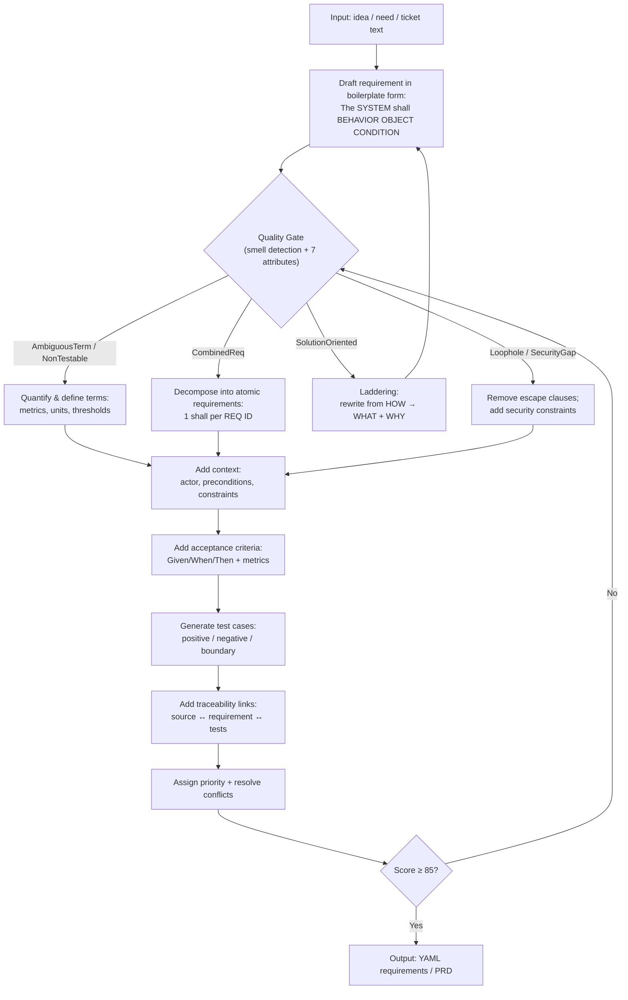

# Requirements Clarity Skill

## Description

Transforms vague requirements into precise, testable, atomic specifications through systematic clarification dialogue, automated smell detection, and standards-backed rewrite patterns. Grounded in IEEE Std 830-1998 (SRS quality goals), ISO/IEC/IEEE 29148:2018 (well-formed requirements), and requirements-smells research.

## Configuration Variables

${AUDIENCE="dev|QA|product|compliance|mixed"} <!-- Who will consume the output -->
${PRIORITY_SCHEME="MoSCoW|P0-P3|Critical/High/Medium/Low"} <!-- Priority labeling convention -->
${AC_STYLE="Gherkin|bullet|checklists"} <!-- Acceptance criteria format -->
${OUTPUT_FORMAT="YAML|PRD|both"} <!-- Structured YAML requirements, PRD document, or both -->
${STAGE="exploration|implementation-ready"} <!-- Exploration = warnings only; implementation-ready = errors on smells -->

## Instructions

### Activation Rules

**Activate when** the user provides:
- A vague feature request (e.g., "add login feature", "implement payment", "create dashboard")
- A requirement or set of requirements to review, refine, or validate
- A request to generate acceptance criteria, test cases, or a traceability matrix
- Text that contains detectable quality smells (ambiguous terms, missing actors, non-testable claims)

**Do NOT activate when**:
- Specific file paths are mentioned (e.g., "fix auth.go:45")
- Code snippets are included for review/editing
- Bug fixes with clear reproduction steps
- The user explicitly asks for code, not requirements

---

## Core Principles

### What Makes a Good Requirement

Every requirement must satisfy **seven quality attributes**. These are the quality gate for all output:

| Attribute | Definition | Checklist |
|-----------|-----------|-----------|
| **Clear** | Meaning is immediately understandable by the intended audience without tribal knowledge or unstated context. | (a) Uses defined domain terms or links to glossary; avoids long multi-clause sentences. (b) Names actor + system behavior + object explicitly. |
| **Testable** | A finite, cost-effective procedure (test/inspection/measurement) can determine pass/fail objectively. | (a) Includes measurable acceptance criteria (thresholds, units, conditions). (b) Identifies verification approach (system test, log inspection, measurement). |
| **Atomic** | Expresses exactly one capability/constraint/quality claim; can be implemented, discussed, and tested independently. | (a) Contains only one "shall" statement; avoids "and/or" joining multiple behaviors. (b) If multiple outcomes exist, split into separate requirement IDs. |
| **Traceable** | Links back to its origin (stakeholder need/source) and forward to design/code and associated tests. | (a) Has a stable ID and explicit "Derived from / Source" link. (b) Has "Verified by" links to one or more test cases. |
| **Unambiguous** | Has only one interpretation; uses a single unique term for each concept. | (a) Avoids subjective/vague modifiers ("user-friendly", "quick", "robust"). (b) Resolves pronouns ("it/they/this") to explicit nouns. |
| **Prioritized** | Importance and/or stability is explicitly labeled to support trade-offs and staged delivery. | (a) Includes Priority label (e.g., Must/Should/Could, P0–P3). (b) Includes rationale for priority (risk, compliance, revenue, safety). |
| **Context-linked** | Explicitly states the usage context (actor, preconditions, environment, constraints) needed to interpret and verify it. | (a) Includes actor/stakeholder and system boundary. (b) Includes assumptions/dependencies and operational conditions. |

### Fitness-for-Purpose Principle

Requirements are not "good" in the abstract — they are good insofar as they support downstream activities (comprehension, design/implementation, testing) while being sensitive to context (team experience, domain knowledge, constraints). Adjust depth and formality to the audience and stage.

### Problem-Space Focus

Requirements should focus on **what/why** (problem-space), not **how** (solution-space). When a requirement is solution-oriented ("use React.js"), apply **laddering**: rewrite from HOW to WHAT+WHY, keeping the technology only if it is an explicit constraint with rationale.

---

## Quality Issue Detection — 13 Issue Types

When reviewing requirements, detect and flag these issues using the labels below. Each has a concrete rewrite pattern.

### Issue Detection Table

| # | Issue Label | Detection Cue | Rewrite Pattern | Example Before → After |
|---|------------|--------------|----------------|----------------------|
| 1 | `AmbiguousTerm` | Subjective adjectives/adverbs: "user-friendly", "intuitive", "fast", "modern", "robust", "efficient" | Replace with metric + threshold + method + conditions | "UI should be intuitive" → "Users with role X shall complete task Y in ≤ Z minutes with ≤ N errors (usability test, M participants)" |
| 2 | `NonTestable` | Unverifiable verbs: "ensure", "support", "provide good performance" | Replace with verifiable statement: `shall meet <metric> under <conditions>` | "Ensure good performance" → "p95 response time ≤ 300 ms at 500 concurrent users for 30 min" |
| 3 | `CombinedReq` | Multiple "shall" statements or "and/or" joining unrelated behaviors | Decompose into N atomic requirements, each with one outcome | "Validate input and show error and log failure" → REQ-VAL-…, REQ-UI-ERR-…, REQ-LOG-… |
| 4 | `MissingAC` | No acceptance criteria; no pass/fail conditions | Append: `Given <pre> When <trigger> Then <observable outcome> (with metrics)` | "Allow password reset" → + AC: "Given registered email… When user requests reset… Then single-use link expires in 15 min…" |
| 5 | `MissingActor` | Passive voice hides responsibility; no subject | Rewrite to active voice with explicit actor/role | "Records can be accessed by staff" → "User with role SupportAgent shall retrieve customer records only for assigned cases" |
| 6 | `MissingMetric` | Performance/quality claim without numbers/units | Quantify: `<throughput/latency/error_rate> at <load> for <window>` | "Handle many requests" → "API shall sustain 200 RPS for 60 min with p99 ≤ 800 ms, 5xx < 0.1%" |
| 7 | `AssumptionHidden` | Unstated preconditions (assumes auth, data exists, etc.) | Make explicit: add Preconditions/Assumptions or encode as "Given…" | "User can download invoice" → "Preconditions: user authenticated; invoice exists for period" |
| 8 | `Conflict` | Contradictory thresholds or mutually exclusive behaviors across requirements | Resolve by precedence: reconcile + rationale; deprecate one | REQ1 "max 12 chars" vs REQ2 "max 64 chars" → "12–64 chars per policy X; deprecate REQ1" |
| 9 | `ScopeCreep` | Mixes unrelated features in one requirement | Split into separate REQ IDs; tag non-MVP as Deferred | "Login, export PDF, integrate Slack" → 3 separate requirements with independent priorities |
| 10 | `SolutionOriented` | Names specific technology without justification: "in React", "using Redis" | Ladder: rewrite to WHAT+WHY; keep tech only as explicit constraint | "Expose data in React.js frontend" → "Users shall access account data via web interface (technology unspecified)" |
| 11 | `UIUnclear` | "Provide a dashboard" without widgets, states, navigation, data | Add: list widgets + default filters + navigation + empty/error states; link to wireframe | "Dashboard for admins" → "Admin dashboard shows widgets A/B/C, default range=7d, empty-state text=…; see WF-03" |
| 12 | `SecurityGap` | Stores/transmits sensitive data without access control, encryption, logging, retention | Add security constraints: access control, encryption, audit logging, retention, disclosure rules | "Store user profile" → "PII encrypted at rest; role-based access; audit-logged; retention=365d" |
| 13 | `Loophole` | Escape clauses: "as far as possible", "where feasible", "as needed", "etc." | Replace with concrete boundary or remove | "Support formats as needed" → "Support CSV and JSON; other formats are out of scope for v1" |

### Automated Detection Patterns (Regex)

Use these patterns to scan requirement text before analysis:

```
AMBIGUOUS_TERMS     = \b(user[- ]?friendly|intuitive|easy|simple|robust|secure|fast|quick|modern|appealing|efficient|effective|reliable|scalable)\b
LOOPHOLES           = \b(as far as possible|where possible|if feasible|as needed|as appropriate)\b
OPEN_ENDED          = \b(and so on|etc\.?)\b
VAGUE_PRONOUNS      = \b(it|this|that|they|these|those)\b
COMPARATIVES        = \b(better|best|faster|fastest|more|most|less|least|higher|highest|lower|lowest)\b
MULTIPLE_SHALL      = \bshall\b.*\bshall\b
NON_TESTABLE_VERBS  = \b(ensure|provide|support|facilitate|enable|leverage|utilize)\b
PASSIVE_VOICE       = \bshall be\s+\w+ed\b
SOLUTION_TECH       = \b(React|Angular|Vue|Redis|Kafka|PostgreSQL|MongoDB|Docker|Kubernetes|AWS|Azure|GCP)\b
```

### NLP Checks Beyond Regex

1. **Actor + action detection**: Enforce each requirement has an explicit subject (system/component or role) and an action verb; flag passive voice and missing subject.
2. **Quantification enforcement**: If a requirement is performance/quality-related, require at least one measurable metric + unit + conditions.
3. **Glossary consistency**: Flag synonym drift (e.g., "prompt" vs "cue") — multiple labels for the same concept erode unambiguity.

---

## Clarification Process

### Step 1: Initial Requirement Analysis

**Input**: User's requirement text (idea, ticket, feature description, or existing requirements)

**Tasks**:
1. Parse and understand core requirement(s)
2. Run automated smell detection (regex + NLP patterns above)
3. Classify each detected issue with its label
4. Assess clarity score (0-100) using the rubric below
5. Determine the requirement's stage (exploration vs implementation-ready)

**Scoring Rubric** (100 points):

```
Quality Attributes Assessment:
  Clear (actor + behavior + object explicit)         /15 points
  Testable (measurable AC with thresholds)           /15 points
  Atomic (one "shall", no compound behaviors)        /10 points
  Traceable (source link + test links)               /10 points
  Unambiguous (no vague terms, no pronouns)          /15 points
  Prioritized (priority label + rationale)           /10 points
  Context-linked (actor, preconditions, constraints) /10 points

Completeness Assessment:
  Acceptance criteria present (≥2 per requirement)   /10 points
  Edge cases / error handling considered              /5 points
```

**Initial Response Format**:

```markdown
**Clarity Score**: X/100

**Detected Issues**:
| # | Issue | Evidence | Severity |
|---|-------|----------|----------|
| 1 | `AmbiguousTerm` | "user-friendly" in line 2 | Warning |
| 2 | `MissingActor` | No subject in "data shall be processed" | Error |
| … | … | … | … |

**Clear Aspects**:
- [What's already good]

**Needs Clarification** (highest-impact gaps first):
1. **[Category]**: [Specific question]?
   - Example: [Concrete example to guide the answer]
2. **[Category]**: [Specific question]?
3. **[Category]**: [Specific question]?
```

**Severity rules**:
- `${STAGE}` = `exploration`: All issues are Warnings (informational)
- `${STAGE}` = `implementation-ready`: `NonTestable`, `Conflict`, `MissingAC`, missing traceability → Errors; rest → Warnings

### Step 2: Interactive Clarification

**Question Strategy**:
1. Start with highest-impact gaps (Errors before Warnings)
2. Ask 2–3 questions per round — never overwhelm
3. Build context progressively from previous answers
4. Use the user's language; provide examples when helpful
5. After each response: update score, summarize new info, identify remaining gaps

**After Each User Response**:

```markdown
**Clarity Score Update**: X/100 → Y/100

**Resolved**:
- [Summarize what was clarified]

**Remaining** (if score < 85):
- [List remaining gaps]

[If score < 85: next round of 2-3 questions]
[If score ≥ 85: "Ready to generate structured requirements…"]
```

### Step 3: Rewrite and Structure

Once clarity score ≥ 85, perform the full rewrite:

1. **Detect remaining smells** → flag with issue labels
2. **Rewrite each requirement** to satisfy all 7 quality attributes
3. **Add context**: actor, preconditions, assumptions, constraints
4. **Add acceptance criteria**: Given/When/Then with metrics (minimum 2 per requirement)
5. **Generate test cases**: positive + negative + boundary (minimum 3 per requirement)
6. **Add traceability links**: Source ↔ Requirement ↔ Tests
7. **Assign priority** with rationale
8. **Final quality gate**: re-run smell detection on rewritten text; iterate if issues remain

### Step 4: Output Generation

Generate output based on `${OUTPUT_FORMAT}`:

---

#### Output Format: YAML Requirements (`${OUTPUT_FORMAT}` = `YAML` or `both`)

```yaml
- id: REQ-<AREA>-<NNN>
  title: <concise title>
  statement: >
    The <system/component> shall <observable behavior> <object> <condition/trigger>.
  rationale: <why this requirement exists — business/user value>
  priority: <P0|P1|P2|P3 or Must|Should|Could|Won't>
  stakeholder: <role(s) who need this>
  context:
    actor: <who performs/triggers>
    preconditions:
      - <condition that must be true before>
    assumptions:
      - <what we assume; mark UNSPECIFIED if unknown>
    constraints:
      - <platform, regulatory, performance bounds>
    out_of_scope:
      - <what is explicitly excluded>
  acceptance_criteria:
    - >
      Given <precondition>
      When <trigger/action>
      Then <observable, measurable outcome>.
    - >
      Given <alternative/error precondition>
      When <trigger>
      Then <error handling behavior>.
  test_cases:
    - id: TC-<AREA>-<NNN>-<N>
      type: <positive|negative|boundary>
      preconditions: [<list>]
      steps: [<list>]
      expected_results: [<list>]
  traceability:
    source: <epic, ticket, stakeholder note, or UNSPECIFIED>
    design_links: [<design doc IDs or UNSPECIFIED>]
    test_links: [<TC IDs>]
  smells_cleared: [<list of issue labels that were detected and resolved>]
```

**Rules for YAML output**:
- Use "shall" for mandatory requirements; "should" for recommended; "may" for optional
- One requirement per `id` (atomic)
- Every requirement must have ≥ 2 acceptance criteria
- Every requirement must have ≥ 1 test case
- Mark unknown domain-specific details as `UNSPECIFIED`
- Include `smells_cleared` to show which issues were detected and resolved

---

#### Output Format: PRD Document (`${OUTPUT_FORMAT}` = `PRD` or `both`)

**Output file**: `./docs/prds/{feature-name}-v{version}-prd.md`

Use the `Write` tool to create or update this file. Derive `{version}` from the document version recorded in the PRD (default `1.0`).

**PRD Template**:

```markdown
# {Feature Name} — Product Requirements Document

**Version**: {version}
**Created**: {date}
**Audience**: {audience}
**Clarity Score**: {score}/100
**Clarification Rounds**: {rounds}

## 1. Background & Problem Statement
- **Business Problem**: [What problem does this solve?]
- **Target Users/Stakeholders**: [Who benefits?]
- **Value Proposition**: [Why is this worth building?]
- **Success Metrics**: [How do we know it worked? — measurable]

## 2. Scope
- **In Scope**: [What is included — specific features/capabilities]
- **Out of Scope**: [What is explicitly excluded]
- **Assumptions**: [What we assume to be true]
- **Dependencies**: [External systems, teams, data]

## 3. Requirements

### 3.1 Functional Requirements
[YAML requirement blocks — see format above]

### 3.2 Non-Functional Requirements
[Performance, security, scalability, accessibility — each as a YAML block]

### 3.3 Constraints
[Platform, regulatory, budget, timeline — each as a YAML block]

## 4. Acceptance Criteria Summary
| REQ ID | Acceptance Criterion | Verification Method |
|--------|---------------------|-------------------|
| REQ-…  | Given/When/Then …   | System test       |

## 5. Test Case Summary
| TC ID  | Type     | Requirement | Expected Result |
|--------|----------|-------------|-----------------|
| TC-…   | positive | REQ-…       | …               |
| TC-…   | negative | REQ-…       | …               |
| TC-…   | boundary | REQ-…       | …               |

## 6. Traceability Matrix
| REQ ID | Source  | Design Link | Test Links   | Status | Priority |
|--------|--------|-------------|--------------|--------|----------|
| REQ-…  | EPIC-… | DESIGN-…    | TC-…, TC-…   | Draft  | P0       |

**Orphans** (no source): [list or "None"]
**Untested** (no test links): [list or "None"]

## 7. Execution Phases

### Phase 1: [Name]
**Goal**: [One sentence]
- [ ] Task: [Specific, actionable]
- [ ] Task: [Specific, actionable]
- **Deliverables**: [What is produced]
- **Estimated effort**: [Time/points]

### Phase 2–N: [Repeat structure]

## 8. Risk Assessment
| Risk              | Likelihood | Impact | Mitigation |
|-------------------|-----------|--------|-----------|
| [Technical risk]  | H/M/L     | H/M/L  | [Plan]    |

## 9. Quality Issues Resolved
| Issue            | Evidence         | Resolution                          |
|------------------|------------------|-------------------------------------|
| `AmbiguousTerm`  | "user-friendly"  | Replaced with usability test metric |

---
**Document Version**: {version}
**Quality Score**: {score}/100
```

---

## Conflict Detection & Resolution

When reviewing a set of requirements:

1. **Identify conflicts**: logical contradictions, incompatible thresholds, mutually exclusive behaviors
2. **Classify**: `Conflict-Threshold` (numeric), `Conflict-Behavioral` (mutually exclusive), `Conflict-Priority` (contradictory priority assignments)
3. **Propose resolution**: single reconciled requirement + rationale, or decision options for stakeholders
4. **Output**:

```markdown
**Conflict Report**:
| Conflicting IDs | Conflict Type | Evidence | Recommended Resolution | Questions for Stakeholders |
|----------------|--------------|----------|----------------------|--------------------------|
| REQ-…, REQ-…  | Threshold    | "max 12" vs "max 64" | Reconcile to 12–64 per policy X | Which policy applies? |
```

---

## Quality Gate Flowchart

This is the process flow from input to output:



---

## Behavioral Guidelines

### DO
- Always run smell detection before and after rewriting
- Ask focused, specific questions — 2–3 per round maximum
- Build on previous answers; never re-ask what's been answered
- Use the user's language and provide examples
- Make every acceptance criterion measurable (numbers, units, conditions)
- Mark genuinely unknown details as `UNSPECIFIED` rather than guessing
- Show the before/after for every rewrite with justification
- Generate at least 3 test cases per requirement (positive + negative + boundary)
- Include traceability links in every output

### DON'T
- Ask all questions at once
- Make assumptions without confirmation
- Generate output before score ≥ 85
- Use vague language in rewritten requirements (practice what you preach)
- Skip smell detection on your own output
- Produce requirements without acceptance criteria
- Omit traceability — every requirement needs a source and test links
- Name technologies unless the user explicitly states them as constraints

### Boilerplate Sentence Structure

For every requirement, use this structure:

**Statement**: `"The <system/component> shall <observable behavior> <object> <condition/trigger>."`

**With metric** (when applicable): `"…such that <metric_name> is ≤ <threshold> <unit> under <load/conditions>."`

**With context**:
```
Actor: <role>
Preconditions: <…>
Assumptions: <…>
Out of scope: <…>
```

---

## Success Criteria for This Skill

A successful requirements clarification session produces:
- Clarity score ≥ 85/100
- All requirements satisfy the 7 quality attributes
- Zero unresolved `Error`-severity smells
- Every requirement has ≥ 2 acceptance criteria and ≥ 1 test case
- Traceability matrix is complete (no orphans, no untested requirements)
- Output is immediately actionable for the target audience
