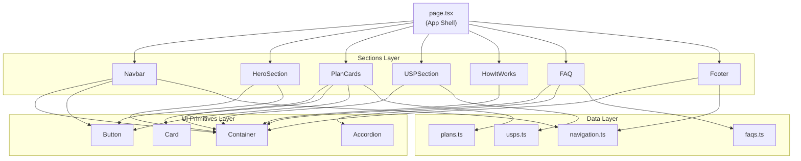

# Architecture Reference

**Audience:** Developers contributing to or maintaining the Vimla.se landing page clone.  
**Prerequisite knowledge:** React, TypeScript, Next.js App Router basics, Tailwind CSS v4.  
**Diátaxis quadrant:** Reference — factual lookup material. For task-oriented guides, see [`../how-to/`](../how-to/).

---

## Table of Contents

1. [System Overview](#1-system-overview)
2. [Dependency Map](#2-dependency-map)
3. [Layer Definitions](#3-layer-definitions)
4. [Component Catalogue](#4-component-catalogue)
5. [Data Model](#5-data-model)
6. [Rendering Model](#6-rendering-model)
7. [Brand Token Reference](#7-brand-token-reference)
8. [Dependency Graph](#8-dependency-graph)
9. [Well-Architected Assessment](#9-well-architected-assessment)
10. [Architectural Decision Records](#10-architectural-decision-records)

---

## 1. System Overview

| Property | Value |
|----------|-------|
| Application type | Static single-page marketing site |
| Framework | Next.js 16 (App Router) |
| Language | TypeScript 5 (strict mode) |
| Styling engine | Tailwind CSS v4 (CSS-native `@theme`) |
| Icon library | lucide-react |
| Content language | Swedish |
| Rendering strategy | Server Components by default; `"use client"` only for interactive nodes |
| Entry point | `app/src/app/page.tsx` |
| Deployment target | Any Node.js host or static export via `next export` |

---

## 2. Dependency Map

```
app/
└── src/
    ├── app/                   # Next.js App Router shell
    │   ├── layout.tsx         # RootLayout — html, lang, metadata, global CSS
    │   ├── page.tsx           # Landing page — composes all section components
    │   └── globals.css        # @theme brand tokens + base body styles
    ├── components/
    │   ├── sections/          # Page-section components (one per visual block)
    │   │   ├── Navbar.tsx
    │   │   ├── HeroSection.tsx
    │   │   ├── PlanCards.tsx
    │   │   ├── USPSection.tsx
    │   │   ├── HowItWorks.tsx
    │   │   ├── FAQ.tsx
    │   │   └── Footer.tsx
    │   └── ui/                # Reusable presentational primitives
    │       ├── Button.tsx
    │       ├── Card.tsx
    │       ├── Accordion.tsx
    │       └── Container.tsx
    └── data/                  # Static typed content — interfaces + arrays
        ├── plans.ts
        ├── usps.ts
        ├── faqs.ts
        └── navigation.ts
```

Allowed import directions:

```
page.tsx  →  sections/  →  ui/
                        →  data/
          →  ui/        →  (no further imports)
          →  data/      →  (no further imports)
```

**Forbidden:** `data/` importing from `components/`, `ui/` importing from `sections/` or `data/`, sections importing each other.

---

## 3. Layer Definitions

| Layer | Location | Responsibility | May import from |
|-------|----------|----------------|-----------------|
| **App shell** | `app/src/app/` | Routing, metadata, global styles, page composition | sections, ui, data |
| **Sections** | `components/sections/` | Full-width page blocks; own their layout and data consumption | ui, data |
| **UI primitives** | `components/ui/` | Stateless (or minimally stateful) presentational atoms | React, lucide-react only |
| **Data** | `data/` | TypeScript interfaces and static content arrays | Nothing (pure TS) |

---

## 4. Component Catalogue

### UI Primitives

#### `Button`

| Prop | Type | Default | Description |
|------|------|---------|-------------|
| `variant` | `"primary" \| "secondary" \| "ghost"` | `"primary"` | Visual style |
| `href` | `string \| undefined` | `undefined` | Renders an `<a>` when provided; `<button>` otherwise |
| `className` | `string` | `""` | Additional Tailwind classes appended after variant classes |
| `...rest` | `ButtonHTMLAttributes` | — | Forwarded to the underlying `<button>` |

Variant classes:

| Variant | Background | Text | Border |
|---------|-----------|------|--------|
| `primary` | `bg-primary` | `text-white` | none |
| `secondary` | `bg-white` | `text-dark` | `border-2 border-primary` |
| `ghost` | transparent | `text-dark` | none |

Rendering rule: when `href` is provided, the component renders `<a href={href}>` with identical classes. No `next/link` — all hrefs are anchor-scroll targets (`#section-id`).

---

#### `Card`

| Prop | Type | Default | Description |
|------|------|---------|-------------|
| `highlight` | `boolean` | `false` | Adds `ring-2 ring-primary` and elevated shadow |
| `className` | `string` | `""` | Additional Tailwind classes |
| `children` | `ReactNode` | — | Card body content |

---

#### `Accordion`

| Prop | Type | Description |
|------|------|-------------|
| `question` | `string` | Header text (always visible) |
| `answer` | `string` | Body text (shown when open) |

- Directive: `"use client"` — owns `useState(false)` for open/closed toggle.
- Chevron rotates 180° via `rotate-180` Tailwind class when open.
- Uses `max-h` transition for smooth open/close animation.

---

#### `Container`

| Prop | Type | Default | Description |
|------|------|---------|-------------|
| `className` | `string` | `""` | Additional classes appended to wrapper |
| `children` | `ReactNode` | — | Content |

Fixed properties: `mx-auto w-full max-w-7xl px-4 sm:px-6 lg:px-8`.

---

### Section Components

| Component | `id` anchor | Background | Client? | Data source |
|-----------|------------|------------|---------|-------------|
| `Navbar` | — | `bg-white/95` sticky | ✅ (`useState`) | `navigation.ts` → `navLinks` |
| `HeroSection` | — (no anchor; CTA links to `#planer`) | `bg-primary-light` | ❌ | none (inline copy) |
| `PlanCards` | `#planer` | `bg-white` | ❌ | `plans.ts` → `plans` |
| `USPSection` | `#om-vimla` | `bg-gray-50` | ❌ | `usps.ts` → `usps` |
| `HowItWorks` | — | `bg-white` | ❌ | inline `steps` array |
| `FAQ` | `#faq` | `bg-gray-50` | ❌ | `faqs.ts` → `faqs` |
| `Footer` | — | `bg-dark` | ❌ | `navigation.ts` → `footerLinkGroups` |

---

## 5. Data Model

### `Plan` (`data/plans.ts`)

| Field | Type | Required | Description |
|-------|------|----------|-------------|
| `id` | `string` | ✅ | Stable React key |
| `name` | `string` | ✅ | Display name (e.g. "Mellan") |
| `dataAmount` | `string` | ✅ | Human-readable data quota (e.g. "15 GB") |
| `price` | `number` | ✅ | Monthly price in SEK |
| `features` | `string[]` | ✅ | Bullet-point feature list |
| `popular` | `boolean` | ❌ | Triggers "Populärast" badge and highlight card ring |

---

### `USP` (`data/usps.ts`)

| Field | Type | Required | Description |
|-------|------|----------|-------------|
| `id` | `string` | ✅ | Stable React key |
| `icon` | `LucideIcon` | ✅ | Icon component reference from `lucide-react` |
| `title` | `string` | ✅ | USP heading |
| `description` | `string` | ✅ | Supporting copy |

---

### `FAQ` (`data/faqs.ts`)

| Field | Type | Required | Description |
|-------|------|----------|-------------|
| `id` | `string` | ✅ | Stable React key |
| `question` | `string` | ✅ | Accordion header |
| `answer` | `string` | ✅ | Accordion body |

---

### `NavLink` (`data/navigation.ts`)

| Field | Type | Description |
|-------|------|-------------|
| `label` | `string` | Link text |
| `href` | `string` | Anchor (`#section`) or relative path |

### `FooterLinkGroup` (`data/navigation.ts`)

| Field | Type | Description |
|-------|------|-------------|
| `title` | `string` | Column heading |
| `links` | `NavLink[]` | Links in this column |

---

## 6. Rendering Model

| Concern | Strategy |
|---------|----------|
| Default component type | React Server Component (RSC) |
| Client components | Only `Navbar` (mobile menu toggle) and `Accordion` (open/close state) |
| Data fetching | None — all content is static TypeScript arrays imported at build time |
| Routing | Single route (`/`). No dynamic segments. |
| Images | None — no `next/image` usage. Logo is styled text. |
| Fonts | System sans-serif stack via CSS variable `--font-sans` in `globals.css` |
| Dark mode | Disabled — `globals.css` contains no `prefers-color-scheme` media query |

---

## 7. Brand Token Reference

Defined in `app/src/app/globals.css` under `@theme inline`. All tokens are available as Tailwind utility classes (e.g. `bg-primary`, `text-dark`).

| CSS Variable | Tailwind Class | Hex Value | Usage |
|-------------|---------------|-----------|-------|
| `--color-primary` | `bg-primary` / `text-primary` | `#3CB371` | Primary brand color — buttons, badges, accents |
| `--color-primary-hover` | `bg-primary-hover` | `#2E9E5E` | Button hover state |
| `--color-primary-light` | `bg-primary-light` | `#E8F5E9` | Hero background, USP icon backgrounds |
| `--color-dark` | `text-dark` | `#2D2D2D` | Primary text color |
| `--color-muted` | `text-muted` | `#6B7280` | Secondary/supporting text |
| `--color-white` | `bg-white` / `text-white` | `#FFFFFF` | Card backgrounds, navbar |
| `--color-gray-50` | `bg-gray-50` | `#F9FAFB` | Alternating section backgrounds |
| `--color-gray-100` | `bg-gray-100` | `#F3F4F6` | Ghost button hover |
| `--color-gray-200` | `border-gray-200` | `#E5E7EB` | Card default ring, dividers |
| `--color-gray-300` | `border-gray-300` | `#D1D5DB` | Subtle borders |
| `--font-sans` | `font-sans` | system-ui stack | Body font |

---

## 8. Dependency Graph



---

## 9. Well-Architected Assessment

Evaluated against five pillars relevant to a static marketing site.

### Operational Excellence

| Check | Status | Notes |
|-------|--------|-------|
| TypeScript strict mode | ✅ Pass | `"strict": true` in `tsconfig.json` |
| ESLint configured | ✅ Pass | `eslint-config-next` via `eslint.config.mjs` |
| Build script defined | ✅ Pass | `npm run build` via `next build` |
| No `any` types in data layer | ✅ Pass | All interfaces are fully typed |
| Consistent naming conventions | ✅ Pass | PascalCase components, camelCase data files |

### Security

| Check | Status | Notes |
|-------|--------|-------|
| No external data fetching | ✅ Pass | No API calls, no user input, no auth |
| No `dangerouslySetInnerHTML` | ✅ Pass | All content rendered via JSX |
| No hardcoded secrets | ✅ Pass | No `.env` usage needed |
| Content Security Policy | ⚠️ Gap | No CSP headers configured in `next.config.ts` — low risk for a static site, but worth adding before production |

### Reliability

| Check | Status | Notes |
|-------|--------|-------|
| No runtime data dependencies | ✅ Pass | Zero fetch calls — page cannot fail due to external service outage |
| TypeScript catches content shape errors | ✅ Pass | Data interfaces enforce required fields at compile time |
| Error boundaries | ⚠️ Gap | No `error.tsx` or `not-found.tsx` in `app/` — acceptable for single-page, add if routes expand |

### Performance Efficiency

| Check | Status | Notes |
|-------|--------|-------|
| Server Components by default | ✅ Pass | Only 2 of 11 components are client components |
| No heavy assets | ✅ Pass | No images, no web fonts, no animations |
| Tailwind v4 CSS-native | ✅ Pass | No JS-in-CSS overhead; purging handled by Tailwind at build |
| `lucide-react` tree-shakeable | ✅ Pass | Only imported icons are bundled |
| `HowItWorks` steps hardcoded in component | ⚠️ Gap | Minor inconsistency with data-driven pattern — steps should move to `data/` |

### Maintainability

| Check | Status | Notes |
|-------|--------|-------|
| Sections are self-contained | ✅ Pass | No cross-section imports |
| Content separated from presentation | ✅ Pass | All copy lives in `data/`, not in JSX |
| UI primitives use variant props | ✅ Pass | No one-off className overrides |
| `USP.icon` couples data layer to lucide-react | ⚠️ Gap | `data/usps.ts` imports `LucideIcon` — the data layer has a dependency on a UI library. Prefer storing icon name as a `string` key and resolving in the component. |

### Summary

| Pillar | Score |
|--------|-------|
| Operational Excellence | ✅ Strong |
| Security | ✅ Acceptable (minor gap) |
| Reliability | ✅ Strong |
| Performance | ✅ Strong (minor gap) |
| Maintainability | ✅ Strong (minor gap) |

**Overall:** Architecture is well-suited for its scope. Three minor gaps identified — none are blockers for current usage.

---

## 10. Architectural Decision Records

### ADR-001: Static data arrays over CMS or API

**Context:** The landing page content (plans, USPs, FAQs) is stable marketing copy that changes infrequently.  
**Decision:** Store all content as typed TypeScript arrays in `src/data/`. No external CMS or API.  
**Consequences:**
- ✅ Zero runtime dependencies — page is fully resilient
- ✅ Content changes go through code review (intentional for a clone project)
- ❌ Non-technical content editors cannot update copy without a code change

---

### ADR-002: Server Components as the default

**Context:** Next.js App Router allows per-component server/client designation.  
**Decision:** All components default to RSC. `"use client"` is added only when `useState` or browser APIs are required.  
**Consequences:**
- ✅ Minimal client-side JavaScript bundle
- ✅ Simpler mental model — no hydration surprises in most components
- ❌ Interactive components (`Navbar`, `Accordion`) cannot directly import server-only modules

---

### ADR-003: Tailwind CSS v4 `@theme` for brand tokens

**Context:** Tailwind v4 replaces `tailwind.config.ts` custom theme extension with CSS-native `@theme` blocks.  
**Decision:** All brand colors and font tokens are defined in `globals.css` under `@theme inline`.  
**Consequences:**
- ✅ Single source of truth for tokens, co-located with global styles
- ✅ No separate config file to maintain for theme values
- ❌ Token values are not importable as TypeScript constants — must use Tailwind class names

---

### ADR-004: Logo as styled text, no image asset

**Context:** The "vimla" wordmark is a simple lowercase logotype.  
**Decision:** Render the logo as `<span>` / `<a>` with `font-extrabold tracking-tight text-primary`.  
**Consequences:**
- ✅ No image asset to manage or optimize
- ✅ Scales perfectly at all sizes, matches brand color automatically
- ❌ Does not precisely match the proprietary typeface used on vimla.se

---

### ADR-005: Codified design system

**Context:** As the project grows, visual consistency (spacing, color pairing, radius, shadows) risks drifting across sections and contributors.  
**Decision:** Document all visual tokens, patterns, constraints, and anti-patterns in a dedicated design system reference (`docs/reference/design-system.md`). Component implementations enforce the system via variant props and shared Tailwind tokens.  
**Consequences:**
- ✅ Single source of truth for look-and-feel decisions
- ✅ New sections/components can be reviewed against documented constraints
- ❌ Requires updating the design system doc when tokens or patterns change
