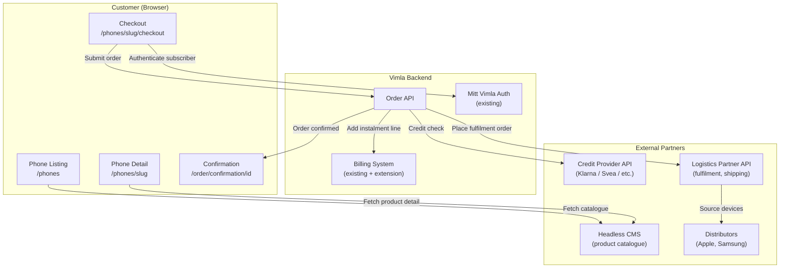
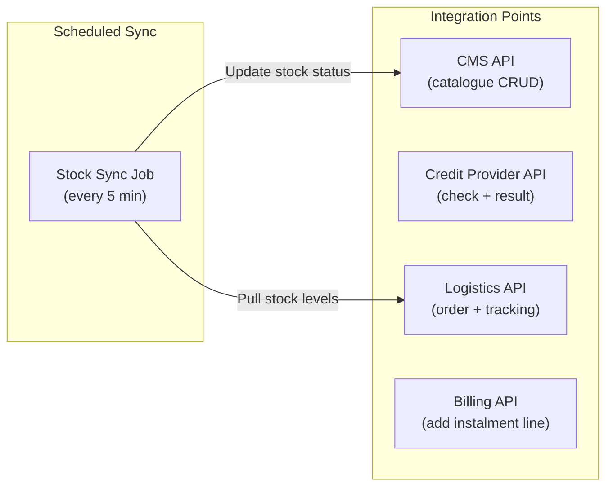
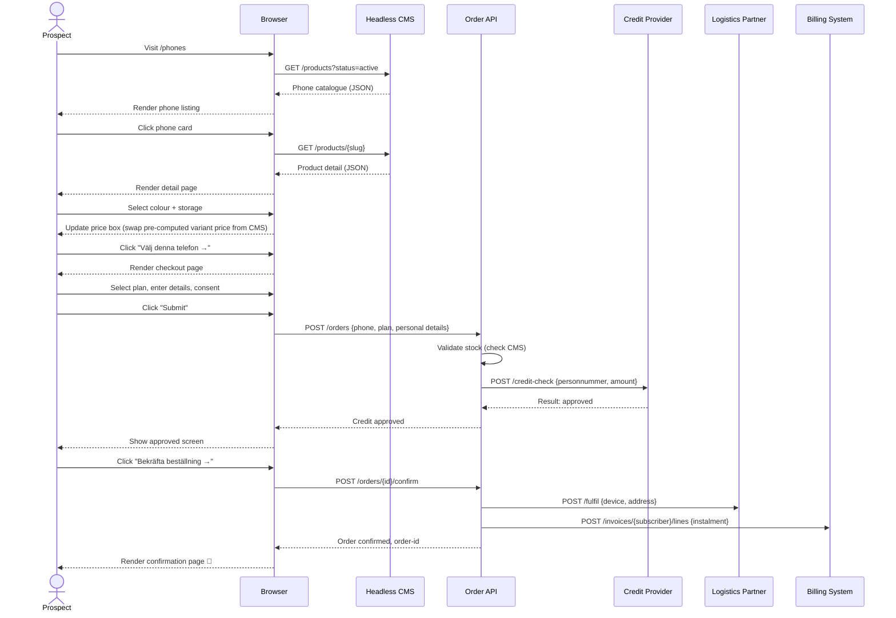
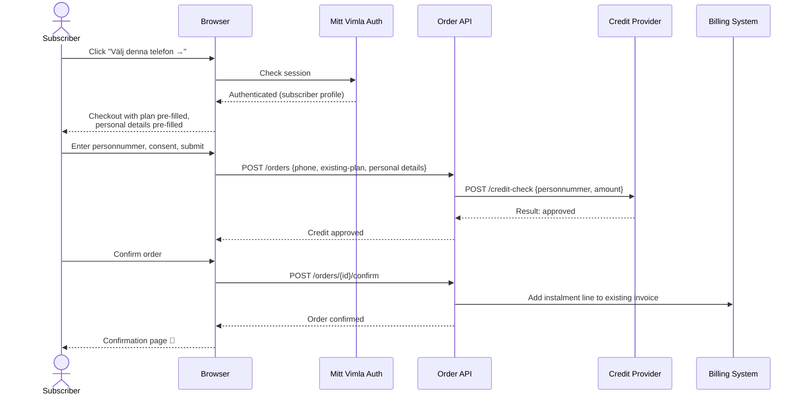
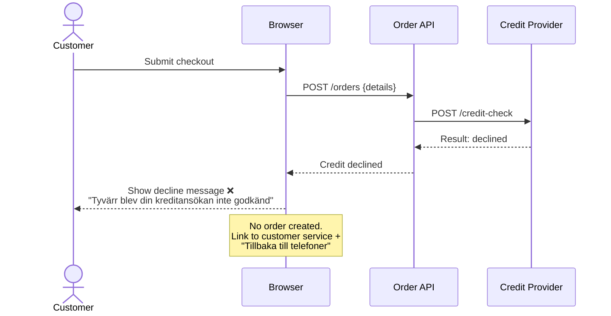
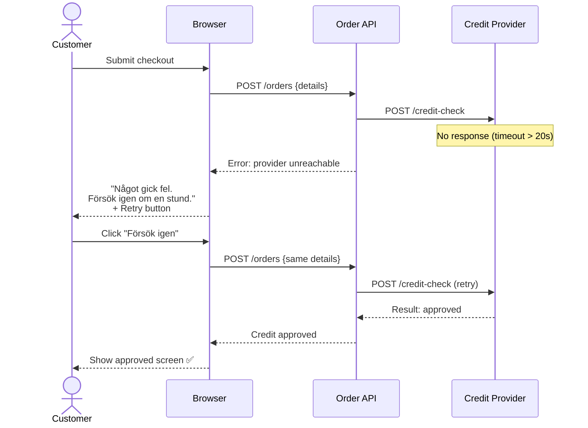

# Solution Design — Vimla Hardware Sales

> **State:** Design
> **Last updated:** 2026-04-08
> **Status:** ⬜ Not Done

---

## Technology Stack

> 📋 This section serves as the **Technology Decisions** artifact defined in the Design state of the project lifecycle.

| Layer | Technology | Rationale |
|-------|-----------|----------|
| **Webshop frontend** | Headless commerce frontend integrated into vimla.se | Reuses existing site infrastructure, brand consistency, SEO continuity |
| **Product catalogue & CMS** | Headless CMS (e.g. Contentful, Sanity, or Storyblok) | Commercial team can manage products without engineering; API-first delivery to frontend |
| **Instalment calculation** | Server-side computation (device price ÷ 36, rounded up) | No client-side financial logic — calculations are authoritative from the server |
| **Credit check & financing** | Third-party provider API (e.g. Klarna, Svea, Collector) | Licensed credit provider handles regulatory compliance, credit risk, and instalment billing |
| **Subscriber authentication** | Existing Mitt Vimla auth (reuse) | No new auth system — leverage existing subscriber login to identify existing customers |
| **Order management** | Backend service / API | Orchestrates checkout: validate stock → call credit provider → create order → trigger fulfilment |
| **Fulfilment & logistics** | Third-party logistics partner API | Handles warehousing, shipping, tracking, returns — Vimla does not hold inventory in Phase 1 |
| **Billing integration** | Extension of existing Vimla billing system | Adds device instalment line item to existing monthly invoice |
| **Monitoring & uptime** | Standard observability stack (e.g. Datadog, Grafana, or equivalent) | Tracks uptime (NFR-403: 99.5%), checkout errors, stock sync failures |

### Why NOT more?

| Intentionally excluded | Reason |
|------------------------|--------|
| Custom-built e-commerce engine | Over-engineered for ~10–15 SKUs; a headless CMS + custom checkout is sufficient and faster to deliver |
| Full shopping cart with multi-item checkout | Phase 1 is single-device purchase only (BR-302: max 1 active instalment). Cart adds complexity with no Phase 1 value |
| Client-side instalment calculation | Financial calculations must be server-authoritative to avoid rounding errors and manipulation |
| Vimla-hosted inventory warehouse | Capital risk and operational complexity; drop-ship / logistics partner model is safer for Phase 1 |
| Custom credit scoring / in-house financing | Regulatory burden (Konsumentkreditlagen) and financial risk — a licensed partner handles both |
| Multiple payment methods (Swish, card, invoice) | Phase 1 is 36-month instalment only. Other methods add integration work without validating the core hypothesis |

---

## Architecture Overview

### Key architectural decisions

1. **Headless CMS for catalogue, custom backend for checkout** — The product browsing experience (listing, detail) is content-driven and suits a CMS. The checkout flow involves credit checks, order orchestration, and billing — this is custom backend logic.

2. **Single-item purchase, no cart** — Phase 1 supports one phone per order, one active instalment per customer (BR-302). A shopping cart is unnecessary complexity. The "checkout" is a direct flow from product selection to order, not a cart-based flow.

3. **Server-side credit check** — The credit check API call is made from the Vimla backend, never from the browser. This protects API credentials (NFR-203) and ensures the credit check result is trustworthy (not client-manipulable).

4. **Logistics partner as fulfilment layer** — Vimla does not hold inventory. Orders are routed to the logistics partner who ships directly from their warehouse. Stock levels are synced from the partner's system.

5. **Billing system extension, not replacement** — The existing billing system is extended to support a new line-item type (device instalment). This avoids the risk and cost of a billing system migration.

---

## Integration Architecture

### Component Inventory

| Component | Type | Responsibility |
|-----------|------|----------------|
| **Site Header (nav update)** | Frontend (existing) | Add "Telefoner" link to existing vimla.se navigation; links to `/phones` |
| **Phone Listing Page** | Frontend (SSR/SSG) | Hero section + fetches active phone models from CMS, renders card grid with filters and sort |
| **Phone Detail Page** | Frontend (SSR/SSG) | Fetches single product from CMS, renders gallery, pickers, price box, specs |
| **Checkout Page** | Frontend (client-side) | Multi-step form: plan selection, personal details, consent, order submission |
| **Order API** | Backend service | Orchestrates: validate stock → credit check → create order → trigger fulfilment → update billing |
| **Stock Sync Job** | Background job | Polls logistics partner for stock levels every 5 minutes, updates CMS product status |
| **Catalogue Admin** | CMS dashboard | Commercial team manages products, pricing, images, stock status, sort order |

---

## Sequence Diagrams

### New Customer: Browse → Checkout → Order

### Existing Subscriber: Checkout with Pre-filled Data

### Credit Check: Declined Flow

### Credit Check: Timeout / Error Flow

---

## Error Handling Strategy

| Scenario | Handling | User Message | Traces to |
|----------|----------|-------------|-----------|
| Credit provider unreachable / timeout (> 20s) | Catch timeout, show error with retry button | "Något gick fel. Försök igen om en stund." | NFR-401, US-404 |
| Credit check returns unknown status | Treat as error, show retry | Same as above | BR-201, edge case #3 |
| Selected phone goes out of stock during checkout | Stock check before credit call; if out of stock, abort | "Tyvärr är [model] inte längre tillgänglig" | BR-401, US-502 |
| Product images fail to load (404/network) | Show placeholder image, page remains functional | No text message — placeholder is visual | NFR-402 |
| CMS unavailable (listing/detail page) | Show cached content if available; if no cache, show error page | "Vi har tekniska problem. Försök igen snart." | NFR-403 |
| Billing system fails to add instalment line | Order is placed, instalment flagged for manual billing follow-up | Confirmation shown normally; billing team alerted | BR-502 |
| Confirmation email fails to send | Order valid, support alert triggered for manual send | Confirmation page shown normally | BR-504 |
| Double-click on submit button | Button disabled on first click, second click ignored | No message — prevented by UI | US-304 edge case |

---

## Constraints & Assumptions

| # | Type | Description | Impact if wrong |
|---|------|-------------|----------------|
| 1 | Constraint | Phase 1: 36-month instalment only, no outright purchase | If customers demand outright purchase, we lose those conversions — but it simplifies the initial build |
| 2 | Constraint | Single-device purchase per order, max 1 active instalment per customer | If multi-device demand is significant, we'll need cart + multi-instalment billing in Phase 2 |
| 3 | Constraint | Vimla does not hold inventory — drop-ship model via logistics partner | If the partner's stock is unreliable, we risk order failures and poor customer experience |
| 4 | Assumption | vimla.se can integrate new pages without a replatform | If not, the project scope and timeline increase substantially |
| 5 | Assumption | Existing Mitt Vimla auth can be reused to identify subscribers in the webshop | If not, a new auth integration is needed — adds 2–4 weeks |
| 6 | Assumption | Credit provider API latency is ≤ 15s for p95 | If higher, checkout abandonment increases — may need async approval via email |
| 7 | Assumption | Billing system supports adding a new line-item type | If not, a billing-system project is a prerequisite — blocks launch |
