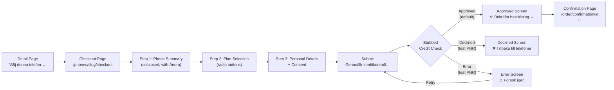
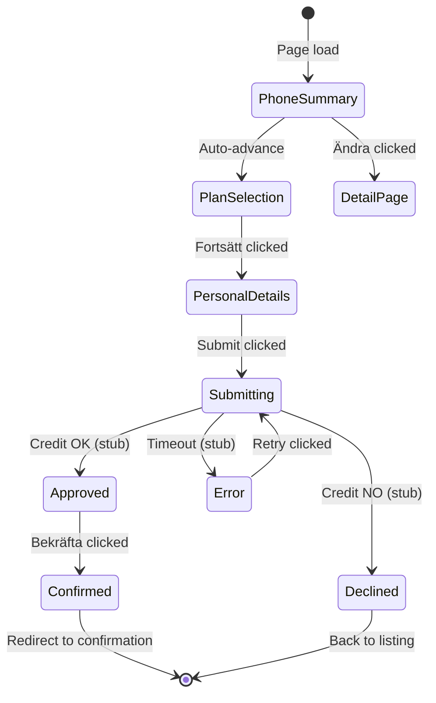
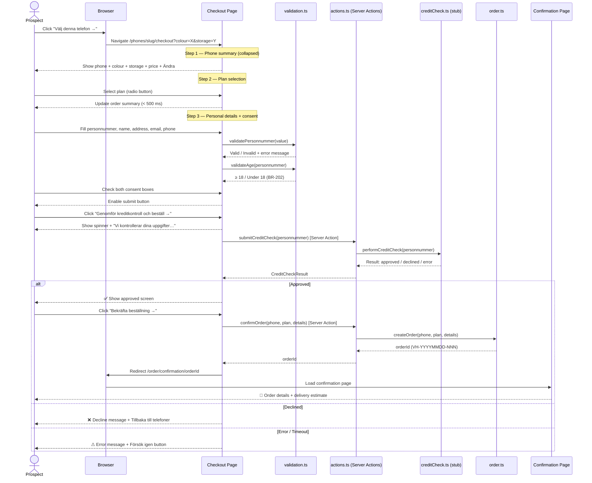
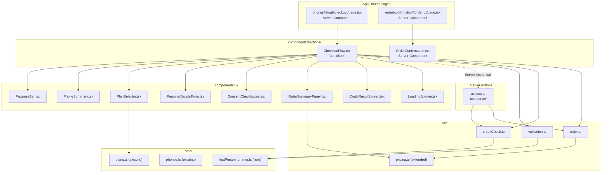

# Detailed Technical Design — Drop 3: Checkout Flow (Stubbed)

> **State:** Build
> **Last updated:** 2026-04-08
> **Drop:** 3 — Checkout Flow (Stubbed)

---

## Overview

Drop 3 delivers the complete checkout flow — from "Välj denna telefon →" on the detail page through plan selection, personal details, stubbed credit check, and order confirmation. The credit check, fulfilment, and billing are **stubbed** (no real external calls). All form validation, business rules, and UI states work end-to-end.

The goal is to prove the **purchase UX** before any live integrations (Drop 4). A visitor can walk through every screen, hit all three credit check outcomes (approved, declined, error), and see a realistic confirmation page — all with zero external dependencies.

---

## Design Decisions

### DD-301: Stubbed credit check via deterministic test personnummer

| Option | Pros | Cons | Decision |
|--------|------|------|----------|
| **Deterministic test personnummer** — specific PNR values trigger approved / declined / error | Testable and reproducible; no randomness; easy to demonstrate all paths; no external dependency | Limited to predefined values; not a real credit check | ✅ **Chosen for Drop 3** |
| Random outcome via Math.random() | Simple | Non-reproducible; flaky tests; poor demo experience | ❌ Rejected |
| External sandbox API from day 1 | Realistic | Adds external dependency to Drop 3 scope; integration issues distract from UX validation | Deferred to Drop 4 |

**Rationale:** The purpose of Drop 3 is to validate the checkout UX, not the credit provider integration. Deterministic test data lets QA, product, and engineering test all three paths (approved, declined, error) reliably and without network dependencies. The same interface will be swapped for the real provider API in Drop 4.

### DD-302: Client-side checkout state vs. multi-page wizard

| Option | Pros | Cons | Decision |
|--------|------|------|----------|
| **Single-page client component with step state** | Smoother UX (no page reloads between steps); simpler state management; form data stays in React state; matches ux.md layout | Requires `"use client"`; larger JS bundle for checkout | ✅ **Chosen** |
| Multi-page wizard (one route per step) | Each step is its own URL; works without JS | Complex state passing between routes; browser back/forward complicates flow; loses form data on navigation | ❌ Rejected |

**Rationale:** The checkout is inherently interactive (form input, validation, loading states, credit check result). A single client component with internal step state matches the ux.md wireframes and provides the smoothest experience. The checkout page is the only page that needs heavy client-side logic — the rest of the site remains Server Components.

### DD-303: Order storage in Drop 3 (stubbed)

| Option | Pros | Cons | Decision |
|--------|------|------|----------|
| **In-memory order store (module-level Map)** | Zero infrastructure; confirmation page can look up order by ID; testable | Orders lost on server restart; not persistent | ✅ **Chosen for Drop 3** |
| localStorage | Persistent across refreshes | Client-only; can't be used from Server Components; PII in browser storage violates NFR-202 | ❌ Rejected |
| Database from day 1 | Persistent, production-ready | Adds infrastructure scope to Drop 3; distracts from UX validation | Deferred to Drop 4 |

**Rationale:** Drop 3 needs just enough order storage to render the confirmation page. An in-memory Map keyed by order ID is sufficient. The `order.ts` module exports a `createOrder()` function that generates the order ID (BR-501), stores the order, and returns the ID. Drop 4 replaces this with a database-backed implementation behind the same interface.

**Implementation note:** In Next.js production, module-level variables are not reliably shared across requests (due to worker processes, edge runtime, and module-scope isolation). The order store must be attached to `globalThis` to ensure a single shared instance per server process:

```typescript
const globalStore = globalThis as unknown as { __orderStore?: Map<string, Order> };
globalStore.__orderStore ??= new Map<string, Order>();
const orderStore = globalStore.__orderStore;
```

This pattern is a known workaround for development/staging; Drop 4 replaces it with a proper database.

### DD-304: Validation strategy

| Option | Pros | Cons | Decision |
|--------|------|------|----------|
| **Custom validation functions in `lib/validation.ts`** | Zero dependencies; tailored to Swedish formats (personnummer, phone); testable; follows existing `lib/` pattern | Must write regex patterns manually | ✅ **Chosen** |
| Zod / Yup schema library | Declarative; ecosystem-standard | Adds dependency; overkill for 5 fields; unfamiliar to project pattern | ❌ Rejected |
| HTML5 native validation only | Zero JS | Cannot implement BR-202 age check or custom personnummer format; poor UX | ❌ Rejected |

**Rationale:** The checkout form has 5 fields with Swedish-specific formats. Custom validation functions in `lib/validation.ts` keep the codebase dependency-free, are unit-testable, and follow the existing `lib/pricing.ts` + `lib/catalogue.ts` pattern.

### DD-305: Server Actions for credit check and order creation

| Option | Pros | Cons | Decision |
|--------|------|------|----------|
| **Server Actions (`"use server"` functions in `actions.ts`)** | Co-located with checkout page; no API route boilerplate; Next.js handles serialisation; server-only modules (`creditCheck.ts`, `order.ts`) stay on the server | Requires Next.js 14+ (we use 16); limited to POST semantics | ✅ **Chosen** |
| API Route Handlers (`app/api/…/route.ts`) | Standard REST endpoints; reusable from external clients | Extra boilerplate; manual request/response handling; no type safety across client/server boundary | ❌ Rejected |
| Direct import from `"use client"` component | Simplest code | **Breaks in production** — server-only modules (`creditCheck.ts`, `order.ts`) cannot be imported into client bundles. Tree-shaking would fail or expose secrets | ❌ Rejected |

**Rationale:** `CheckoutFlow.tsx` is a `"use client"` component. It cannot directly import server-only modules like `creditCheck.ts` and `order.ts` because the Next.js bundler would attempt to include them in the client bundle. Server Actions provide a clean RPC-style boundary: the `"use server"` functions in `actions.ts` are callable from the client component but execute exclusively on the server. This keeps PII (personnummer) server-side and aligns with NFR-202.

---

## Checkout Flow — End-to-End



---

## Checkout State Machine



---

## Sequence Diagram — New Customer Checkout (Stubbed)



---

## Component Architecture — Drop 3



---

## Data Layer

### New file: `app/src/data/testPersonnummer.ts`

```typescript
/**
 * Deterministic test personnummer values for the stubbed credit check (Drop 3).
 *
 * These values control the credit check outcome in the stub. Any personnummer
 * NOT listed here is treated as "approved" (the happy path).
 *
 * Removed in Drop 4 when the real credit provider API replaces the stub.
 *
 * Traces to: US-401, US-403, US-404, Drop 3 scope
 */

/** Personnummer that triggers a "declined" credit check result */
export const DECLINED_PERSONNUMMER = "199001019999";

/** Personnummer that triggers an "error / timeout" credit check result */
export const ERROR_PERSONNUMMER = "199001018888";
```

### Existing file: `app/src/data/plans.ts` — No changes

The existing `Plan` interface and `plans` array are consumed as-is by the `PlanSelector` component. No schema changes needed.

### Existing file: `app/src/data/phones.ts` — No changes

The existing `Phone`, `PhoneVariant`, and `PhoneColour` interfaces are consumed as-is. The checkout page receives the phone via slug lookup from the existing catalogue utilities.

---

## Library Layer

### New file: `app/src/lib/validation.ts`

```typescript
/**
 * Form validation utilities for the checkout flow.
 *
 * Each validator returns { valid: boolean; error?: string }.
 * Error messages are in Swedish (matching the UI language).
 *
 * Traces to: FR-305, FR-306, FR-308, BR-202, BR-203, US-303
 */

export interface ValidationResult {
  valid: boolean;
  error?: string;
}

/** The shape of the checkout form fields — used across CheckoutFlow, validation, and Server Actions. */
export interface CheckoutFormFields {
  personnummer: string;
  name: string;
  address: string;
  email: string;
  phone: string;
}

/**
 * Validate Swedish personnummer format: YYYYMMDD-XXXX or YYYYMMDDXXXX
 * Does NOT verify the Luhn checksum — that's the credit provider's job.
 */
export function validatePersonnummer(value: string): ValidationResult;

/**
 * Check if the person is at least 18 years old based on personnummer.
 * Returns invalid with BR-202 error message if under 18.
 * Edge case: person turning 18 today is allowed (BR-202 edge case #4).
 */
export function validateAge(personnummer: string): ValidationResult;

/**
 * Validate that a required text field is non-empty after trimming.
 */
export function validateRequired(value: string, fieldName: string): ValidationResult;

/**
 * Validate email format (basic RFC 5322 subset).
 */
export function validateEmail(value: string): ValidationResult;

/**
 * Validate Swedish phone number format (07X-XXX XX XX variants).
 */
export function validatePhone(value: string): ValidationResult;

/**
 * Validate the full checkout form. Returns a map of field → ValidationResult.
 */
export function validateCheckoutForm(fields: CheckoutFormFields): Record<string, ValidationResult>;
```

### New file: `app/src/lib/creditCheck.ts`

```typescript
/**
 * Stubbed credit check for Drop 3.
 *
 * Simulates a credit provider API call with a 2-second delay.
 * Outcome is determined by the personnummer:
 *   - DECLINED_PERSONNUMMER → "declined"
 *   - ERROR_PERSONNUMMER   → "error"
 *   - All other values     → "approved"
 *
 * Drop 4 replaces this with a real server-side API call to the
 * credit provider, behind the same CreditCheckResult interface.
 *
 * Traces to: FR-309, FR-401, FR-403, NFR-401, US-304, US-401, US-403, US-404
 */

import { DECLINED_PERSONNUMMER, ERROR_PERSONNUMMER } from "@/data/testPersonnummer";

export type CreditCheckStatus = "approved" | "declined" | "error";

export interface CreditCheckResult {
  status: CreditCheckStatus;
  message?: string;
}

/**
 * Perform a stubbed credit check. Returns a promise that resolves
 * after a simulated 2-second delay.
 *
 * @param personnummer — the customer's Swedish personal ID
 * @returns CreditCheckResult with status and optional message
 */
export async function performCreditCheck(personnummer: string): Promise<CreditCheckResult>;
```

### New file: `app/src/lib/order.ts`

```typescript
/**
 * Order creation and storage for Drop 3 (stubbed).
 *
 * Orders are stored in an in-memory Map — lost on server restart.
 * Drop 4 replaces this with a database-backed implementation.
 *
 * Traces to: FR-402, FR-404, BR-501, BR-104, US-402
 */

import type { Phone, PhoneVariant, PhoneColour } from "@/data/phones";
import type { Plan } from "@/data/plans";

export interface OrderDetails {
  phone: Phone;
  variant: PhoneVariant;
  colour: PhoneColour;
  plan: Plan;
  personalDetails: {
    personnummer: string;
    name: string;
    address: string;
    email: string;
    phone: string;
  };
}

export interface Order extends OrderDetails {
  orderId: string;              // Format: VH-YYYYMMDD-NNN — BR-501
  createdAt: Date;
  monthlyInstalment: number;    // Device instalment — BR-101
  monthlySubscription: number;  // Plan price
  totalMonthly: number;         // instalment + subscription — BR-104
  totalDeviceCost: number;      // instalment × 36 — BR-103
  deliveryEstimate: string;     // "1–3 arbetsdagar"
}

/**
 * Generate an order ID in format VH-YYYYMMDD-NNN — BR-501.
 * Counter extends to 4+ digits if > 999 orders in a day — BR-501 edge case #6.
 */
export function generateOrderId(): string;

/**
 * Create and store an order. Returns the full Order object
 * including the generated order ID and computed totals.
 */
export function createOrder(details: OrderDetails): Order;

/**
 * Retrieve a stored order by its ID.
 * Returns undefined if the order doesn't exist.
 */
export function getOrder(orderId: string): Order | undefined;
```

### Extended file: `app/src/lib/pricing.ts`

```typescript
// ── Existing (unchanged) ────────────────────────────────────────────

export const INSTALMENT_MONTHS = 36;
export function calculateInstalment(retailPrice: number): number;
export function calculateTotalCost(instalmentPrice: number): number;

// ── New for Drop 3 ──────────────────────────────────────────────────

/**
 * Calculate the combined monthly cost: device instalment + subscription.
 * Used in the order summary panel — BR-104.
 */
export function calculateCombinedMonthly(instalmentPrice: number, subscriptionPrice: number): number;
```

---

## Component Structure

### New Files — Drop 3

```
app/src/
├── app/
│   ├── phones/
│   │   └── [slug]/
│   │       └── checkout/
│   │           ├── page.tsx                # Checkout page — US-301
│   │           ├── actions.ts              # Server Actions — DD-305
│   │           ├── not-found.tsx           # 404 for invalid slug — FR-208
│   │           └── loading.tsx             # Skeleton while data loads
│   └── order/
│       └── confirmation/
│           └── [orderId]/
│               ├── page.tsx                # Order confirmation page — US-402
│               └── not-found.tsx           # 404 for invalid order ID — FR-404
├── components/
│   ├── sections/
│   │   ├── CheckoutFlow.tsx                # Client component: checkout state machine — US-301–US-404
│   │   └── OrderConfirmation.tsx           # Server component: order details display — US-402
│   └── ui/
│       ├── ProgressBar.tsx                 # 4-step progress indicator — FR-301
│       ├── PhoneSummary.tsx                # Collapsed phone summary with Ändra — FR-302
│       ├── PlanSelector.tsx                # Radio-button plan list — FR-303
│       ├── PersonalDetailsForm.tsx         # 5-field form with validation — FR-305
│       ├── ConsentCheckboxes.tsx           # 2 required checkboxes — FR-306
│       ├── OrderSummaryPanel.tsx           # Sticky sidebar / bottom bar — FR-307
│       ├── CreditResultScreen.tsx          # Approved / Declined / Error screens — FR-401, FR-403
│       └── LoadingSpinner.tsx              # Spinner with message — FR-309
├── data/
│   └── testPersonnummer.ts                 # Test PNR values for stub — Drop 3
└── lib/
    ├── validation.ts                       # Form validation — FR-305, BR-202
    ├── creditCheck.ts                      # Stubbed credit check — FR-309
    └── order.ts                            # Order creation + storage — FR-402, BR-501
```

### Modified Files — Drop 3

| File | Change | Traces to |
|------|--------|-----------|
| `lib/pricing.ts` | Add `calculateCombinedMonthly()` function | BR-104, FR-307 |
| `components/sections/PhoneDetail.tsx` | Update CTA button `href` to pass `colour` + `storage` as URL search params to checkout page | FR-208, US-301 AC-1 |

### New file: `app/src/app/phones/[slug]/checkout/actions.ts` (Server Actions)

```typescript
"use server";

import { performCreditCheck, type CreditCheckResult } from "@/lib/creditCheck";
import { createOrder, type OrderDetails, type Order } from "@/lib/order";
import { validateCheckoutForm, type CheckoutFormFields } from "@/lib/validation";

/**
 * Server Action: submit a credit check.
 * Called from CheckoutFlow (client component) — executes on the server.
 * Validates the personnummer server-side, then delegates to the stub.
 */
export async function submitCreditCheck(personnummer: string): Promise<CreditCheckResult> {
  // Server-side validation (defence-in-depth — client validates first)
  // ...
  return performCreditCheck(personnummer);
}

/**
 * Server Action: create a confirmed order.
 * Called from CheckoutFlow after the "Bekräfta beställning →" click.
 * Returns the generated order ID for client-side redirect.
 */
export async function confirmOrder(details: OrderDetails): Promise<{ orderId: string }> {
  const order = createOrder(details);
  return { orderId: order.orderId };
}
```

**Traces to:** DD-305, FR-309, FR-402, US-304, US-401

---

## Component Design

### `phones/[slug]/checkout/page.tsx` (Server Component — Page)

**Responsibility:** Server-side data loading and page composition for the checkout route.

**Data loading:**
1. Resolve phone from `slug` param using `findBySlug(phones, slug)` → 404 if invalid/inactive
2. Parse `colour` and `storage` from URL search params
3. Derive initial variant and colour from search params (fall back to defaults)
4. Pass `phone`, `initialColour`, `initialVariant`, `plans` as props to `CheckoutFlow`

**Composition:**
1. `<Navbar />` (minimal — logo only per ux.md checkout wireframe)
2. `<CheckoutFlow phone={phone} initialColour={…} initialVariant={…} plans={plans} />`

**Traces to:** FR-208, FR-301, US-301

---

### `CheckoutFlow.tsx` (Client Component — `"use client"`)

**Props:**
- `phone: Phone`
- `initialColour: PhoneColour`
- `initialVariant: PhoneVariant`
- `plans: Plan[]`

**State:**

| State variable | Type | Initial value | Purpose |
|---------------|------|---------------|---------|
| `step` | `1 \| 2 \| 3 \| "submitting" \| "approved" \| "declined" \| "error"` | `2` (Step 1 is always collapsed) | Tracks current checkout step |
| `selectedPlan` | `Plan \| null` | `null` | User's plan selection — FR-303 |
| `formFields` | `CheckoutFormFields` | All empty strings | Personal details — FR-305 |
| `formErrors` | `Record<string, string>` | Empty object | Inline validation errors |
| `consents` | `{ terms: boolean; credit: boolean }` | Both `false` | Consent checkboxes — FR-306 |
| `creditResult` | `CreditCheckResult \| null` | `null` | Result from stub — FR-401/403 |
| `orderId` | `string \| null` | `null` | Generated on confirm — BR-501 |
| `isSubmitting` | `boolean` | `false` | Loading state guard — FR-309 |

**Behaviour:**

1. **Step 1 (Phone Summary):** Always rendered as collapsed summary. Shows `PhoneSummary` with phone model, colour, storage, instalment price, and "Ändra" link back to detail page.

2. **Step 2 (Plan Selection):** Renders `PlanSelector` with radio buttons for all plans. Selecting a plan updates `selectedPlan` and the `OrderSummaryPanel` within 500 ms (FR-307). A "Fortsätt till personuppgifter →" button appears below the plan selector once a plan is selected. Clicking the button advances to Step 3. (No auto-advance — user controls the pace.)

3. **Step 3 (Personal Details):** Renders `PersonalDetailsForm` + `ConsentCheckboxes`. Inline validation on blur using `lib/validation.ts`. Submit button (`"Genomför kreditkontroll och beställ →"`) is disabled until all fields valid + both consents checked (FR-308).

4. **Submitting:** Calls the `submitCreditCheck` Server Action (from `actions.ts`) which invokes `performCreditCheck(personnummer)` server-side. Shows `LoadingSpinner` with "Vi kontrollerar dina uppgifter…". Button disabled to prevent double-click (US-304 edge case). A `beforeunload` event handler is registered while `isSubmitting === true` to warn the user if they try to navigate away during the credit check.

5. **Approved:** Renders `CreditResultScreen` variant="approved" with order summary, delivery estimate, and "Bekräfta beställning →" button. On confirm click: calls the `confirmOrder` Server Action (from `actions.ts`) which invokes `createOrder()` server-side, returns the `orderId`, and the client calls `router.push(`/order/confirmation/${orderId}`)` to redirect.

6. **Declined:** Renders `CreditResultScreen` variant="declined" with empathetic message, customer service link, and "Tillbaka till telefoner" link.

7. **Error:** Renders `CreditResultScreen` variant="error" with "Något gick fel" message and "Försök igen" button that re-triggers the credit check with same data.

**Traces to:** US-301–US-404, FR-301–FR-309, FR-401–FR-405

---

### `ProgressBar.tsx` (UI Primitive)

**Props:**
- `currentStep: number` (1–4)
- `completedSteps: number[]`

**Renders:**
- Horizontal 4-step bar: Välj telefon → Abonnemang → Dina uppgifter → Bekräfta
- Completed steps: filled circle (●) + label, interactive (clickable to go back)
- Active step: filled circle + bold label, not clickable
- Upcoming steps: outlined circle (○) + muted label, not clickable
- Responsive: horizontal on desktop, remains horizontal on mobile (compact labels)

**Accessibility:**
- `role="navigation"` with `aria-label="Kassasteg"`
- Each step: `aria-current="step"` for current, `aria-disabled="true"` for upcoming

**Traces to:** FR-301, ux.md progress bar wireframe

---

### `PhoneSummary.tsx` (UI Primitive)

**Props:**
- `phone: Phone`
- `colour: PhoneColour`
- `variant: PhoneVariant`
- `detailPageUrl: string`

**Renders:**
- Collapsed row: `[image] iPhone 17 Pro · Titan Natur · 256 GB · 399 kr/mån [Ändra]`
- "Ändra" is a link back to the detail page with colour + storage preserved
- Subtle border, rounded corners, compact layout

**Traces to:** FR-302, US-301 AC-2, US-301 AC-3

---

### `PlanSelector.tsx` (UI Primitive)

**Props:**
- `plans: Plan[]`
- `selectedPlanId: string | null`
- `onPlanChange: (plan: Plan) => void`

**Renders:**
- Radio-button list, one per plan
- Each option shows: plan name, data allowance (GB), monthly price (kr/mån)
- Plan with `popular: true` gets a "Populärast" badge
- Selected plan: highlighted border + filled radio
- Keyboard accessible: arrow keys navigate between options

**Accessibility:**
- `role="radiogroup"` with `aria-label="Välj abonnemang"`
- Each option: `role="radio"`, `aria-checked`

**Traces to:** FR-303, FR-307, US-302

---

### `PersonalDetailsForm.tsx` (UI Primitive)

**Props:**
- `fields: CheckoutFormFields`
- `errors: Record<string, string>`
- `onChange: (field: string, value: string) => void`
- `onBlur: (field: string) => void`

**Renders:**
- 5 fields in a vertical stack:

| Field | Label | Type | Validation | Error message |
|-------|-------|------|-----------|---------------|
| `personnummer` | Personnummer | text | YYYYMMDD-XXXX format, ≥ 18 years (BR-202) | "Ange ett giltigt personnummer (YYYYMMDD-XXXX)" / "Du måste vara minst 18 år för att ansöka om delbetalning" |
| `name` | Namn | text | Non-empty | "Ange ditt namn" |
| `address` | Adress | text | Non-empty | "Ange din adress" |
| `email` | E-post | email | Valid email format | "Ange en giltig e-postadress" |
| `phone` | Telefon | tel | Swedish phone format | "Ange ett giltigt telefonnummer" |

- All fields marked as required (asterisk)
- Inline error: red border + red text below field on blur
- Valid field: green checkmark inside field
- Focus: brand-colour border

**Accessibility:**
- Each field has `<label>` with `htmlFor`
- Errors linked via `aria-describedby`
- Required fields: `aria-required="true"`

**Traces to:** FR-305, FR-308, US-303, BR-202

---

### `ConsentCheckboxes.tsx` (UI Primitive)

**Props:**
- `consents: { terms: boolean; credit: boolean }`
- `onChange: (field: "terms" | "credit", checked: boolean) => void`

**Renders:**
- Two checkboxes:
  1. "Jag godkänner <a href='#'>villkoren</a> för 36 mån delbetalning" — "villkoren" is rendered as an inline hyperlink (underlined, opens terms page or `#` placeholder in Drop 3). Clicking the link does **not** toggle the checkbox.
  2. "Jag godkänner kreditupplysning"
- Unchecked: empty box. Checked: filled with checkmark
- Both must be checked before submit button activates (BR-203)

**Traces to:** FR-306, BR-203, US-303

---

### `OrderSummaryPanel.tsx` (UI Primitive)

**Props:**
- `phone: Phone`
- `variant: PhoneVariant`
- `plan: Plan | null`
- `isSubmitEnabled: boolean`
- `isSubmitting: boolean`
- `onSubmit: () => void`

**Renders:**
- Title: "Din beställning"
- Phone line: `{phone.name} {variant.storage}` — `{variant.instalmentPrice} kr/mån`
- Plan line (if selected): `{plan.name} {plan.dataAmount}` — `{plan.price} kr/mån`
- Divider
- Total: `Totalt per månad: {instalment + subscription} kr/mån` — BR-104
- Subtext: "(i 36 månader)"
- Delivery: `Frakt: 0 kr`
- Submit button: "Genomför kreditkontroll och beställ →"
  - Disabled (grey, `cursor: not-allowed`) until `isSubmitEnabled` — FR-308
  - Submitting: replaced with `LoadingSpinner` — FR-309

**Layout:**
- Desktop (≥ 1024px): sticky sidebar (`position: sticky; top: 2rem`)
- Mobile (< 1024px): sticky bottom bar, collapsed by default, tap to expand

**Update timing:** Within 500 ms of plan change — FR-307

**Traces to:** FR-307, FR-308, FR-309, BR-104, ux.md order summary wireframe

---

### `CreditResultScreen.tsx` (UI Primitive)

**Props:**
- `variant: "approved" | "declined" | "error"`
- `orderSummary?: { phone, variant, plan, totalMonthly }` (for approved)
- `onConfirm?: () => void` (for approved)
- `onRetry?: () => void` (for error)

**Renders (variant-dependent):**

| Variant | Icon | Heading | Content | CTA |
|---------|------|---------|---------|-----|
| `approved` | ✅ | "Din kreditkontroll är godkänd!" | Order summary, delivery estimate "1–3 arbetsdagar" | "Bekräfta beställning →" |
| `declined` | ❌ | "Tyvärr blev din kreditansökan inte godkänd." | Empathetic message, customer service link | "Tillbaka till telefoner" (link to `/phones`) |
| `error` | ⚠️ | "Något gick fel." | "Försök igen om en stund." | "Försök igen" (button, triggers `onRetry`) |

**Traces to:** FR-401, FR-403, NFR-401, US-401, US-403, US-404

---

### `LoadingSpinner.tsx` (UI Primitive)

**Props:**
- `message: string`

**Renders:**
- Centred spinner animation (CSS `animate-spin` on circle SVG)
- Message text below: e.g. "Vi kontrollerar dina uppgifter…"
- `role="status"`, `aria-live="assertive"` for screen readers

**Traces to:** FR-309, ux.md loading state wireframe

---

### `order/confirmation/[orderId]/page.tsx` (Server Component — Page)

**Data loading:**
1. Resolve order from `orderId` param using `getOrder(orderId)` from `lib/order.ts`
2. If order not found → 404

**Composition:**
1. `<Navbar />` (minimal — logo only)
2. `<OrderConfirmation order={order} />`

**Traces to:** FR-404, FR-405, US-402

---

### `OrderConfirmation.tsx` (Section Component — Server Component)

**Props:** `order: Order`

**Renders:**
- 🎉 icon
- Heading: "Tack för din beställning!"
- Order number: `{order.orderId}` (displayed prominently)
- Order details box:
  - Phone: `{phone.name} · {variant.storage} · {colour.name}`
  - Plan: `{plan.name} {plan.dataAmount}`
  - Monthly breakdown: `Telefon: {instalment} kr/mån × 36 mån`
  - Total device cost: `Totalt: {totalDeviceCost} kr`
  - Subscription: `Abonnemang: {plan.price} kr/mån`
  - **Total monthly:** `Totalt/mån: {totalMonthly} kr/mån`
- Delivery address: `{order.personalDetails.address}`
- Delivery estimate: `Beräknad leverans: 1–3 arbetsdagar`
- Email note: `Vi har skickat en bekräftelse till {order.personalDetails.email}`
- Ångerrätt placeholder: "Du har 14 dagars ångerrätt enligt distansavtalslagen." (static text — no cancellation flow in Drop 3; full implementation in Drop 5)
- CTA: "Gå till Mitt Vimla →" (link to `#` — no real auth in Drop 3)

**Data attributes:** All CTA buttons and key sections include `data-analytics-section` and `data-analytics-action` attributes for future instrumentation (e.g. `data-analytics-section="confirmation"`, `data-analytics-action="go-to-mitt-vimla"`).

**Traces to:** FR-404, FR-405, BR-104, BR-501, US-402

---

## URL Structure

| URL | Component | Drop | Notes |
|-----|-----------|------|-------|
| `/phones` | Phone listing page | Drop 1 ✅ | Existing |
| `/phones/<slug>` | Phone detail page | Drop 2 ✅ | Existing |
| `/phones/<slug>/checkout` | Checkout page | **Drop 3** | New — colour + storage passed as search params |
| `/order/confirmation/<orderId>` | Order confirmation | **Drop 3** | New — orderId generated by `lib/order.ts` |

**Search params on checkout URL:**
- `colour` — selected colour name (URL-encoded)
- `storage` — selected storage capacity (e.g. "256 GB")

Example: `/phones/iphone-17-pro/checkout?colour=Titan%20Natur&storage=256%20GB`

---

## Modified File: `PhoneDetail.tsx`

The CTA button currently links to `/phones/<slug>/checkout` which 404s. In Drop 3, it must pass the selected colour and storage as URL search params:

**Before (Drop 2):**
```tsx
<Link href={`/phones/${phone.slug}/checkout`}>
  Välj denna telefon →
</Link>
```

**After (Drop 3):**
```tsx
<Link
  href={`/phones/${phone.slug}/checkout?colour=${encodeURIComponent(currentColour.name)}&storage=${encodeURIComponent(currentVariant.storage)}`}
>
  Välj denna telefon →
</Link>
```

**Traces to:** FR-208, US-301 AC-1

---

## Business Rule Enforcement — Drop 3

| Rule | Enforcement | Location |
|------|-------------|----------|
| **BR-101** (instalment = ceil(price ÷ 36)) | Existing — variant prices pre-computed in `data/phones.ts` | `data/phones.ts`, `lib/pricing.ts` |
| **BR-103** (total = instalment × 36) | Existing — `calculateTotalCost()` | `lib/pricing.ts` |
| **BR-104** (combined = instalment + subscription) | New — `calculateCombinedMonthly()` used in `OrderSummaryPanel` and `OrderConfirmation` | `lib/pricing.ts`, `OrderSummaryPanel.tsx`, `OrderConfirmation.tsx` |
| **BR-201** (credit check mandatory) | `CheckoutFlow` always calls `performCreditCheck()` before order creation | `CheckoutFlow.tsx`, `lib/creditCheck.ts` |
| **BR-202** (must be ≥ 18) | `validateAge()` in `lib/validation.ts`, checked on personnummer blur and pre-submit | `lib/validation.ts`, `PersonalDetailsForm.tsx` |
| **BR-203** (both consents required) | Submit button disabled unless `consents.terms && consents.credit` | `CheckoutFlow.tsx`, `ConsentCheckboxes.tsx` |
| **BR-204** (two-step confirmation) | Credit approval shows "Bekräfta beställning →" — order only created on explicit confirm click | `CheckoutFlow.tsx`, `CreditResultScreen.tsx` |
| **BR-205** (declined → no order) | When status is "declined", `createOrder()` is never called | `CheckoutFlow.tsx` |
| **BR-302** (single instalment guard) | Stubbed in Drop 3 — always passes (no existing instalment data). Real check in Drop 4 | `lib/creditCheck.ts` — noted as stub |
| **BR-501** (order ID format) | `generateOrderId()` produces `VH-YYYYMMDD-NNN` with auto-extending counter | `lib/order.ts` |

---

## Stubbed Credit Check — Test Personnummer Matrix

| Personnummer | Outcome | Purpose | Traces to |
|-------------|---------|---------|-----------|
| `199001019999` | Declined | Test the decline flow (❌ screen) | US-403, FR-403 |
| `199001018888` | Error / Timeout | Test the error flow (⚠ screen + retry) | US-404, NFR-401 |
| Any other valid PNR | Approved | Happy path (✅ → confirm → 🎉) | US-401, FR-401 |

The stub introduces a 2-second `setTimeout` delay to simulate real credit check latency and test the loading state (spinner + "Vi kontrollerar dina uppgifter…").

---

## Form Validation Rules

| Field | Rule | Regex / Logic | Error message (Swedish) |
|-------|------|--------------|------------------------|
| `personnummer` | Must match YYYYMMDD-XXXX format with plausible date | `/^(\d{4})(0[1-9]|1[0-2])(0[1-9]|[12]\d|3[01])-?\d{4}$/` | "Ange ett giltigt personnummer (YYYYMMDD-XXXX)" |
| `personnummer` | Person must be ≥ 18 years old (BR-202) | Parse YYYYMMDD, compare to today | "Du måste vara minst 18 år för att ansöka om delbetalning" |
| `name` | Non-empty after trim | `value.trim().length > 0` | "Ange ditt namn" |
| `address` | Non-empty after trim | `value.trim().length > 0` | "Ange din adress" |
| `email` | Valid email format | `/^[^\s@]+@[^\s@]+\.[^\s@]+$/` | "Ange en giltig e-postadress" |
| `phone` | Swedish phone format | `/^(?:\+46|0)7\d{8}$/` — input is **normalised first** (strip spaces, dashes, dots) before applying regex | "Ange ett giltigt telefonnummer" |

Validation trigger: on field blur (inline) + on submit attempt (all fields).

---

## Responsive Layout — Drop 3

### Checkout Page

| Breakpoint | Layout | Order Summary |
|------------|--------|---------------|
| ≥ 1024px | Two-column: form left, order summary sticky sidebar right | Sticky sidebar (`position: sticky; top: 2rem`) |
| 768px–1023px | Single column, order summary below form steps | Static below form |
| < 768px | Single column, order summary as sticky bottom bar | Sticky bottom bar, collapsed by default, tap to expand |

### Confirmation Page

| Breakpoint | Layout |
|------------|--------|
| ≥ 768px | Centred card with max-width 640px |
| < 768px | Full-width with side padding |

---

## Accessibility — Drop 3

| Element | Implementation | Traces to |
|---------|---------------|-----------|
| Progress bar | `role="navigation"`, `aria-label="Kassasteg"`, `aria-current="step"` on active step | NFR-302 |
| Plan selector | `role="radiogroup"`, `aria-label="Välj abonnemang"`, arrow key navigation | NFR-302 |
| Form fields | `<label>` + `htmlFor`, `aria-required="true"`, `aria-describedby` for errors | NFR-302, NFR-304 |
| Consent checkboxes | Native `<input type="checkbox">` with `<label>`, `aria-required="true"` | NFR-302 |
| Submit button | `aria-disabled="true"` when disabled; `aria-busy="true"` when submitting | NFR-302 |
| Loading spinner | `role="status"`, `aria-live="assertive"`, "Kreditkontroll pågår" | NFR-304, ux.md |
| Credit result screens | `role="alert"` for result announcements | NFR-304 |
| Order summary panel | `aria-live="polite"` for price updates on plan change | NFR-304 |
| Price changes | Order summary total updates announced via `aria-live="polite"` within 500 ms | NFR-304, FR-307 |
| Language | All text in Swedish; `lang="sv"` on `<html>` (existing in `layout.tsx`) | NFR-602 |

---

## Out-of-Stock Guard — Drop 3

| Scenario | Handling | Traces to |
|----------|----------|-----------|
| Phone is "out-of-stock" when checkout page loads (server-side) | `findBySlug()` returns phone → check `phone.status !== "active"` → 404 | BR-401, US-502 |
| Phone goes out-of-stock during form fill (client-side, stubbed) | In Drop 3, stock is static data — no real-time stock check. Placeholder: `CheckoutFlow` checks `phone.status` before calling `performCreditCheck()`. If not "active", shows "Tyvärr är {name} inte längre tillgänglig" with link to `/phones` | BR-401, US-502 |

Real-time stock checks come in Drop 4 when the stock sync job is implemented.

---

## Test Strategy — Drop 3

### Unit Tests (`vitest`)

| Test file | What it covers | Key assertions |
|-----------|---------------|----------------|
| `lib/validation.test.ts` | All validation functions | Valid/invalid personnummer formats, age ≥ 18 check (including exact birthday = today), email formats, phone formats, required fields |
| `lib/creditCheck.test.ts` | Stubbed credit check | Returns "approved" for normal PNR, "declined" for `DECLINED_PERSONNUMMER`, "error" for `ERROR_PERSONNUMMER`, resolves after delay |
| `lib/order.test.ts` | Order creation + ID generation | Order ID format `VH-YYYYMMDD-NNN`, counter increments, order stored and retrievable, totals computed correctly (BR-104) |
| `lib/pricing.test.ts` | Extended pricing (add `calculateCombinedMonthly`) | `calculateCombinedMonthly(399, 149)` returns `548` |

### Integration Tests (manual / E2E — not automated in Drop 3)

| Scenario | Steps | Expected result | Traces to |
|----------|-------|-----------------|-----------|
| Happy path: approved order | Detail → checkout → select plan → fill form → submit → approve → confirm | Confirmation page with order number | Drop 3 AC #1–#9 |
| Declined path | Use `199001019999` as personnummer → submit | ❌ decline screen | Drop 3 AC #10 |
| Error path with retry | Use `199001018888` → submit → retry with valid PNR | ⚠ error → retry → ✅ approved | Drop 3 AC #11 |
| Under-18 rejection | Enter PNR for person < 18 | Age error, submit disabled | BR-202 |
| Incomplete form | Leave fields empty, don't check consents | Submit button remains disabled | FR-308 |
| Double-click prevention | Rapidly click submit | Only one credit check triggered | US-304 edge case |

---

## Dependencies & Risk

| # | Dependency | Risk | Mitigation |
|---|-----------|------|------------|
| 1 | Drop 2 complete (detail page + CTA button) | Low — Drop 2 is marked complete | Verify CTA button linkage in integration test |
| 2 | `plans.ts` data sufficient for plan selector | Low — 4 plans already defined | Add `popular` flag if missing |
| 3 | No real credit provider in Drop 3 | None (by design) — stub is intentional | Document the stub interface clearly so Drop 4 can swap it |
| 4 | In-memory order store lost on restart | Accepted for Drop 3 | Document as known limitation; Drop 4 replaces with DB |
| 5 | No PII security review in Drop 3 | Medium — form collects personnummer + personal data | NFR-202: verify no PII in localStorage/cookies. Full security review in Drop 6 |

---

## Delivery Checklist

- [ ] Checkout page loads at `/phones/<slug>/checkout` with phone summary
- [ ] Plan selector shows ≥ 3 plans with radio buttons
- [ ] Personal details form validates all 5 fields on blur
- [ ] Age check rejects under-18 personnummer (BR-202)
- [ ] Submit button disabled until all fields valid + both consents checked
- [ ] Spinner + "Vi kontrollerar dina uppgifter…" shown during credit check
- [ ] Approved flow: ✅ screen → Bekräfta → confirmation page with order number
- [ ] Declined flow: ❌ screen with empathetic message (test PNR `199001019999`)
- [ ] Error flow: ⚠ screen with retry button (test PNR `199001018888`)
- [ ] Order summary panel visible throughout; total = instalment + subscription
- [ ] Confirmation page shows: order number, breakdown, delivery estimate, email note
- [ ] Unit tests pass for `validation.ts`, `creditCheck.ts`, `order.ts`, `pricing.ts`
- [ ] No PII stored in browser localStorage, sessionStorage, or cookies (NFR-202)
- [ ] All interactive elements keyboard-accessible (NFR-302)
- [ ] Swedish text throughout; no English UI strings
- [ ] `data-analytics-*` attributes on all CTA buttons and key sections for future instrumentation
- [ ] `loading.tsx` skeleton shown while checkout page data loads
- [ ] `not-found.tsx` returns 404 for invalid phone slug on checkout and invalid order ID on confirmation
- [ ] `beforeunload` handler warns user during in-flight credit check
