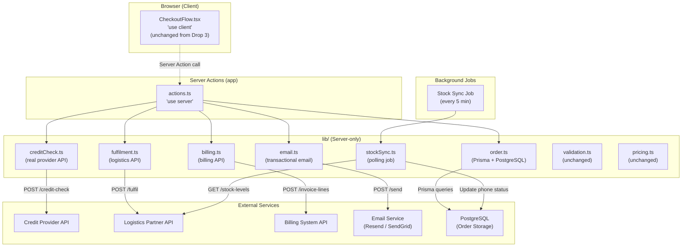
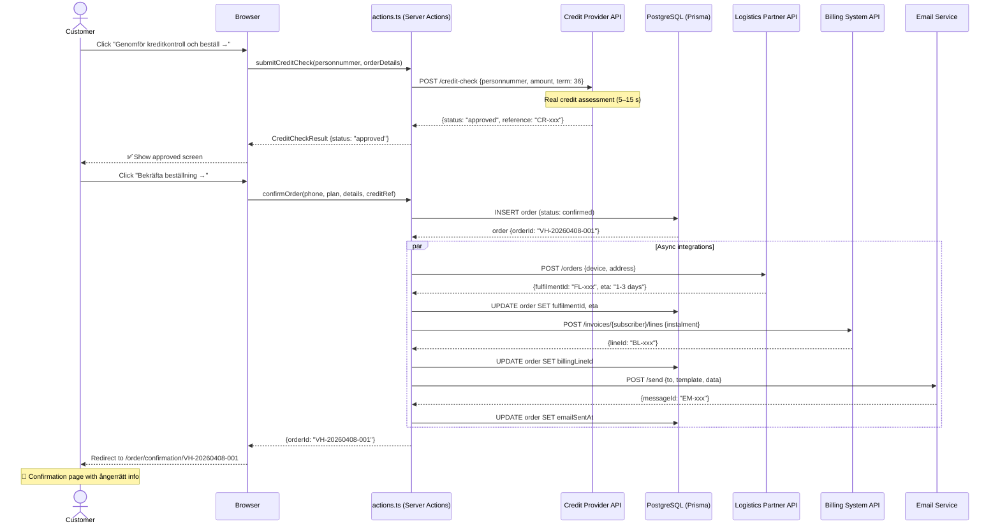
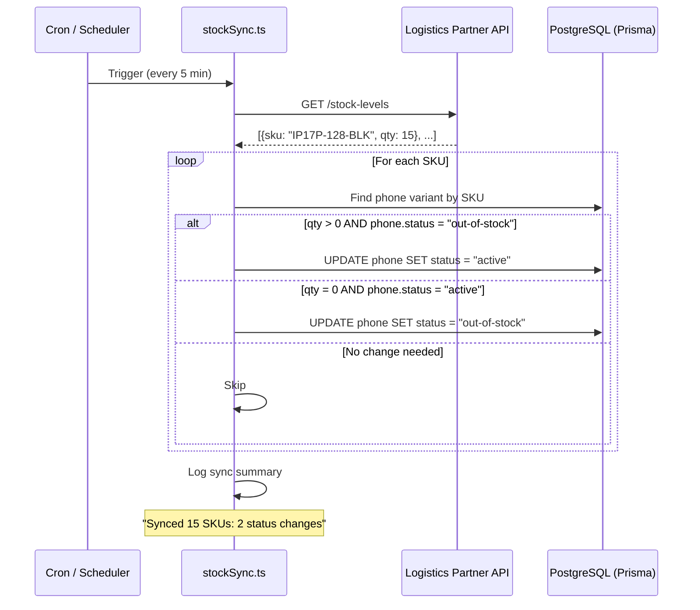
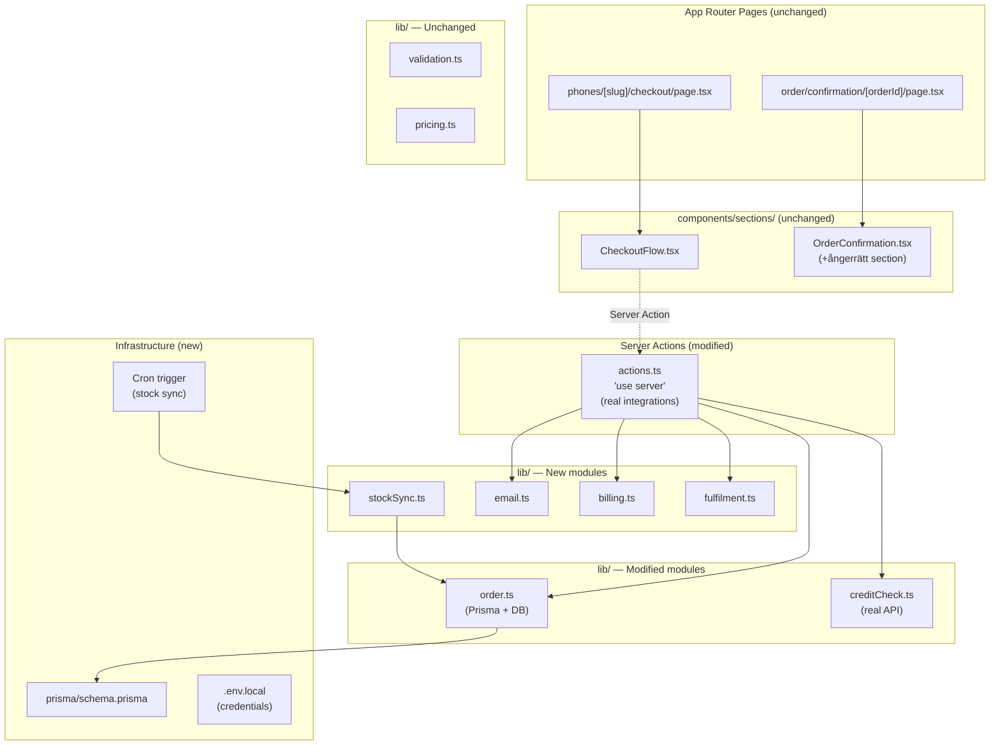

# Detailed Technical Design — Drop 4: Live Integrations

> **State:** Build
> **Last updated:** 2026-04-08
> **Drop:** 4 — Live Integrations

---

## Overview

Drop 4 replaces all stubbed external integrations from Drop 3 with real provider connections. After this drop, the system can process a **real order end-to-end** in a staging environment: real credit check, real fulfilment trigger, real billing update, real confirmation email, and real stock synchronisation.

The goal is to prove that the **backend orchestration layer** works with live partner APIs before any customer-facing launch. Drop 4 does not change the checkout UI — the frontend components from Drop 3 remain unchanged. All changes are behind the server boundary (Server Actions, `lib/` modules, background jobs).

---

## Design Decisions

### DD-401: Credit check integration — direct API call vs. SDK vs. webhook

| Option | Pros | Cons | Decision |
|--------|------|------|----------|
| **Direct HTTPS API call via `fetch()`** | Zero extra dependencies; full control over request/response; matches existing pattern (no SDK in project); server-side only | Must handle auth, retries, and error mapping manually | ✅ **Chosen** |
| Provider SDK (e.g. `@klarna/sdk`) | Higher-level abstraction; built-in retry/error handling | Adds dependency; SDK may not exist for all providers; SDK versioning risk; obscures request details | ❌ Rejected |
| Webhook-based async flow | Decouples credit check from request/response cycle | Requires webhook endpoint, state management for pending checks, more complex UX (polling or SSE); overkill for a synchronous 5–15 s check | ❌ Rejected |

**Rationale:** The credit check is a synchronous request/response call that completes within 15 seconds (NFR-104). A direct `fetch()` call from the Server Action keeps the architecture simple, avoids new dependencies, and keeps the server-only pattern established in Drop 3. The `creditCheck.ts` module already defines the `CreditCheckResult` interface — Drop 4 replaces the stub implementation behind the same interface.

### DD-402: Fulfilment integration — fire-and-forget vs. synchronous confirmation

| Option | Pros | Cons | Decision |
|--------|------|------|----------|
| **Fire-and-forget with status polling** | Order confirmation is not blocked by logistics latency; fulfilment call can be retried independently; customer gets confirmation immediately | Must handle "fulfilment pending" state; requires a status-check mechanism | ✅ **Chosen** |
| Synchronous fulfilment in the confirm flow | Simpler: order is only confirmed when fulfilment is acknowledged | Logistics API latency (seconds to minutes) blocks the confirmation page; poor UX; single point of failure | ❌ Rejected |

**Rationale:** The customer clicks "Bekräfta beställning →" and expects immediate confirmation (FR-402). Blocking on the logistics API would degrade UX. Instead, the `confirmOrder` Server Action creates the order, triggers the fulfilment call asynchronously, and returns the order ID immediately. If the fulfilment call fails, the order is flagged for manual retry. The customer sees the confirmation page without delay.

### DD-403: Billing integration — API call vs. event-driven

| Option | Pros | Cons | Decision |
|--------|------|------|----------|
| **Direct API call to billing system** | Simple; immediate feedback; matches the synchronous order flow | Billing system must expose an API endpoint; tight coupling | ✅ **Chosen for Phase 1** |
| Event-driven (message queue) | Decoupled; billing processes events at its own pace | Adds message broker infrastructure; over-engineered for Phase 1 volume (~10–50 orders/day) | Deferred to Phase 2 |

**Rationale:** Phase 1 volume is low (tens of orders per day). A direct API call from the order confirmation flow is sufficient. If billing fails, the order is flagged for manual follow-up (BR-504 pattern). Event-driven architecture is a Phase 2 consideration if volume warrants it.

### DD-404: Stock sync — polling vs. webhook push

| Option | Pros | Cons | Decision |
|--------|------|------|----------|
| **Polling every 5 minutes** | Simple to implement; no webhook infrastructure needed on logistics side; predictable load pattern; matches BR-402 SLA (5-min freshness) | Slight delay (up to 5 min) before stock changes reflect; polling even when nothing changes | ✅ **Chosen** |
| Webhook push from logistics partner | Real-time stock updates; no unnecessary requests | Requires logistics partner to support webhooks; adds ingress endpoint; more complex error handling | Deferred — evaluate when partner supports it |

**Rationale:** BR-402 requires stock updates within 5 minutes. Polling every 5 minutes meets this SLA exactly. The logistics partner's API capabilities in Phase 1 may not include webhooks. Polling is the lowest-risk approach and can be replaced with push notifications later.

### DD-405: Confirmation email — send from app vs. transactional email service

| Option | Pros | Cons | Decision |
|--------|------|------|----------|
| **Transactional email service (e.g. Resend, SendGrid, Postmark)** | Reliable delivery; handles DKIM/SPF/DMARC; delivery tracking; templates; no SMTP server management | Adds external service dependency; cost (negligible at Phase 1 volume) | ✅ **Chosen** |
| Send from Next.js via `nodemailer` + SMTP relay | No third-party service | SMTP reliability issues; deliverability concerns; no delivery tracking; must manage SMTP credentials | ❌ Rejected |

**Rationale:** Email deliverability is critical for order confirmation (BR-504). A transactional email service handles authentication, reputation, and retry logic. At Phase 1 volume, cost is negligible. The email module exports a `sendOrderConfirmation()` function — the service choice is an implementation detail behind this interface.

### DD-406: Order persistence — database choice

| Option | Pros | Cons | Decision |
|--------|------|------|----------|
| **PostgreSQL via Prisma ORM** | Industry-standard relational DB; Prisma provides type-safe queries matching the TypeScript codebase; migrations built-in; works with Vercel Postgres, Supabase, Neon, or self-hosted | Adds Prisma dependency + database infrastructure | ✅ **Chosen** |
| SQLite (embedded) | Zero infrastructure; file-based | Not suitable for serverless/edge deployment; no concurrent write support; not production-ready for multi-instance | ❌ Rejected |
| In-memory Map (Drop 3 approach) | Zero infrastructure | Orders lost on restart; not production-viable | ❌ Replaced |
| MongoDB | Flexible schema | Overkill for structured order data; less natural for relational queries (order → items → plan) | ❌ Rejected |

**Rationale:** Drop 3's in-memory `globalThis` store was a deliberate stub (DD-303). Drop 4 requires persistent, reliable order storage that survives restarts and supports concurrent access. PostgreSQL with Prisma provides type safety that aligns with the project's strict TypeScript approach. The Prisma schema serves as the single source of truth for the order model.

### DD-407: Environment variable management for provider credentials

| Option | Pros | Cons | Decision |
|--------|------|------|----------|
| **Environment variables via `.env.local` (dev) + hosting provider secrets (staging/prod)** | Standard Next.js pattern; server-only by default (no `NEXT_PUBLIC_` prefix); works with Vercel, Docker, etc. | Must ensure no credential leaks to client bundle | ✅ **Chosen** |
| Vault / secrets manager (e.g. HashiCorp Vault) | Enterprise-grade rotation; audit trail | Over-engineered for Phase 1; adds infrastructure | Deferred to Phase 2 |

**Rationale:** NFR-203 requires that provider credentials never appear in the client bundle. Next.js server-only environment variables (without `NEXT_PUBLIC_` prefix) satisfy this requirement. All integration modules (`creditCheck.ts`, `fulfilment.ts`, `billing.ts`, `email.ts`) read credentials from `process.env` and run exclusively in Server Actions or background jobs.

### DD-408: Real timeout handling for credit check

| Option | Pros | Cons | Decision |
|--------|------|------|----------|
| **`AbortController` with 20-second timeout** | Native Web API; no dependencies; matches NFR-401 (20 s timeout); clean abort of in-flight requests | Must handle AbortError specifically | ✅ **Chosen** |
| `setTimeout` + Promise.race | Works but less clean than AbortController | Leaves the original fetch in-flight even after timeout; resource waste | ❌ Rejected |

**Rationale:** NFR-401 specifies a 20-second timeout. `AbortController` is the standard way to cancel `fetch()` requests and provides clean error semantics. The credit check module catches `AbortError` and returns a `CreditCheckResult` with status `"error"` and an appropriate message.

---

## Architecture — Drop 4 Integration Layer



---

## Sequence Diagram — Real Order Flow (Drop 4)



---

## Sequence Diagram — Stock Sync Job



---

## Component Architecture — Drop 4



---

## Data Layer

### New: Prisma Schema (`app/prisma/schema.prisma`)

```prisma
// Prisma schema for Vimla Hardware Sales — Drop 4
// Replaces the in-memory order store from Drop 3 (DD-406)

generator client {
  provider = "prisma-client-js"
}

datasource db {
  provider = "postgresql"
  url      = env("DATABASE_URL")
}

model Order {
  id                String      @id @default(cuid())
  orderId           String      @unique              // VH-YYYYMMDD-NNN format (BR-501)
  createdAt         DateTime    @default(now())
  updatedAt         DateTime    @updatedAt

  // Phone configuration
  phoneSlug         String
  phoneName         String
  colourName        String
  storage           String
  instalmentPrice   Int                               // Monthly device instalment (SEK) — BR-101
  totalDeviceCost   Int                               // instalment × 36 — BR-103

  // Subscription
  planId            String
  planName          String
  planPrice         Int                               // Monthly subscription price (SEK)
  totalMonthly      Int                               // instalment + subscription — BR-104

  // Personal details (encrypted at rest via DB-level encryption)
  personnummer      String                            // Swedish personal ID — NFR-202
  customerName      String
  address           String
  email             String
  phone             String

  // Credit check
  creditRef         String?                           // Provider reference ID
  creditStatus      CreditStatus

  // Fulfilment
  fulfilmentId      String?                           // Logistics partner reference
  fulfilmentStatus  FulfilmentStatus @default(PENDING)
  deliveryEstimate  String           @default("1–3 arbetsdagar")

  // Billing
  billingLineId     String?                           // Billing system line item ID
  billingStatus     BillingStatus    @default(PENDING)

  // Email
  emailSentAt       DateTime?                         // Null = not sent yet — BR-504
  emailMessageId    String?                           // Email service message ID

  // Ångerrätt
  withdrawalDeadline DateTime?                        // 14 days from delivery — BR-304

  // Customer type
  isExistingSubscriber Boolean @default(false)        // true = existing Vimla subscriber (Drop 5)

  @@index([orderId])
  @@index([createdAt])
  @@index([personnummer])
}

enum CreditStatus {
  APPROVED
  DECLINED
  ERROR
}

enum FulfilmentStatus {
  PENDING
  TRIGGERED
  SHIPPED
  DELIVERED
  FAILED
}

enum BillingStatus {
  PENDING
  ADDED
  FAILED
}
```

**Traces to:** BR-501 (order ID format), BR-104 (total monthly), BR-103 (total device cost), BR-304 (ångerrätt deadline), NFR-202 (PII handling — DB-level encryption)

### Removed: `app/src/data/testPersonnummer.ts`

The test personnummer constants (`DECLINED_PERSONNUMMER`, `ERROR_PERSONNUMMER`) are no longer needed. The real credit provider determines outcomes based on actual credit assessment. Remove this file and all imports.

### Unchanged Data Files

| File | Drop 4 Status | Notes |
|------|---------------|-------|
| `data/phones.ts` | Unchanged | Phone catalogue data. In Drop 4, stock status updates come from the stock sync job via the database. The static `phones.ts` file remains the source for phone specs, colours, and pricing. Stock status is overlaid from DB. |
| `data/plans.ts` | Unchanged | Subscription plans. No changes needed. |
| `data/navigation.ts` | Unchanged | No navigation changes. |

### New: Stock Status Overlay

Drop 4 introduces a hybrid data model: phone specs, colours, and pricing come from `data/phones.ts` (static), but stock status comes from the database (dynamic, updated by the stock sync job).

The catalogue utility is extended to merge these two sources:

```typescript
// lib/catalogue.ts — new function
export async function getActivePhonesDynamic(): Promise<Phone[]> {
  // 1. Load static phone data from phones.ts
  // 2. Query DB for current stock status per phone slug
  // 3. Override phone.status with DB stock status
  // 4. Filter by status === "active" (same as existing getActivePhones)
  // Return merged list
}
```

**Migration path:** In a future drop (Drop 6), when the CMS is fully operational, both specs AND stock status will come from the CMS/DB, and `phones.ts` becomes the seed/fallback only.

---

## Library Layer

### Modified: `app/src/lib/creditCheck.ts` (Real Provider API)

```typescript
/**
 * Real credit check integration — Drop 4.
 * Replaces the stubbed implementation from Drop 3.
 *
 * Makes a server-side HTTPS call to the credit provider API.
 * Credentials are read from environment variables (DD-407).
 * Timeout is enforced at 20 seconds via AbortController (DD-408).
 *
 * The CreditCheckResult interface is UNCHANGED from Drop 3 —
 * all consumers (actions.ts, CheckoutFlow.tsx) require zero changes.
 *
 * Traces to: FR-309, FR-401, FR-403, NFR-104, NFR-203, NFR-401,
 *            US-304, US-401, US-403, US-404
 */

export type CreditCheckStatus = "approved" | "declined" | "error";

export interface CreditCheckResult {
  status: CreditCheckStatus;
  message?: string;
  /** Provider reference ID — returned on approved/declined, null on error */
  creditRef?: string;
}

/**
 * Perform a real credit check via the provider API.
 *
 * @param personnummer — Swedish personal ID (YYYYMMDD-XXXX)
 * @param amount — total device cost in SEK (instalment × 36)
 * @returns CreditCheckResult — same interface as Drop 3 stub
 *
 * Environment variables required:
 *   CREDIT_PROVIDER_URL — base URL for the credit API
 *   CREDIT_PROVIDER_API_KEY — API key / bearer token
 *
 * Timeout: 20 seconds (NFR-401). On timeout, returns status: "error".
 * Retry logic: not built into this function — the UI retry button
 * triggers a fresh call via the Server Action.
 */
export async function performCreditCheck(
  personnummer: string,
  amount: number
): Promise<CreditCheckResult>;
```

**Implementation details:**

1. Read `CREDIT_PROVIDER_URL` and `CREDIT_PROVIDER_API_KEY` from `process.env`
2. Create `AbortController` with 20-second `setTimeout` for abort signal
3. `fetch(url, { method: "POST", headers: { Authorization, Content-Type }, body: JSON.stringify({ personnummer, amount, term: 36 }), signal })`
4. Map provider response to `CreditCheckResult`:
   - Provider "approved" → `{ status: "approved", creditRef: response.reference }`
   - Provider "declined" → `{ status: "declined", creditRef: response.reference }`
   - Any other status → `{ status: "error", message: "Oväntat svar från kreditgivaren" }`
5. Catch `AbortError` → `{ status: "error", message: "Kreditkontrollen tog för lång tid. Försök igen." }`
6. Catch network errors → `{ status: "error", message: "Kunde inte nå kreditgivaren. Försök igen om en stund." }`

**Breaking change:** The function signature adds a second parameter `amount`. The Server Action (`actions.ts`) must be updated to pass the total device cost.

### Modified: `app/src/lib/order.ts` (Prisma + PostgreSQL)

```typescript
/**
 * Order creation and retrieval — Drop 4.
 * Replaces the in-memory Map store from Drop 3 with Prisma + PostgreSQL.
 *
 * The Order interface is EXTENDED (not replaced) from Drop 3 to include
 * integration tracking fields (fulfilment, billing, email status).
 *
 * Traces to: FR-402, FR-404, BR-501, BR-104, BR-304, US-402
 */

import { PrismaClient } from "@prisma/client";

// Singleton Prisma client (standard Next.js pattern)
const globalForPrisma = globalThis as unknown as { prisma: PrismaClient };
export const prisma = globalForPrisma.prisma ?? new PrismaClient();
if (process.env.NODE_ENV !== "production") globalForPrisma.prisma = prisma;

export interface OrderDetails {
  phoneSlug: string;
  phoneName: string;
  colourName: string;
  storage: string;
  instalmentPrice: number;
  totalDeviceCost: number;
  planId: string;
  planName: string;
  planPrice: number;
  totalMonthly: number;
  personnummer: string;
  customerName: string;
  address: string;
  email: string;
  phone: string;
  creditRef: string;
  creditStatus: "approved";  // Only approved orders can be created — BR-205
  isExistingSubscriber: boolean;
}

export interface Order extends OrderDetails {
  orderId: string;             // VH-YYYYMMDD-NNN — BR-501
  createdAt: Date;
  fulfilmentId: string | null;
  fulfilmentStatus: string;
  billingLineId: string | null;
  billingStatus: string;
  emailSentAt: Date | null;
  deliveryEstimate: string;
  withdrawalDeadline: Date | null;
}

/**
 * Generate an order ID in format VH-YYYYMMDD-NNN.
 * Counter is per-day and atomic (database-backed sequence).
 */
export async function generateOrderId(): Promise<string>;

/**
 * Create and persist an order. Returns the full Order object.
 * Replaces in-memory createOrder() from Drop 3.
 */
export async function createOrder(details: OrderDetails): Promise<Order>;

/**
 * Retrieve a stored order by its orderId (VH-YYYYMMDD-NNN).
 * Returns undefined if not found.
 */
export async function getOrder(orderId: string): Promise<Order | undefined>;

/**
 * Update order with fulfilment tracking information.
 */
export async function updateFulfilment(
  orderId: string,
  fulfilmentId: string,
  status: string,
  eta?: string
): Promise<void>;

/**
 * Update order with billing line item information.
 */
export async function updateBilling(
  orderId: string,
  billingLineId: string,
  status: string
): Promise<void>;

/**
 * Update order with email send confirmation.
 */
export async function updateEmailStatus(
  orderId: string,
  messageId: string
): Promise<void>;
```

**Key changes from Drop 3:**
- `createOrder()` and `getOrder()` are now `async` (database queries)
- `generateOrderId()` is now `async` (atomic counter via DB transaction)
- New update functions for fulfilment, billing, and email status tracking
- `OrderDetails` interface extended with `creditRef` and `isExistingSubscriber`

### New: `app/src/lib/fulfilment.ts`

```typescript
/**
 * Fulfilment integration — Drop 4.
 *
 * Triggers a shipment order with the logistics partner API.
 * Called asynchronously after order confirmation (DD-402).
 *
 * Traces to: FR-402, US-402, D-02 (logistics partner dependency)
 */

export interface FulfilmentRequest {
  orderId: string;
  phoneSku: string;         // e.g. "IP17P-256-NAT" (slug + storage + colour)
  customerName: string;
  address: string;
  phone: string;
  email: string;
}

export interface FulfilmentResult {
  success: boolean;
  fulfilmentId?: string;    // Logistics partner's reference ID
  eta?: string;             // e.g. "1–3 arbetsdagar"
  error?: string;
}

/**
 * Trigger a fulfilment order with the logistics partner.
 *
 * Environment variables required:
 *   FULFILMENT_API_URL — base URL for the logistics API
 *   FULFILMENT_API_KEY — API key for authentication
 *
 * @param request — order and delivery details
 * @returns FulfilmentResult — success/failure with reference ID
 */
export async function triggerFulfilment(
  request: FulfilmentRequest
): Promise<FulfilmentResult>;
```

### New: `app/src/lib/billing.ts`

```typescript
/**
 * Billing integration — Drop 4.
 *
 * Adds a device instalment line item to the customer's invoice.
 * - New customers (prospects): creates a new subscription + instalment line
 * - Existing subscribers: adds instalment line to existing invoice
 *
 * Traces to: BR-502, BR-503, FR-503, D-04 (billing system dependency)
 */

export interface BillingRequest {
  orderId: string;
  personnummer: string;
  customerName: string;
  email: string;
  instalmentPrice: number;      // Monthly device instalment (SEK)
  instalmentMonths: number;     // 36 — BR-301
  planId: string;
  planPrice: number;
  isExistingSubscriber: boolean;
}

export interface BillingResult {
  success: boolean;
  billingLineId?: string;       // Billing system's reference for the instalment line
  error?: string;
}

/**
 * Add device instalment to the customer's invoice.
 *
 * For new customers (isExistingSubscriber = false):
 *   Creates a new subscription AND adds the instalment line (BR-503).
 *
 * For existing subscribers (isExistingSubscriber = true):
 *   Adds the instalment line to the existing invoice (BR-502).
 *
 * Environment variables required:
 *   BILLING_API_URL — base URL for the billing API
 *   BILLING_API_KEY — API key for authentication
 *
 * @param request — billing details
 * @returns BillingResult — success/failure with reference ID
 */
export async function addInstalmentToBilling(
  request: BillingRequest
): Promise<BillingResult>;
```

### New: `app/src/lib/email.ts`

```typescript
/**
 * Order confirmation email — Drop 4.
 *
 * Sends a transactional email via an email service (Resend, SendGrid, etc.).
 * Email must be sent within 5 minutes of order placement (BR-504).
 *
 * Traces to: BR-504, FR-404
 */

export interface OrderEmailData {
  orderId: string;
  customerName: string;
  email: string;
  phoneName: string;
  colourName: string;
  storage: string;
  planName: string;
  instalmentPrice: number;
  planPrice: number;
  totalMonthly: number;
  totalDeviceCost: number;
  deliveryEstimate: string;
  address: string;
  withdrawalDeadline: string;     // Formatted date string — BR-304
}

export interface EmailResult {
  success: boolean;
  messageId?: string;
  error?: string;
}

/**
 * Send order confirmation email.
 *
 * Environment variables required:
 *   EMAIL_SERVICE_URL — API endpoint for the email service
 *   EMAIL_SERVICE_API_KEY — API key for authentication
 *   EMAIL_FROM_ADDRESS — sender address (e.g. "order@vimla.se")
 *
 * @param data — order details for the email template
 * @returns EmailResult — success/failure with message ID
 */
export async function sendOrderConfirmation(
  data: OrderEmailData
): Promise<EmailResult>;
```

**Email template content (Swedish):**

| Section | Content |
|---------|---------|
| Subject | `Orderbekräftelse — {orderId}` |
| Heading | `Tack för din beställning!` |
| Order number | `Ordernummer: {orderId}` |
| Phone | `{phoneName} · {storage} · {colourName}` |
| Plan | `{planName}` |
| Monthly breakdown | `Telefon: {instalmentPrice} kr/mån × 36 mån` |
| Total device | `Totalt: {totalDeviceCost} kr` |
| Subscription | `Abonnemang: {planPrice} kr/mån` |
| Total monthly | `Totalt per månad: {totalMonthly} kr/mån` |
| Delivery | `Leveransadress: {address}` |
| ETA | `Beräknad leverans: {deliveryEstimate}` |
| Ångerrätt | `Du har 14 dagars ångerrätt från leveransdagen. Sista dag för ångerrätt: {withdrawalDeadline}. Kontakta kundtjänst för att ångra ditt köp.` |
| CTA | `Gå till Mitt Vimla →` |

### New: `app/src/lib/stockSync.ts`

```typescript
/**
 * Stock synchronisation job — Drop 4.
 *
 * Polls the logistics partner API for current stock levels every 5 minutes.
 * Updates phone model status in the database:
 *   - qty > 0 AND status = "out-of-stock" → set to "active"
 *   - qty = 0 AND status = "active" → set to "out-of-stock"
 *
 * Traces to: BR-401, BR-402, D-02 (logistics partner)
 */

export interface StockLevel {
  sku: string;            // Product SKU from logistics partner
  quantity: number;       // Current stock level
}

export interface StockSyncResult {
  synced: number;         // Total SKUs processed
  updated: number;        // SKUs with status changes
  errors: string[];       // Any errors encountered
}

/**
 * Run a stock sync cycle.
 *
 * Environment variables required:
 *   FULFILMENT_API_URL — base URL for the logistics API (shared with fulfilment.ts)
 *   FULFILMENT_API_KEY — API key (shared with fulfilment.ts)
 *
 * @returns StockSyncResult — summary of sync operation
 */
export async function runStockSync(): Promise<StockSyncResult>;
```

**SKU mapping:** The logistics partner uses SKU codes (e.g. `IP17P-256-NAT`) while our catalogue uses slugs + storage + colour. A mapping function resolves partner SKUs to our phone slugs:

```typescript
/**
 * Map a logistics partner SKU to our internal phone slug + variant.
 * Returns undefined if the SKU is not recognised.
 */
export function resolvePartnerSku(
  sku: string
): { phoneSlug: string; storage: string; colourName: string } | undefined;
```

### New: `app/src/lib/config.ts`

```typescript
/**
 * Centralised configuration for external service URLs and keys — Drop 4.
 *
 * Reads from process.env (server-only). Throws at startup if
 * required variables are missing (fail-fast, not fail-silently).
 *
 * Traces to: DD-407, NFR-203
 */

export interface IntegrationConfig {
  creditProvider: {
    url: string;
    apiKey: string;
  };
  fulfilment: {
    url: string;
    apiKey: string;
  };
  billing: {
    url: string;
    apiKey: string;
  };
  email: {
    url: string;
    apiKey: string;
    fromAddress: string;
  };
  database: {
    url: string;
  };
}

/**
 * Load and validate integration configuration from environment variables.
 * Throws an error with a descriptive message if any required variable is missing.
 */
export function getConfig(): IntegrationConfig;
```

**Environment variables (all server-only, no `NEXT_PUBLIC_` prefix):**

| Variable | Purpose | Required in |
|----------|---------|-------------|
| `DATABASE_URL` | PostgreSQL connection string | All environments |
| `CREDIT_PROVIDER_URL` | Credit check API base URL | Staging + Production |
| `CREDIT_PROVIDER_API_KEY` | Credit check API authentication | Staging + Production |
| `FULFILMENT_API_URL` | Logistics partner API base URL | Staging + Production |
| `FULFILMENT_API_KEY` | Logistics partner API authentication | Staging + Production |
| `BILLING_API_URL` | Billing system API base URL | Staging + Production |
| `BILLING_API_KEY` | Billing system API authentication | Staging + Production |
| `EMAIL_SERVICE_URL` | Transactional email API base URL | Staging + Production |
| `EMAIL_SERVICE_API_KEY` | Email service API authentication | Staging + Production |
| `EMAIL_FROM_ADDRESS` | Sender email address | Staging + Production |

### Modified: `app/src/lib/pricing.ts` — No changes

The pricing module (`calculateInstalment`, `calculateTotalCost`, `calculateCombinedMonthly`) is unchanged. All pricing logic remains server-side and authoritative.

### Unchanged: `app/src/lib/validation.ts`

The validation module is unchanged. All form validation rules remain the same.

---

## Server Actions — Modified

### Modified: `app/src/app/phones/[slug]/checkout/actions.ts`

```typescript
"use server";

import { performCreditCheck, type CreditCheckResult } from "@/lib/creditCheck";
import {
  createOrder,
  updateFulfilment,
  updateBilling,
  updateEmailStatus,
  type OrderDetails,
} from "@/lib/order";
import { triggerFulfilment } from "@/lib/fulfilment";
import { addInstalmentToBilling } from "@/lib/billing";
import { sendOrderConfirmation } from "@/lib/email";
import { validateCheckoutForm, type CheckoutFormFields } from "@/lib/validation";
import { calculateTotalCost, INSTALMENT_MONTHS } from "@/lib/pricing";

/**
 * Server Action: submit a real credit check.
 *
 * Changes from Drop 3:
 * - Calls the real credit provider API instead of the stub
 * - Passes total device cost (amount) to the provider
 * - Returns creditRef for order creation
 *
 * Traces to: FR-309, NFR-104, NFR-203, US-304
 */
export async function submitCreditCheck(
  personnummer: string,
  totalDeviceCost: number
): Promise<CreditCheckResult> {
  // Server-side validation (defence-in-depth)
  // ...
  return performCreditCheck(personnummer, totalDeviceCost);
}

/**
 * Server Action: create a confirmed order with real integrations.
 *
 * Changes from Drop 3:
 * - Persists order to PostgreSQL (not in-memory)
 * - Triggers fulfilment API call (async, non-blocking)
 * - Adds instalment to billing system
 * - Sends confirmation email
 * - All integration failures are logged but do NOT block order confirmation
 *
 * Traces to: FR-402, FR-404, BR-502, BR-503, BR-504, US-402
 */
export async function confirmOrder(
  details: OrderDetails
): Promise<{ orderId: string }> {
  // 1. Create order in database
  const order = await createOrder(details);

  // 2. Trigger integrations (non-blocking — failures are logged, not thrown)
  //    Use Promise.allSettled to run in parallel without blocking on failures
  const integrationResults = await Promise.allSettled([
    // 2a. Fulfilment
    triggerFulfilment({
      orderId: order.orderId,
      phoneSku: buildSku(details),
      customerName: details.customerName,
      address: details.address,
      phone: details.phone,
      email: details.email,
    }).then(async (result) => {
      if (result.success && result.fulfilmentId) {
        await updateFulfilment(
          order.orderId,
          result.fulfilmentId,
          "TRIGGERED",
          result.eta
        );
      } else {
        await updateFulfilment(order.orderId, "", "FAILED");
        // Log error for ops alerting
        console.error(`Fulfilment failed for ${order.orderId}:`, result.error);
      }
    }),

    // 2b. Billing
    addInstalmentToBilling({
      orderId: order.orderId,
      personnummer: details.personnummer,
      customerName: details.customerName,
      email: details.email,
      instalmentPrice: details.instalmentPrice,
      instalmentMonths: INSTALMENT_MONTHS,
      planId: details.planId,
      planPrice: details.planPrice,
      isExistingSubscriber: details.isExistingSubscriber,
    }).then(async (result) => {
      if (result.success && result.billingLineId) {
        await updateBilling(order.orderId, result.billingLineId, "ADDED");
      } else {
        await updateBilling(order.orderId, "", "FAILED");
        // Log error for ops alerting
        console.error(`Billing failed for ${order.orderId}:`, result.error);
      }
    }),

    // 2c. Confirmation email
    sendOrderConfirmation({
      orderId: order.orderId,
      customerName: details.customerName,
      email: details.email,
      phoneName: details.phoneName,
      colourName: details.colourName,
      storage: details.storage,
      planName: details.planName,
      instalmentPrice: details.instalmentPrice,
      planPrice: details.planPrice,
      totalMonthly: details.totalMonthly,
      totalDeviceCost: details.totalDeviceCost,
      deliveryEstimate: "1–3 arbetsdagar",
      address: details.address,
      withdrawalDeadline: formatWithdrawalDeadline(new Date()),
    }).then(async (result) => {
      if (result.success && result.messageId) {
        await updateEmailStatus(order.orderId, result.messageId);
      } else {
        // Email failure: order valid, alert support — BR-504
        console.error(`Email failed for ${order.orderId}:`, result.error);
      }
    }),
  ]);

  // 3. Return order ID — customer sees confirmation regardless of integration outcomes
  return { orderId: order.orderId };
}
```

**Key architectural decision:** Integration failures (fulfilment, billing, email) do **not** block order confirmation. The customer has passed the credit check and explicitly confirmed — the order is valid. Failed integrations are tracked in the database (status fields) and logged for ops alerting. This follows the error handling strategy in `design.md`.

---

## Modified Components

### Modified: `OrderConfirmation.tsx` — Ångerrätt Section

The only frontend change in Drop 4. The confirmation page's static ångerrätt placeholder text is replaced with real withdrawal information:

**Before (Drop 3):**
```
"Du har 14 dagars ångerrätt enligt distansavtalslagen."
```

**After (Drop 4):**
```
"Du har 14 dagars ångerrätt från leveransdagen enligt distansavtalslagen.
 Om du vill ångra ditt köp, kontakta vår kundtjänst innan {withdrawalDeadline}."
```

The `OrderConfirmation` component receives `withdrawalDeadline` from the order data (calculated as order date + delivery estimate + 14 days).

**Traces to:** BR-304, NFR-601

### Modified: `CheckoutFlow.tsx` — Minimal Changes

The `CheckoutFlow` component requires only two changes:

1. **`submitCreditCheck` call signature:** Pass `totalDeviceCost` as second argument
2. **`confirmOrder` call:** Pass `creditRef` from the credit check result and `isExistingSubscriber: false` (Drop 5 will add subscriber detection)

All UI rendering, state management, and step logic remain unchanged from Drop 3.

---

## File Structure — Drop 4

### New Files

```
app/
├── prisma/
│   └── schema.prisma                   # Database schema — DD-406
├── src/
│   └── lib/
│       ├── fulfilment.ts               # Logistics partner API — DD-402
│       ├── billing.ts                  # Billing system API — DD-403
│       ├── email.ts                    # Transactional email — DD-405
│       ├── stockSync.ts               # Stock sync polling job — DD-404
│       └── config.ts                   # Centralised env config — DD-407
├── .env.local                          # Environment variables (gitignored)
└── .env.example                        # Template with required var names
```

### Modified Files

| File | Change | Traces to |
|------|--------|-----------|
| `lib/creditCheck.ts` | Replace stub with real provider API call; add `amount` parameter; add `AbortController` timeout | DD-401, DD-408, NFR-104, NFR-401 |
| `lib/order.ts` | Replace in-memory store with Prisma + PostgreSQL; add update functions for fulfilment/billing/email; make functions async | DD-406, BR-501 |
| `app/phones/[slug]/checkout/actions.ts` | Wire real integrations: credit check, fulfilment, billing, email; add `Promise.allSettled` for parallel non-blocking calls | DD-402, DD-403, DD-405 |
| `components/sections/OrderConfirmation.tsx` | Add real ångerrätt text with withdrawal deadline | BR-304, NFR-601 |
| `components/sections/CheckoutFlow.tsx` | Update `submitCreditCheck` call to pass `totalDeviceCost`; update `confirmOrder` call to pass `creditRef` | Minimal change |
| `lib/catalogue.ts` | Add `getActivePhonesDynamic()` for stock-status overlay from DB | BR-401, BR-402, DD-404 |
| `package.json` | Add `@prisma/client`, `prisma` as dependencies | DD-406 |

### Removed Files

| File | Reason |
|------|--------|
| `data/testPersonnummer.ts` | Stub data no longer needed — real credit provider determines outcomes |

### Unchanged Files

| File | Notes |
|------|-------|
| `lib/validation.ts` | All validation rules unchanged |
| `lib/pricing.ts` | All pricing calculations unchanged |
| All `components/ui/*` | No UI primitive changes |
| `components/sections/CheckoutFlow.tsx` | Functionally unchanged (2 minor call signature updates) |
| All `components/sections/` (except OrderConfirmation) | No changes |
| `data/phones.ts`, `data/plans.ts`, `data/navigation.ts` | No changes |

---

## Stock Sync Job — Deployment

### Trigger Mechanism

The stock sync job (`runStockSync()`) needs to execute every 5 minutes. The trigger mechanism depends on the deployment platform:

| Platform | Approach |
|----------|----------|
| **Vercel** | Vercel Cron Jobs — add to `vercel.json`: `{ "crons": [{ "path": "/api/cron/stock-sync", "schedule": "*/5 * * * *" }] }` |
| **Self-hosted** | System cron job or PM2 cron, calling a dedicated script or API route |
| **Docker** | Sidecar container with cron, or Kubernetes CronJob |

### API Route for Cron Trigger

```
app/src/app/api/cron/stock-sync/route.ts
```

```typescript
/**
 * Cron endpoint for stock synchronisation — triggered every 5 minutes.
 *
 * Protected by a shared secret (CRON_SECRET env var) to prevent
 * unauthorised invocation.
 *
 * Traces to: BR-401, BR-402, DD-404
 */
import { NextRequest, NextResponse } from "next/server";
import { runStockSync } from "@/lib/stockSync";

export async function GET(request: NextRequest) {
  // Verify cron secret
  const authHeader = request.headers.get("authorization");
  if (authHeader !== `Bearer ${process.env.CRON_SECRET}`) {
    return NextResponse.json({ error: "Unauthorized" }, { status: 401 });
  }

  const result = await runStockSync();
  return NextResponse.json(result);
}
```

**Environment variable:** `CRON_SECRET` — shared secret between the cron scheduler and the API route.

---

## Business Rule Enforcement — Drop 4

| Rule | Drop 3 Status | Drop 4 Change | Enforcement Location |
|------|---------------|---------------|---------------------|
| **BR-101** (instalment = ceil(price ÷ 36)) | ✅ Enforced | Unchanged | `lib/pricing.ts`, `data/phones.ts` |
| **BR-103** (total = instalment × 36) | ✅ Enforced | Unchanged | `lib/pricing.ts`, `data/phones.ts` |
| **BR-104** (combined = instalment + subscription) | ✅ Enforced | Unchanged | `lib/pricing.ts`, `OrderSummaryPanel.tsx` |
| **BR-201** (credit check mandatory) | ✅ Enforced (stub) | **Now real** — provider API call | `lib/creditCheck.ts`, `actions.ts` |
| **BR-202** (must be ≥ 18) | ✅ Enforced | Unchanged | `lib/validation.ts` |
| **BR-203** (both consents required) | ✅ Enforced | Unchanged | `CheckoutFlow.tsx` |
| **BR-204** (two-step confirmation) | ✅ Enforced | Unchanged | `CheckoutFlow.tsx`, `CreditResultScreen.tsx` |
| **BR-205** (declined → no order) | ✅ Enforced | Unchanged — `createOrder()` only called after approval | `actions.ts` |
| **BR-301** (36 months fixed) | ✅ Enforced | Unchanged | `lib/pricing.ts` (INSTALMENT_MONTHS constant) |
| **BR-302** (single instalment guard) | Stubbed (always pass) | **Now real** — checked via billing API before order | `actions.ts`, `lib/billing.ts` |
| **BR-304** (14-day ångerrätt) | Placeholder text | **Now real** — withdrawal deadline calculated and displayed | `OrderConfirmation.tsx`, `lib/email.ts`, DB schema |
| **BR-401** (only active + in-stock shown) | ✅ Enforced (static) | **Now dynamic** — stock status from DB (synced every 5 min) | `lib/catalogue.ts`, `lib/stockSync.ts` |
| **BR-402** (out-of-stock hidden within 5 min) | N/A (static data) | **Now enforced** — stock sync job runs every 5 min | `lib/stockSync.ts`, cron endpoint |
| **BR-501** (order ID format) | ✅ Enforced (in-memory) | **Now persistent** — atomic counter via DB | `lib/order.ts`, Prisma schema |
| **BR-502** (existing subscriber → existing invoice) | N/A (Drop 5) | **Billing API supports both paths** — Drop 5 activates subscriber path | `lib/billing.ts` |
| **BR-503** (new customer → new subscription + instalment) | Stubbed | **Now real** — billing API creates subscription + instalment | `lib/billing.ts` |
| **BR-504** (confirmation email within 5 min) | Not implemented | **Now enforced** — email sent immediately after order creation | `lib/email.ts`, `actions.ts` |

---

## Single Instalment Guard — BR-302

In Drop 3, the single-instalment check was stubbed (always passes). Drop 4 implements the real check:

```typescript
// In actions.ts — before credit check
async function checkActiveInstalment(personnummer: string): Promise<boolean> {
  // Query billing API for active instalment plans for this personnummer
  // Returns true if an active instalment exists
}
```

**Flow:**
1. Before calling `performCreditCheck()`, the Server Action calls the billing API to check for active instalments
2. If an active instalment exists → return immediately with a structured error:
   ```typescript
   { status: "blocked", message: "Du har redan en aktiv delbetalning. Kontakta kundtjänst för mer information." }
   ```
3. The `CheckoutFlow` component displays this as a `CreditResultScreen` variant="declined" with the BR-302 message
4. No credit check is performed (no need to waste a credit check query)

**Traces to:** BR-302, Edge Case #2

---

## Error Handling — Drop 4

| Scenario | Handling | User Impact | Traces to |
|----------|----------|-------------|-----------|
| Credit provider unreachable (timeout > 20 s) | `AbortController` aborts fetch; returns `{status: "error"}` | ⚠ Error screen + retry button | NFR-401, DD-408 |
| Credit provider returns unknown status | Map to `{status: "error"}` | ⚠ Error screen + retry button | Edge Case #3 |
| Credit check approved | Return `{status: "approved", creditRef}` | ✅ Approved screen | FR-401 |
| Credit check declined | Return `{status: "declined", creditRef}` | ❌ Declined screen | FR-403 |
| Active instalment exists (BR-302) | Block before credit check | ❌ "Du har redan en aktiv delbetalning" | BR-302 |
| Fulfilment API fails | Order confirmed; fulfilment status set to FAILED; ops alerted | 🎉 Confirmation shown normally; ops resolves manually | DD-402 |
| Billing API fails | Order confirmed; billing status set to FAILED; ops alerted | 🎉 Confirmation shown normally; billing team resolves manually | DD-403 |
| Email send fails | Order confirmed; emailSentAt remains null; support alerted | 🎉 Confirmation shown normally; support sends manually | BR-504 |
| Database connection error | Server Action throws; Next.js shows error page | ⚠ Generic error — user retries | Critical — monitoring required |
| Stock sync job fails | Previous stock levels remain; next sync retries automatically | No user impact (stale data for ≤ 10 min) | BR-402 |
| Stock sync finds unknown SKU | Logged and skipped | No user impact | Defensive |

**Principle:** Integration failures after credit approval do NOT block order confirmation. The customer's commitment is valid. Failed downstream integrations are tracked, logged, and resolved by ops/support.

---

## URL Structure — Drop 4

No new customer-facing URLs. All routes remain the same as Drop 3:

| URL | Component | Status |
|-----|-----------|--------|
| `/phones` | Phone listing page | ✅ Existing (stock status now dynamic) |
| `/phones/<slug>` | Phone detail page | ✅ Existing |
| `/phones/<slug>/checkout` | Checkout page | ✅ Existing (real integrations behind same UI) |
| `/order/confirmation/<orderId>` | Order confirmation | ✅ Existing (ångerrätt info updated) |
| `/api/cron/stock-sync` | Stock sync cron endpoint | **New** (internal only, not customer-facing) |

---

## Responsive Layout — Drop 4

No responsive layout changes. All layouts from Drop 3 remain unchanged. The only frontend change (ångerrätt text in `OrderConfirmation.tsx`) fits within the existing centred card layout.

---

## Accessibility — Drop 4

No accessibility changes beyond the existing Drop 3 implementation. The ångerrätt text addition in `OrderConfirmation.tsx` follows the existing semantic structure (paragraph text within the order details card).

All Drop 3 accessibility implementations remain in effect:
- Progress bar with `role="navigation"` and `aria-current`
- Form fields with `aria-required` and `aria-describedby`
- Loading spinner with `role="status"` and `aria-live="assertive"`
- Credit result screens with `role="alert"`

---

## Performance Considerations — Drop 4

| Concern | Target | Approach |
|---------|--------|----------|
| **Credit check latency** | p95 ≤ 15 s (NFR-104) | 20 s timeout via `AbortController`; provider SLA monitoring |
| **Order confirmation speed** | < 3 s from "Bekräfta" click to confirmation page | Integrations run in parallel via `Promise.allSettled`; none blocks the response |
| **Stock sync impact on listing** | No perceptible latency | DB query for stock status is indexed by slug; merged with static data server-side |
| **Database query performance** | Order lookup by orderId < 50 ms | Unique index on `orderId` column |
| **Page load times** | Unchanged from Drop 3 targets (p95 ≤ 2 s) | No frontend bundle changes; SSG for listing/detail unchanged |

---

## Security Considerations — Drop 4

| Concern | Mitigation | Traces to |
|---------|------------|-----------|
| **API credentials in client bundle** | All integration modules are server-only (`lib/`), imported only by Server Actions (`"use server"`) or API routes. No `NEXT_PUBLIC_` prefix on any credential variable. | NFR-203 |
| **PII in database** | PostgreSQL with encryption at rest enabled. Personnummer stored in DB (required for billing/fulfilment); access restricted to Server Actions. | NFR-202 |
| **PII in browser storage** | Unchanged from Drop 3 — no PII in localStorage/sessionStorage/cookies. | NFR-202 |
| **Cron endpoint protection** | Stock sync API route protected by `CRON_SECRET` bearer token. | DD-404 |
| **Credit check data** | Personnummer transmitted only over HTTPS to the credit provider. Server-side only — never exposed to the browser. | NFR-201, NFR-203 |
| **Email content** | Confirmation email contains order details and address. Sent via encrypted connection to email service. No PII logged in application logs. | NFR-202 |

---

## Test Strategy — Drop 4

### Unit Tests (`vitest`)

| Test file | What it covers | Key assertions |
|-----------|---------------|----------------|
| `lib/creditCheck.test.ts` | Real credit check module (mocked fetch) | Correct request body to provider; maps "approved"/"declined"/"error" responses; timeout after 20 s returns error; missing env vars throw |
| `lib/order.test.ts` | Prisma-backed order CRUD (mocked Prisma) | Order ID format `VH-YYYYMMDD-NNN`; atomic counter; order creation with all fields; retrieval by orderId; update functions set correct fields |
| `lib/fulfilment.test.ts` | Fulfilment integration (mocked fetch) | Correct request body to logistics API; maps success/failure responses; handles network errors |
| `lib/billing.test.ts` | Billing integration (mocked fetch) | New customer: creates subscription + instalment; existing subscriber: adds instalment to existing invoice; maps success/failure |
| `lib/email.test.ts` | Email sending (mocked fetch) | Correct template data; handles send success; handles send failure; returns messageId |
| `lib/stockSync.test.ts` | Stock sync logic (mocked fetch + Prisma) | Updates status for out-of-stock → active; updates active → out-of-stock; skips no-change SKUs; handles unknown SKUs; handles API errors |
| `lib/config.test.ts` | Configuration loading | Throws on missing required vars; returns correct config structure |
| `lib/pricing.test.ts` | Unchanged from Drop 3 | All existing tests pass |
| `lib/validation.test.ts` | Unchanged from Drop 3 | All existing tests pass |

### Integration Tests (Staging Environment)

| Scenario | Steps | Expected Result | Traces to |
|----------|-------|-----------------|-----------|
| **E2E: Approved order** | Detail → checkout → select plan → fill form → submit → real credit check approved → confirm → verify fulfilment triggered → verify billing updated → verify email received | Confirmation page with real order number; fulfilment in partner dashboard; instalment on invoice; email in inbox | Drop 4 AC #1–#5, #9 |
| **E2E: Declined credit** | Submit with a real personnummer that the provider declines (staging) | ❌ Declined screen; no order created; no fulfilment/billing/email | Drop 4 AC #1, FR-403 |
| **Credit timeout** | Block provider endpoint (chaos test) for > 20 s | ⚠ Error screen within 20 s; retry button works | Drop 4 AC #6, #7, NFR-401 |
| **Stock sync: out-of-stock** | Set a model to qty=0 in logistics partner dashboard | Within 5 min, model disappears from listing page | Drop 4 AC #4 |
| **Stock sync: back in stock** | Set a model back to qty>0 | Within 5 min, model reappears on listing page | Drop 4 AC #4 |
| **Email delivery** | Place order in staging | Confirmation email received within 5 min | Drop 4 AC #5, BR-504 |
| **Ångerrätt display** | Complete order, view confirmation page | "14 dagars ångerrätt" text with specific deadline date | Drop 4 AC #8 |
| **Active instalment guard** | Attempt second order with same personnummer (staging: create mock active instalment) | "Du har redan en aktiv delbetalning" message, checkout blocked | BR-302 |
| **Fulfilment failure** | Block fulfilment API (chaos test) | Order confirmed; fulfilment status = FAILED in DB; ops alert logged | DD-402 error path |
| **Billing failure** | Block billing API (chaos test) | Order confirmed; billing status = FAILED in DB; ops alert logged | DD-403 error path |

### Load Tests

| Scenario | Target | Tool |
|----------|--------|------|
| 100 concurrent checkout sessions (NFR-502) | p95 response ≤ 3 s (excluding credit check latency) | k6, Artillery, or similar |
| Stock sync with 50 SKUs (NFR-501) | Completes within 60 s | Synthetic catalogue data |

---

## Dependencies & Risk — Drop 4

| # | Dependency | Risk Level | Status | Mitigation |
|---|-----------|------------|--------|------------|
| 1 | **D-01: Credit provider contract** | 🔴 High | Must be signed before Drop 4 starts | Finance/Legal to prioritise during Drop 3. Stub remains functional as fallback. |
| 2 | **D-02: Logistics partner agreement** | 🔴 High | Must be signed before fulfilment integration | Ops/Commercial to finalise during Drop 3. Fulfilment can be stubbed if delayed (order created, fulfilment = manual). |
| 3 | **D-03: Distributor agreements** | 🟡 Medium | Needed for real inventory in partner warehouse | Commercial to negotiate. Not a code blocker — stock sync works once partner API is available. |
| 4 | **D-04: Billing system extension** | 🔴 High | Billing API must support instalment line items | Engineering/Billing team to conduct spike early. If not ready, billing = manual (logged as FAILED, ops follows up). |
| 5 | **PostgreSQL database provisioning** | 🟢 Low | Standard infrastructure | Vercel Postgres, Supabase, Neon, or self-hosted — team chooses based on deployment platform. |
| 6 | **Email service account** | 🟢 Low | Standard SaaS setup | Resend/SendGrid free tier sufficient for staging/early production. |
| 7 | **Provider API sandboxes available** | 🟡 Medium | Staging testing requires sandbox access | Request sandbox credentials as part of contract negotiation (D-01, D-02). |

**Fallback strategy:** If any external dependency (D-01 through D-04) is not ready when Drop 4 starts, that specific integration remains stubbed while the others go live. The codebase supports mixed real/stub mode because each integration module is independent. Priority order for go-live:

1. **Database (order persistence)** — first, as all other integrations need it
2. **Credit provider** — second, as it gates the entire purchase flow
3. **Billing** — third, as it's needed for invoicing
4. **Fulfilment** — fourth, can be triggered manually for early orders
5. **Email** — fifth, confirmation page is the primary receipt; email is secondary

---

## Migration Plan — Drop 3 → Drop 4

### Step 1: Database Setup

1. Add `prisma` and `@prisma/client` to `package.json`
2. Create `prisma/schema.prisma` with the Order model
3. Run `npx prisma db push` to create the schema in the development database
4. Run `npx prisma generate` to generate the Prisma client

### Step 2: Replace Order Store

1. Rewrite `lib/order.ts` to use Prisma instead of the in-memory Map
2. Make `createOrder()` and `getOrder()` async
3. Update `actions.ts` to `await` order operations
4. Add `updateFulfilment()`, `updateBilling()`, `updateEmailStatus()` functions
5. Run existing order tests with mocked Prisma client

### Step 3: Replace Credit Check Stub

1. Rewrite `lib/creditCheck.ts` to call the real provider API
2. Add `amount` parameter to `performCreditCheck()`
3. Add `AbortController` with 20-second timeout
4. Update `actions.ts` to pass `totalDeviceCost` to `submitCreditCheck()`
5. Remove `data/testPersonnummer.ts` and all imports
6. Run credit check tests with mocked `fetch()`

### Step 4: Add New Integration Modules

1. Create `lib/fulfilment.ts` with `triggerFulfilment()`
2. Create `lib/billing.ts` with `addInstalmentToBilling()`
3. Create `lib/email.ts` with `sendOrderConfirmation()`
4. Create `lib/stockSync.ts` with `runStockSync()`
5. Create `lib/config.ts` with `getConfig()`
6. Write unit tests for all new modules

### Step 5: Wire Integrations in Server Actions

1. Update `confirmOrder()` in `actions.ts` to call fulfilment, billing, and email
2. Use `Promise.allSettled()` for parallel, non-blocking execution
3. Add `checkActiveInstalment()` guard before credit check (BR-302)

### Step 6: Add Stock Sync Cron

1. Create `app/api/cron/stock-sync/route.ts`
2. Add `getActivePhonesDynamic()` to `lib/catalogue.ts`
3. Configure cron trigger for deployment platform
4. Test stock sync with logistics partner sandbox

### Step 7: Update Confirmation Page

1. Update `OrderConfirmation.tsx` with real ångerrätt text and withdrawal deadline
2. Verify responsive layout is unchanged

### Step 8: Environment & Deployment

1. Create `.env.example` with all required variable names
2. Configure staging environment with real/sandbox credentials
3. Run full E2E test in staging

---

## Delivery Checklist

- [ ] PostgreSQL database provisioned and accessible (development + staging)
- [ ] Prisma schema created and migrated; `prisma generate` runs successfully
- [ ] `lib/order.ts` uses Prisma for all CRUD operations; in-memory store removed
- [ ] `lib/creditCheck.ts` calls real credit provider API with 20-second timeout
- [ ] `data/testPersonnummer.ts` removed; no references remain in codebase
- [ ] `lib/fulfilment.ts` triggers fulfilment via logistics partner API
- [ ] `lib/billing.ts` adds instalment line to billing system
- [ ] `lib/email.ts` sends confirmation email via transactional email service
- [ ] `lib/stockSync.ts` polls logistics partner and updates stock status in DB
- [ ] `lib/config.ts` validates all required environment variables at startup
- [ ] `actions.ts` wires all integrations with `Promise.allSettled()` (non-blocking)
- [ ] Active instalment guard (BR-302) checks billing API before credit check
- [ ] Stock sync cron runs every 5 minutes; out-of-stock models hidden within 5 min
- [ ] Confirmation email received within 5 minutes of order placement (BR-504)
- [ ] Ångerrätt text with specific withdrawal deadline on confirmation page (BR-304)
- [ ] Credit check timeout (> 20 s) shows error message with retry button (NFR-401)
- [ ] Credit check round-trip p95 ≤ 15 seconds (NFR-104)
- [ ] All API credentials are server-only (no `NEXT_PUBLIC_` prefix); verified in client bundle (NFR-203)
- [ ] No PII in browser localStorage/sessionStorage/cookies (NFR-202 — unchanged)
- [ ] Unit tests pass for all new and modified modules
- [ ] E2E test in staging: place order → credit approved → fulfilment triggered → instalment on invoice → email received
- [ ] Integration failure paths tested: fulfilment/billing/email failures logged, order still confirmed
- [ ] `.env.example` documents all required environment variables
- [ ] Swedish text throughout; no English UI strings in ångerrätt section
- [ ] Existing Drop 1–3 acceptance criteria still pass (no regressions)

---

## Traceability Matrix — Drop 4

### Requirements → Components

| Requirement | Drop 3 Status | Drop 4 Component(s) |
|-------------|---------------|---------------------|
| FR-309 (credit check API call) | Stubbed | `lib/creditCheck.ts` (real API) |
| FR-401 (approved screen) | Stubbed | Unchanged UI; real credit result |
| FR-402 (fulfilment on confirm) | Stubbed | `lib/fulfilment.ts`, `actions.ts` |
| FR-403 (declined screen) | Stubbed | Unchanged UI; real credit result |
| FR-404 (confirmation page) | Stubbed | `OrderConfirmation.tsx` (+ångerrätt) |
| NFR-104 (credit check ≤ 15 s) | N/A (stub = 2 s) | `lib/creditCheck.ts` (AbortController 20 s) |
| NFR-203 (credentials server-only) | N/A (no credentials) | `lib/config.ts`, all `lib/` modules |
| NFR-401 (timeout handling) | Stubbed | `lib/creditCheck.ts` (AbortController) |
| BR-302 (single instalment) | Stubbed (always pass) | `actions.ts` → `lib/billing.ts` check |
| BR-304 (ångerrätt 14 days) | Placeholder text | `OrderConfirmation.tsx`, `lib/email.ts`, DB schema |
| BR-401 (active + in-stock) | Static data | `lib/stockSync.ts`, `lib/catalogue.ts` |
| BR-402 (5-min stock freshness) | N/A | `lib/stockSync.ts`, cron job |
| BR-501 (order ID format) | In-memory counter | DB-backed atomic counter |
| BR-502 (existing → existing invoice) | N/A (Drop 5) | `lib/billing.ts` (ready, activated in Drop 5) |
| BR-503 (new → subscription + instalment) | Stubbed | `lib/billing.ts` |
| BR-504 (email within 5 min) | Not implemented | `lib/email.ts`, `actions.ts` |

### User Stories → Components

| Story | Drop 4 Change |
|-------|---------------|
| US-304 (submit for credit check) | Real credit provider API call |
| US-401 (confirm approved order) | Real fulfilment + billing + email triggered |
| US-402 (see confirmation) | Real order in DB; ångerrätt info; email sent |
| US-403 (declined credit) | Real decline from provider |
| US-404 (credit timeout/error) | Real timeout handling (20 s AbortController) |
| US-502 (out-of-stock during checkout) | Real stock sync (5-min polling) |

### Drop 4 AC → Test Scenarios

| Drop 4 AC | Test Scenario |
|-----------|---------------|
| #1 Real credit check approved/declined | E2E: Approved order; E2E: Declined credit |
| #2 Fulfilment triggered on confirm | E2E: Approved order (verify partner dashboard) |
| #3 Billing instalment on invoice | E2E: Approved order (verify billing system) |
| #4 Stock sync every 5 min | Stock sync: out-of-stock; Stock sync: back in stock |
| #5 Confirmation email within 5 min | Email delivery test |
| #6 Credit timeout > 20 s | Credit timeout (chaos test) |
| #7 Credit p95 ≤ 15 s | Load test with provider sandbox |
| #8 Ångerrätt on confirmation page | Ångerrätt display test |
| #9 E2E real order | Full E2E: order → credit → fulfilment → billing → email |

---

## What Drop 4 Does NOT Include

| Excluded | Reason | When |
|----------|--------|------|
| Existing subscriber detection and pre-fill | Drop 5 scope — requires Mitt Vimla auth integration (D-06) | Drop 5 |
| Catalogue management tool for commercial team | Drop 6 scope — CMS dashboard configuration | Drop 6 |
| HTTPS enforcement | Drop 6 scope — security hardening | Drop 6 |
| WCAG accessibility audit | Drop 6 scope — axe-core + manual testing | Drop 6 |
| Monitoring and alerting setup | Drop 6 scope — uptime monitoring, checkout error alerting | Drop 6 |
| Legal sign-off | Drop 6 scope — requires legal review of all pages | Drop 6 |
| Real product photography | Drop 6 scope — commercial team populates catalogue | Drop 6 |
| Phone comparison feature | Phase 2 (HLR-9, Could) | Phase 2 |
| Trade-in program | Phase 2 (HLR-10, Could) | Phase 2 |
| Outright purchase option | Phase 2 (HLR-11, Could) | Phase 2 |

---

## Estimated Effort

| Task | Estimate | Dependencies |
|------|----------|-------------|
| Database setup (Prisma schema, migration, Prisma client) | 1–2 days | PostgreSQL provisioned |
| Order store migration (in-memory → Prisma) | 2–3 days | Database setup |
| Credit check integration (real API) | 2–3 days | D-01 signed, sandbox access |
| Fulfilment integration | 2–3 days | D-02 signed, sandbox access |
| Billing integration | 2–3 days | D-04 billing API ready |
| Email integration | 1–2 days | Email service account |
| Stock sync job | 2–3 days | D-02 signed, logistics API access |
| Config module + env setup | 1 day | — |
| Ångerrätt UI update | 0.5 days | — |
| Unit tests for all new modules | 3–4 days | Parallel with implementation |
| Integration testing in staging | 3–5 days | All integrations connected |
| Chaos testing (timeouts, failures) | 1–2 days | Staging environment |
| **Total** | **3–4 weeks** | Critical path: D-01 + D-02 + D-04 |

> **Note:** The 3–4 week estimate assumes all external dependencies (D-01 through D-04) are resolved and sandbox access is available when Drop 4 starts. If dependencies are partially resolved, the drop can proceed with mixed real/stub mode (see fallback strategy above).
