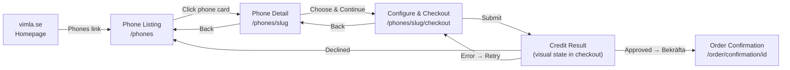
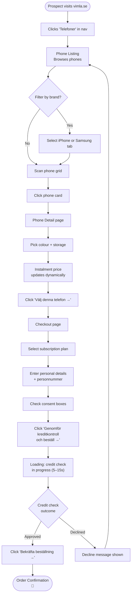
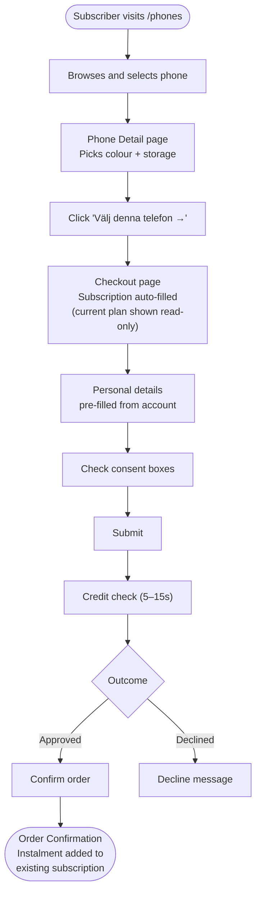

# UX Boundaries & Flows — Vimla Hardware Sales

> **State:** Design
> **Last updated:** 2026-04-08
> **Status:** ⬜ Not Done

---

## Design Principles

| # | Principle | Implication |
|---|-----------|-------------|
| 1 | **Total cost transparency** | The customer must always see the total monthly cost (subscription + device instalment) — never hide or bury it |
| 2 | **Browse-first, commit-late** | Users can explore, filter, and compare phones freely before any personal data or credit check is required |
| 3 | **Familiar shopping experience** | The webshop must feel like a standard e-commerce product listing and detail page — minimise novelty, maximise recognition |
| 4 | **Confidence at every step** | Checkout progress, clear pricing breakdowns, and confirmation summaries reduce anxiety on a 36-month commitment |
| 5 | **Two paths, one shop** | New customers and existing subscribers share the same browse/detail experience; the flow diverges only at checkout |
| 6 | **Minimal catalogue, maximum clarity** | With ~10–15 Phase 1 SKUs, favour generous product cards over dense grids — let each phone breathe |

---

## Screen Inventory

| Screen | Purpose | URL Pattern |
|--------|---------|-------------|
| **Phone Listing** | Browse all available phones, filter by brand, sort by price | `/phones` |
| **Phone Detail** | View a single phone — images, specs, colour/storage picker, price breakdown | `/phones/<phone-slug>` |
| **Configure & Checkout** | Select subscription plan (or confirm existing), review total monthly cost, enter personal details, trigger credit check | `/phones/<phone-slug>/checkout` |
| **Credit Check Result** | Display credit check outcome (approved / declined / error) and next steps | Visual state within `/phones/<phone-slug>/checkout` (not a separate route — rendered by `CreditResultScreen` inside `CheckoutFlow`) |
| **Order Confirmation** | Order summary, expected delivery, what happens next | `/order/confirmation/<order-id>` |

---

## Screen Flow



---

## Screen Layouts

### Phone Listing (`/phones`)

```
┌──────────────────────────────────────────────────────────────────────┐
│  ┌─ Site Header ──────────────────────────────────────────────────┐  │
│  │  Vimla logo   [Abonnemang]  [●Telefoner]  [Mitt Vimla]  […]   │  │
│  └────────────────────────────────────────────────────────────────┘  │
│                                                                      │
│  ┌─ Page Title ───────────────────────────────────────────────────┐  │
│  │  Telefoner — Köp mobil med Vimla                               │  │
│  │  Betala från 249 kr/mån med 36 månaders delbetalning           │  │
│  └────────────────────────────────────────────────────────────────┘  │
│                                                                      │
│  ┌─ Filters ─────────────────────────────────────────────────────┐  │
│  │  [Alla]  [iPhone]  [Samsung]    Sortera: [Pris ▼]             │  │
│  └────────────────────────────────────────────────────────────────┘  │
│                                                                      │
│  ┌─ Phone Grid (2–3 columns) ────────────────────────────────────┐  │
│  │                                                                │  │
│  │  ┌──────────────┐   ┌──────────────┐   ┌──────────────┐       │  │
│  │  │  ┌────────┐  │   │  ┌────────┐  │   │  ┌────────┐  │       │  │
│  │  │  │  img   │  │   │  │  img   │  │   │  │  img   │  │       │  │
│  │  │  └────────┘  │   │  └────────┘  │   │  └────────┘  │       │  │
│  │  │  iPhone 17   │   │  iPhone 17   │   │  Galaxy S26  │       │  │
│  │  │  Pro         │   │  Pro Max     │   │  Ultra       │       │  │
│  │  │              │   │              │   │              │       │  │
│  │  │  fr. 399 kr  │   │  fr. 499 kr  │   │  fr. 449 kr  │       │  │
│  │  │  /mån        │   │  /mån        │   │  /mån        │       │  │
│  │  │              │   │              │   │              │       │  │
│  │  │  [Välj →]    │   │  [Välj →]    │   │  [Välj →]    │       │  │
│  │  └──────────────┘   └──────────────┘   └──────────────┘       │  │
│  │                                                                │  │
│  │  ┌──────────────┐   ┌──────────────┐   ┌──────────────┐       │  │
│  │  │    ...       │   │    ...       │   │    ...       │       │  │
│  │  └──────────────┘   └──────────────┘   └──────────────┘       │  │
│  │                                                                │  │
│  └────────────────────────────────────────────────────────────────┘  │
│                                                                      │
│  ┌─ Footer ──────────────────────────────────────────────────────┐  │
│  │  …                                                             │  │
│  └────────────────────────────────────────────────────────────────┘  │
└──────────────────────────────────────────────────────────────────────┘
```

#### Element Inventory

| Element | Detail |
|---------|--------|
| **Brand filter tabs** | Toggle buttons: Alla (default), iPhone, Samsung. Single-select. Active tab uses Vimla brand colour fill |
| **Sort control** | Dropdown: Pris (lägst först), Pris (högst först), Populärast. Default: Populärast |
| **Phone card** | White card, rounded corners, subtle shadow. Contains: product image (square, centred), model name, starting instalment price ("fr. X kr/mån"), and a CTA button "Välj →" |
| **Instalment price** | Always displayed as monthly instalment for 36 months on the cheapest storage variant. Format: `fr. XXX kr/mån` |
| **Empty state** | If filters yield no results: centred message "Inga telefoner matchar ditt filter" with a reset-filters link |

---

### Phone Detail (`/phones/<phone-slug>`)

```
┌──────────────────────────────────────────────────────────────────────┐
│  ┌─ Site Header ──────────────────────────────────────────────────┐  │
│  │  Vimla logo   [Abonnemang]  [●Telefoner]  [Mitt Vimla]  […]   │  │
│  └────────────────────────────────────────────────────────────────┘  │
│                                                                      │
│  ← Tillbaka till alla telefoner                                      │
│                                                                      │
│  ┌─ Product Section ─────────────────────────────────────────────┐  │
│  │                                                                │  │
│  │  ┌─ Image Gallery ──┐   ┌─ Product Info ──────────────────┐   │  │
│  │  │                   │   │                                 │   │  │
│  │  │   ┌───────────┐   │   │  iPhone 17 Pro                 │   │  │
│  │  │   │           │   │   │                                 │   │  │
│  │  │   │  main     │   │   │  Färg:  ● ● ● ○               │   │  │
│  │  │   │  image    │   │   │         Titan Natur             │   │  │
│  │  │   │           │   │   │                                 │   │  │
│  │  │   └───────────┘   │   │  Lagring: [128] [256] [512]    │   │  │
│  │  │                   │   │            [1TB]                │   │  │
│  │  │  ○ ○ ● ○          │   │                                 │   │  │
│  │  │  (thumbnails)     │   │  ┌─ Price Box ──────────────┐  │   │  │
│  │  │                   │   │  │  399 kr/mån              │  │   │  │
│  │  └───────────────────┘   │  │  i 36 månader            │  │   │  │
│  │                           │  │                          │  │   │  │
│  │                           │  │  Totalt: 14 364 kr       │  │   │  │
│  │                           │  │                          │  │   │  │
│  │                           │  │  + abonnemang fr. 99 kr  │  │   │  │
│  │                           │  │    /mån                  │  │   │  │
│  │                           │  └──────────────────────────┘  │   │  │
│  │                           │                                 │   │  │
│  │                           │  [ Välj denna telefon → ]       │   │  │
│  │                           │                                 │   │  │
│  │                           └─────────────────────────────────┘   │  │
│  │                                                                │  │
│  └────────────────────────────────────────────────────────────────┘  │
│                                                                      │
│  ┌─ Specs Section ───────────────────────────────────────────────┐  │
│  │  Specifikationer                                               │  │
│  │  ┌──────────────┬──────────────────────────────────────────┐   │  │
│  │  │ Skärm        │ 6.3" Super Retina XDR, 120Hz             │   │  │
│  │  │ Chip         │ A19 Pro                                   │   │  │
│  │  │ Kamera       │ 48 MP + 12 MP + 12 MP                    │   │  │
│  │  │ Batteri      │ Upp till 23 tim video                     │   │  │
│  │  │ 5G           │ Ja                                        │   │  │
│  │  │ …            │ …                                         │   │  │
│  │  └──────────────┴──────────────────────────────────────────┘   │  │
│  └────────────────────────────────────────────────────────────────┘  │
│                                                                      │
│  ┌─ Footer ──────────────────────────────────────────────────────┐  │
│  │  …                                                             │  │
│  └────────────────────────────────────────────────────────────────┘  │
└──────────────────────────────────────────────────────────────────────┘
```

#### Element Inventory

| Element | Detail |
|---------|--------|
| **Image gallery** | Main image (large), thumbnail strip below. Click thumbnail to swap main image. Supports 3–5 images per colour variant |
| **Colour picker** | Circular swatches. Filled circle = selected. Selecting a colour updates the main image and product name suffix |
| **Storage picker** | Pill-shaped toggle buttons (e.g. 128 / 256 / 512 / 1TB). Selecting a storage option updates the instalment price |
| **Price box** | Prominent box: monthly instalment amount in large text, "i 36 månader" subtext, total price (instalment × 36), and "abonnemang fr. X kr/mån" to show the subscription cost separately. Updates dynamically when storage changes |
| **CTA button** | Primary action: "Välj denna telefon →". Navigates to the checkout/configuration screen |
| **Back link** | Top of page: "← Tillbaka till alla telefoner" links to `/phones` |
| **Specs table** | Two-column key–value table. Displays specs relevant to the selected model. Collapsible on mobile |

---

### Configure & Checkout (`/phones/<phone-slug>/checkout`)

```
┌──────────────────────────────────────────────────────────────────────┐
│  ┌─ Site Header ──────────────────────────────────────────────────┐  │
│  │  Vimla logo                                                    │  │
│  └────────────────────────────────────────────────────────────────┘  │
│                                                                      │
│  ┌─ Progress Bar ────────────────────────────────────────────────┐  │
│  │  ● Välj telefon  ──  ● Abonnemang  ──  ○ Dina uppgifter      │  │
│  │                      ──  ○ Bekräfta                            │  │
│  └────────────────────────────────────────────────────────────────┘  │
│                                                                      │
│  ┌─ Step Content ────────────────────────────────────────────────┐  │
│  │                                                                │  │
│  │  STEP 1 — Already done (summary):                             │  │
│  │  ┌─ Selected Phone (collapsed) ────────────────────────────┐  │  │
│  │  │  iPhone 17 Pro · Titan Natur · 256 GB · 399 kr/mån     │  │  │
│  │  │                                      [Ändra]            │  │  │
│  │  └─────────────────────────────────────────────────────────┘  │  │
│  │                                                                │  │
│  │  STEP 2 — Abonnemang (active for new customers):              │  │
│  │  ┌─────────────────────────────────────────────────────────┐  │  │
│  │  │  ○  Vimla S    6 GB     99 kr/mån                      │  │  │
│  │  │  ●  Vimla M   20 GB    149 kr/mån    ← Populärast      │  │  │
│  │  │  ○  Vimla L   40 GB    199 kr/mån                      │  │  │
│  │  │  ○  Vimla XL  100 GB   299 kr/mån                      │  │  │
│  │  └─────────────────────────────────────────────────────────┘  │  │
│  │  (Existing subscribers see: "Ditt abonnemang: Vimla M,       │  │
│  │   149 kr/mån" with no selection needed)                       │  │
│  │                                                                │  │
│  │  STEP 3 — Dina uppgifter:                                     │  │
│  │  ┌─────────────────────────────────────────────────────────┐  │  │
│  │  │  Personnummer    [____________]                          │  │  │
│  │  │  Namn            [____________]                          │  │  │
│  │  │  Adress          [____________]                          │  │  │
│  │  │  E-post          [____________]                          │  │  │
│  │  │  Telefon         [____________]                          │  │  │
│  │  │                                                         │  │  │
│  │  │  ☐ Jag godkänner villkoren för 36 mån delbetalning     │  │  │
│  │  │  ☐ Jag godkänner kreditupplysning                      │  │  │
│  │  └─────────────────────────────────────────────────────────┘  │  │
│  │                                                                │  │
│  └────────────────────────────────────────────────────────────────┘  │
│                                                                      │
│  ┌─ Order Summary (sticky sidebar / bottom on mobile) ───────────┐  │
│  │  Din beställning                                               │  │
│  │  ─────────────────────────────                                 │  │
│  │  iPhone 17 Pro 256 GB          399 kr/mån                      │  │
│  │  Vimla M 20 GB                 149 kr/mån                      │  │
│  │  ─────────────────────────────                                 │  │
│  │  Totalt per månad              548 kr/mån                      │  │
│  │  (i 36 månader)                                                │  │
│  │                                                                │  │
│  │  Frakt                         0 kr                            │  │
│  │                                                                │  │
│  │  [ Genomför kreditkontroll och beställ → ]                     │  │
│  └────────────────────────────────────────────────────────────────┘  │
└──────────────────────────────────────────────────────────────────────┘
```

#### Element Inventory

| Element | Detail |
|---------|--------|
| **Progress bar** | 4 steps: Välj telefon → Abonnemang → Dina uppgifter → Bekräfta. Current step is highlighted. Completed steps show ● and are clickable to go back |
| **Phone summary** | Collapsed row showing selected phone, colour, storage, and monthly instalment. "Ändra" link navigates back to the detail page |
| **Subscription selector** | Radio-button list of available Vimla plans with data allowance and monthly price. Highlighted "Populärast" badge on recommended plan. Skipped for existing subscribers — their current plan is displayed as read-only |
| **Personal details form** | Fields: personnummer (Swedish personal ID), name, address, email, phone. All required. Personnummer triggers the credit check |
| **Consent checkboxes** | Two required checkboxes: instalment terms and credit check consent. Both must be checked to proceed |
| **Order summary** | Sticky sidebar (desktop) / sticky bottom bar (mobile). Shows: phone + monthly instalment, subscription + monthly cost, total monthly cost, delivery cost. Updates live as selections change |
| **Submit button** | Primary CTA: "Genomför kreditkontroll och beställ →". Disabled until all fields are valid and both checkboxes are checked |

---

### Credit Check Result (visual state within `/phones/<phone-slug>/checkout`)

> **Note:** The credit check result is **not** a separate route. It is rendered as a visual state within the checkout page by the `CreditResultScreen` component inside `CheckoutFlow`. The URL remains `/phones/<phone-slug>/checkout`.

```
┌──────────────────────────────────────────────────────────────────────┐
│  ┌─ Site Header ──────────────────────────────────────────────────┐  │
│  │  Vimla logo                                                    │  │
│  └────────────────────────────────────────────────────────────────┘  │
│                                                                      │
│  APPROVED:                                                           │
│  ┌────────────────────────────────────────────────────────────────┐  │
│  │                         ✅                                     │  │
│  │                                                                │  │
│  │        Din kreditkontroll är godkänd!                          │  │
│  │                                                                │  │
│  │  Din beställning:                                              │  │
│  │  iPhone 17 Pro · 256 GB · Titan Natur                         │  │
│  │  + Vimla M 20 GB                                              │  │
│  │  Totalt: 548 kr/mån i 36 månader                              │  │
│  │                                                                │  │
│  │  Leverans: 1–3 arbetsdagar                                    │  │
│  │                                                                │  │
│  │  [ Bekräfta beställning → ]                                    │  │
│  └────────────────────────────────────────────────────────────────┘  │
│                                                                      │
│  DECLINED:                                                           │
│  ┌────────────────────────────────────────────────────────────────┐  │
│  │                         ❌                                     │  │
│  │                                                                │  │
│  │  Tyvärr blev din kreditansökan inte godkänd.                  │  │
│  │                                                                │  │
│  │  Det kan bero på flera saker. Du är välkommen                 │  │
│  │  att kontakta vår kundtjänst om du har frågor.                │  │
│  │                                                                │  │
│  │  [ Tillbaka till telefoner ]                                   │  │
│  └────────────────────────────────────────────────────────────────┘  │
│                                                                      │
│  ERROR / TIMEOUT:                                                    │
│  ┌────────────────────────────────────────────────────────────────┐  │
│  │                         ⚠️                                     │  │
│  │                                                                │  │
│  │  Något gick fel.                                              │  │
│  │                                                                │  │
│  │  Försök igen om en stund. Om problemet kvarstår,              │  │
│  │  kontakta vår kundtjänst.                                     │  │
│  │                                                                │  │
│  │  [ Försök igen ]                                               │  │
│  └────────────────────────────────────────────────────────────────┘  │
└──────────────────────────────────────────────────────────────────────┘
```

#### Element Inventory

| Element | Detail |
|---------|--------|
| **Approved state** | Green checkmark icon, confirmation text, order summary, estimated delivery, and a final "Bekräfta beställning →" CTA |
| **Declined state** | Red X icon, empathetic decline message, no details about why (credit provider policy), link to customer service, and a "Tillbaka till telefoner" link |
| **Error/timeout state** | Warning icon (⚠️), "Något gick fel" heading, suggestion to try again, customer service fallback link, and a "Försök igen" button that re-submits the credit check with the same data (no need to re-enter details). Personal details remain in form state |
| **Loading state** | While credit check is in progress: spinner + "Vi kontrollerar dina uppgifter…" message. Typical wait: 2 seconds (stubbed) / 5–15 seconds (production) |

---

### Order Confirmation (`/order/confirmation/<order-id>`)

```
┌──────────────────────────────────────────────────────────────────────┐
│  ┌─ Site Header ──────────────────────────────────────────────────┐  │
│  │  Vimla logo                                                    │  │
│  └────────────────────────────────────────────────────────────────┘  │
│                                                                      │
│  ┌────────────────────────────────────────────────────────────────┐  │
│  │                         🎉                                     │  │
│  │                                                                │  │
│  │        Tack för din beställning!                               │  │
│  │                                                                │  │
│  │  Ordernummer: VH-20260408-001                                  │  │
│  │                                                                │  │
│  │  ┌─ Order Details ─────────────────────────────────────────┐   │  │
│  │  │  iPhone 17 Pro · 256 GB · Titan Natur                  │   │  │
│  │  │  Vimla M 20 GB                                         │   │  │
│  │  │                                                         │   │  │
│  │  │  Telefon:       399 kr/mån × 36 mån                    │   │  │
│  │  │  Totalt:        14 364 kr                               │   │  │
│  │  │  Abonnemang:    149 kr/mån                              │   │  │
│  │  │  ──────────────────────────────────────                 │   │  │
│  │  │  Totalt/mån:    548 kr/mån                              │   │  │
│  │  └─────────────────────────────────────────────────────────┘   │  │
│  │                                                                │  │
│  │  Leveransadress: [address]                                     │  │
│  │  Beräknad leverans: 1–3 arbetsdagar                           │  │
│  │                                                                │  │
│  │  Vi har skickat en bekräftelse till [email]                    │  │
│  │                                                                │  │
│  │  [ Gå till Mitt Vimla → ]                                      │  │
│  └────────────────────────────────────────────────────────────────┘  │
└──────────────────────────────────────────────────────────────────────┘
```

#### Element Inventory

| Element | Detail |
|---------|--------|
| **Celebration icon** | 🎉 or confetti animation — brief, non-intrusive |
| **Order number** | Displayed prominently. Format: `VH-YYYYMMDD-NNN` |
| **Order details** | Phone model + variant, subscription plan, monthly cost breakdown, total monthly cost, total device cost |
| **Delivery info** | Shipping address (from personal details), estimated delivery window |
| **Email confirmation** | Confirmation that a receipt was sent to the provided email |
| **CTA** | "Gå till Mitt Vimla →" — links to the customer's account dashboard |

---

## Interaction States

| Element | State | Visual |
|---------|-------|--------|
| **Phone card** (listing) | Default | White card, subtle shadow, product image, model name, starting price |
| **Phone card** (listing) | Hover | Elevated shadow, slight scale-up (1.02×), cursor: pointer |
| **Phone card** (listing) | Focus (keyboard) | 2px Vimla-brand-colour outline |
| **Brand filter tab** | Inactive | Outlined pill, muted text |
| **Brand filter tab** | Active | Filled pill with Vimla brand colour, white text |
| **Colour swatch** | Unselected | Circle with colour fill, thin border |
| **Colour swatch** | Selected | Circle with colour fill, thick border + checkmark overlay |
| **Colour swatch** | Hover | Slight scale-up (1.1×), tooltip with colour name |
| **Storage pill** | Unselected | Outlined pill, muted text |
| **Storage pill** | Selected | Filled pill with Vimla brand colour, white text |
| **CTA button** | Default | Filled, Vimla brand colour, white text |
| **CTA button** | Hover | Slightly darker fill |
| **CTA button** | Disabled | Grey fill, reduced opacity, cursor: not-allowed |
| **CTA button** | Loading | Spinner replaces label text, button remains disabled |
| **Form field** | Default | Light border, label above |
| **Form field** | Focus | Vimla-brand-colour border, label floats |
| **Form field** | Error | Red border, error message below field |
| **Form field** | Valid | Green checkmark icon inside field |
| **Order summary** | Default (desktop) | Sticky sidebar, always visible during scroll |
| **Order summary** | Default (mobile) — collapsed | Sticky bottom bar showing single line: "Totalt: XXX kr/mån ▲" with expand chevron. Height: 48px |
| **Order summary** | Default (mobile) — expanded | Full order summary slides up from bottom (200ms ease-out). Background overlay dims page content. Tap chevron (▼) or overlay to collapse |
| **Progress bar step** | Completed | Filled circle + label, clickable |
| **Progress bar step** | Active | Filled circle + bold label, not clickable |
| **Progress bar step** | Upcoming | Outlined circle + muted label, not clickable |

---

## User Flows

### Primary: New customer buys a phone on 36-month instalments



### Secondary: Existing subscriber adds a phone



---

## Responsive Behaviour

| Breakpoint | Layout |
|------------|--------|
| ≥ 1280px | Phone grid: 3 columns. Detail page: image left, info right (side-by-side). Checkout: form left, order summary sticky sidebar right |
| 1024px–1279px | Phone grid: 2 columns. Detail page: image left, info right (slightly narrower). Checkout: form left, order summary sidebar |
| 768px–1023px | Phone grid: 2 columns. Detail page: image stacks above info. Checkout: single column, order summary as sticky bottom bar |
| < 768px | Phone grid: 1 column (full-width cards). Detail page: single column, vertical stack. Checkout: single column, order summary as expandable sticky bottom bar. Specs table collapsible |

---

## Accessibility

| Concern | Approach |
|---------|----------|
| **Keyboard navigation** | All interactive elements (cards, filters, swatches, pills, buttons, form fields) are reachable via Tab. Enter/Space to activate. Phone cards are focusable with `role="link"` |
| **Focus indicators** | 2px solid Vimla-brand-colour focus ring on all interactive elements |
| **Colour swatch labels** | Each swatch has a tooltip and `aria-label` with the colour name (e.g. "Titan Natur") so colour-blind users and screen readers can identify the selection |
| **Price announcements** | When colour or storage selection changes the price, the updated price box has `aria-live="polite"` so screen readers announce the new amount |
| **Form validation** | Inline error messages are associated with fields via `aria-describedby`. Errors are announced to screen readers on blur |
| **Image alt text** | Product images have descriptive alt text: "[Model] in [Colour], [angle]" (e.g. "iPhone 17 Pro in Titan Natur, front view") |
| **Contrast** | All text/background combinations meet WCAG 2.1 AA. Price text (large) meets AAA. CTA buttons meet AA for normal text |
| **Loading states** | Credit check spinner has `aria-live="assertive"` and `role="status"` with text "Kreditkontroll pågår" |
| **Language** | All customer-facing text in Swedish. `lang="sv"` on the HTML element |
